### 1.A review of classification algorithms for EEG based brain–computer interfaces: a 10 year update

### 2. Optimizing spatial filter pairs for EEG classification based on phase-synchronization

​	In particular, optimal spatial filters have been designed to classify EEG signals based on band power features. Unfortunately, there are other relevant EEG features for which no optimal spatial filter exists. This is the case for Phase Locking Value (PLV) features, which measure the synchronization between 2 EEG channels.

​	The PLV was introduced in the 1999 as a statistics for detecting synchrony in a precise frequency range between two different recording sites.

### 3. Understanding Brain Connectivity Patterns during Motor Imagery for Brain-Computer Interfacing

​	EEG connectivity measures could provide a new type of feature space for inferring subject’s intention in Brain-Computer Interfaces.

### 4. Entropy and complexity measures for EEG signal classification of schizophrenic and control participants

​	Abrams and Taylor, using a system of classification similar to DSM-IV showed that schizophrenic patients had twice as many left sided temporal EEG abnormalities as patients with affective disorders.

Several ==features== including <u>Shannon entropy, spectral entropy, approximate entropy, Lempel-Ziv complexity and ==Higuchi fractal dimension==(参考下一篇文献)</u> are extracted from EEG signals. Leaveone (participant)-out cross-validation is used for reliable estimate of the separability of the two groups. The training set is used for training the two classifiers, namely,linear discriminant analysis (LDA) and adaptive boosting (Adaboost). Each classifier is assessed using the test dataset.

​	The results agree with most previous works showing that schizophrenic patients are characterized by less complex neurobehavioral and neuropsychological measurements.
$$
L(k)=\sum_{m=1}^{k} L_{m}(k)
$$
This procedure is repeated for each $k$ ranging from 1 to  $k_{max}$, the total average length for delay $k$, L(k), is proportional to $k^{-D}$, where $D$ is the fractal dimension by Higuchi’s method. In the curve of $ln(L(k))$（y轴） versus $ln(1/k)$ （x轴）, the slope of the least squares linear fit is the estimate of the fractal dimension. 

For determination of $k_{max}$, fractal dimension was plotted against different values of $k_{max}$. The point at which the fractal dimension becomes saturated gives an appropriate value for $k_{max}$ . The best result for this study is obtained as $k_{max}=40$.

### 5. Approach to an irregular time series on the basis of the fractal theory

We now consider a finite set of time series observations taken at a regular interval:
$$
X(1), X(2), X(3), \ldots, X(N)
$$
From given time series,we first construct a new time series, $X_{k}^{m}$ ,defined as follows:
$$
X_{k}^{m} ; X(m), X(m+k), X(m+2 k), \ldots, X\left(m+\left[\frac{N-m}{k}\right] \cdot k\right) \quad(m=1,2, \ldots, k)
$$
where [] denotes the Gauss' notation and both k and m are integers.m and k indicate the initial time and the interval time, respectively. For a time interval equal to k, we get k sets of new time series. In the case of k=3 and N=100, three time series obtained by the above process are described as follows:
$$
\begin{array}{l}{X_{3}^{1} ; X(1), X(4), X(7), \ldots, X(97), X(100)} \\ {X_{3}^{2} ; X(2), X(5), X(8), \ldots, X(98)} \\ {X_{3}^{3} ; X(3), X(6), X(9), \ldots, X(99)}\end{array}
$$
We define the length of the curve,$X_{k}^{m}$,as follows:
$$
L_{m}(k)=\left\{\left(\sum_{i=1}^{\frac{N-m}{k}}|X(m+i k)-X(m+(i-1) \cdot k)|\right) \frac{N-1}{\left[\frac{N-m}{k}\right] \cdot k}\right\} / k
$$
The term, $N-1 /([(N-m) / k] \cdot k）$，$k$ represents the normalization factor for the curve length of subset time series. We define the length of the curve for the time interval $k$, $\langle L(k)\rangle$, as the average value over $k$ sets of $\langle L_m(k)\rangle$. If $\langle L(k)\rangle \propto k^{-D}$, then the curve is fractal with the dimension D.
To test that our method for determining a fractal dimension is valid, we show numerical application to simulated data. First, we apply our technique to the simulated data $Y(i)(i=1,2, \ldots, N)$ with the fractal dimension D of 1.5. $Y(i)$ are generated by
$$
Y(i)=\sum_{j=1}^{1000+i} Z(j)
$$
where $Z(j)$ is a Gaussian noise with the mean zero and a standard deviation of 1. The value of 1000 is arbitrarily chosen to eliminate the effect of sampling $Z(1)$ on $Y(1)$. We use the following values of the interval time $k$; $k=1,2,3,4$ and $ k=\left[2^{(j-1) / 4}\right](j=11,12,13, \ldots)$ for $k$ larger than 4, where [] denotes Gauss' notation. The function $\langle L(k)\rangle$ is described as $\langle L(k)\rangle \propto k^{-D}$ for a statistically self-similar curve. Then, if $\langle L(k)\rangle$ is plotted against k on a doubly logarithmic scale, the data should fall on a straight line with a slope $-D$. The logarithm of the length, $log\langle L(k)\rangle$, for a time series $Y(i)$ with $N=2^{17}$, is plotted as a function of $log k$ in fig.1. The value of the vertical axis is multiplied by an arbitrary factor.
The error bar denotes the standard deviation of $\langle L(k)\rangle$. In this calculation, the maximum value of $k$, $k_{max}$ is $2^{11}$.

分形看作具有如下性质的集合：

- 1. F具有精细结构，即在任意小的比例尺度内包含整体。
- 1. F是不规则的，以致于不能用传统的几何语言来描述。
  2. F通常具有某种自相似性，或许是近似的或许是统计意义下的。
  3. F在某种方式下定义的“分维数”通常大于F的拓扑维数。
  4. F的定义常常是非常简单的，或许是递归的。 

分数维的性质

- 分数维一定大于拓扑维而小于它的所占的空间维；
- 分数维数值D的大小是分形对象复杂程度的一个度量，数值越大分形对象越复杂
- 对于各种分形来说，即使在不同的尺度上，用分维表示的不规整程度却是一个常量。

#### ==谢尔宾斯基三角形==

（==Sierpinski triangle==）是一种分形，由波兰数学家谢尔宾斯基在1915年提出。它是[自相似](https://baike.baidu.com/item/自相似)集的例子。它的[豪斯多夫维](https://baike.baidu.com/item/豪斯多夫维/6352968)是log(3)/log(2) ≈ 1.585。

##### 构造

1. 去掉中心

   > 1.取一个实心的三角形。（多数使用[等边三角形](https://baike.baidu.com/item/等边三角形/6409004)）
   >
   > 2.沿三边中点的连线，将它分成四个小三角形。
   >
   > 3.去掉中间的那一个小三角形。
   >
   > 4.对其余三个小三角形重复1。
   >
   > 取一个[正方形](https://baike.baidu.com/item/正方形/1019418)或其他形状开始，用类似的方法构作，形状也会和谢尔宾斯基三角形相近。 [1] 

2. Chaos Game

   > 用随机的方法（Chaos Game），都可得到谢尔宾斯基三角形：
   >
   > 1. 任意取平面上三点A,B,C，组成一三角形
   > 2. 任意取三角形ABC内的一点P，画出 该点
   > 3. 画出 P和三角形其中一个顶点的中点
   > 4. 重复1

3. L系统

> 下图展示了曲线如何逼近谢尔宾斯基三角形。
>
> [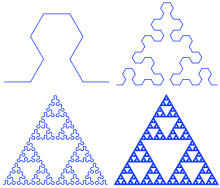](https://baike.baidu.com/pic/谢尔宾斯基三角形/1332191/0/d53f8794a4c27d1e8aee74631bd5ad6edcc43848?fr=lemma&ct=single)
>
> 图1.曲线逼近
>
> 这条曲线以L系统来记述为：
>
> 变量: A , B 常数: + , - 公理: A 规则: A → B-A-B B → A+B+A A,B ： 向前
>
> \- ： 左转60°
>
> \+ ： 右转60°

#### Fractal Dimension

Students (and teachers) are often fascinated by the fact that certain geometric images have fractional dimension. The Sierpinski triangle provides an easy way to explain why this must be so.

To explain the concept of fractal dimension, it is necessary to understand what we mean by dimension in the first place. Obviously, a line has dimension 1, a plane dimension 2, and a cube dimension 3. But why is this? It is interesting to see students struggle to enunciate why these facts are true. And then: What is the dimension of the Sierpinski triangle?

They often say that a line has dimension 1 because there is only 1 way to move on a line. Similarly, the plane has dimension 2 because there are 2 directions in which to move. Of course, there really are 2 directions in a line -- backward and forward -- and infinitely many in the plane. What the students really are trying to say is there are 2 linearly independent directions in the plane. Of course, they are right. But the notion of linear independence is quite sophisticated and difficult to articulate. Students often say that the plane is two-dimensional because it has ``two dimensions,'' meaning length and width. Similarly, a cube is three-dimensional because it has ``three dimensions,'' length, width, and height. Again, this is a valid notion, though not expressed in particularly rigorous mathematical language.

Another pitfall occurs when trying to determine the dimension of a curve in the plane or in three-dimensional space. An interesting debate occurs when a teacher suggests that these curves are actually one-dimensional. But they have 2 or 3 dimensions, the students object.

So why is a line one-dimensional and the plane two-dimensional? Note that both of these objects are self-similar. We may break a line segment into 4 self-similar intervals, each with the same length, and ecah of which can be magnified by a factor of 4 to yield the original segment. We can also break a line segment into 7 self-similar pieces, each with magnification factor 7, or 20 self-similar pieces with magnification factor 20. In general, we can break a line segment into **N** self-similar pieces, each with magnification factor **N**.

A square is different. We can decompose a square into 4 self-similar sub-squares, and the magnification factor here is 2. Alternatively, we can break the square into 9 self-similar pieces with magnification factor 3, or 25 self-similar pieces with magnification factor 5. Clearly, the square may be broken into **N^2** self-similar copies of itself, each of which must be magnified by a factor of **N** to yield the original figure. See Figure 8. Finally, we can decompose a cube into **N^3** self-similar pieces, each of which has magnification factor **N**.

**Figure 8:** A square may be broken into **N^2** self-similar pieces, each with magnification factor **N**

Now we see an alternative way to specify the dimension of a self-similar object: The dimension is simply the exponent of the number of self-similar pieces with magnification factor **N** into which the figure may be broken.

So what is the dimension of the Sierpinski triangle? How do we find the exponent in this case? For this, we need logarithms. Note that, for the square, we have **N^2** self-similar pieces, each with magnification factor **N**. So we can write

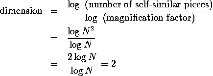

Similarly, the dimension of a cube is

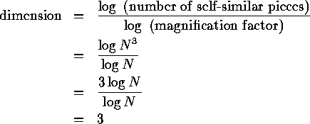

Thus, we take as the *definition* of the fractal dimension of a self-similar object

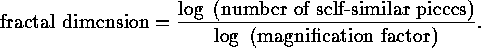

Now we can compute the dimension of **S**. For the Sierpinski triangle consists of 3 self-similar pieces, each with magnification factor 2. So the fractal dimension is

so the dimension of **S** is somewhere between 1 and 2, just as our ``eye'' is telling us.

But wait a moment, **S** also consists of 9 self-similar pieces with magnification factor 4. No problem -- we have

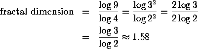

as before. Similarly, **S** breaks into **3^N** self-similar pieces with magnification factors **2^N**, so we again have

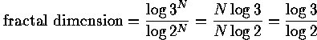

Fractal dimension is a measure of how "complicated" a self-similar figure is. In a rough sense, it measures "how many points" lie in a given set. A plane is "larger" than a line, while **S** sits somewhere in between these two sets.

On the other hand, all three of these sets have the same number of points in the sense that each set is uncountable. Somehow, though, fractal dimension captures the notion of "how large a set is" quite nicely, as we will see below.

### 

### 6. A new approach for EEG signal classification of schizophrenic and control participants

​	This paper is concerned with a two stage procedure for analysis and classification of electroencephalogram(EEG) signals for twenty schizophrenic patients and twenty age-matched control participants.
​	For each case,20 channels of EEG are recorded. First, the more informative channels are selected using the mutual information techniques. Then, genetic programming is employed to select the best features from the selected channels. Several ==features== including <u>autoregressive model parameters, band power and fractal dimension</u> are used for the purpose of classification. Both linear discriminant analysis (LDA) and adaptive boosting(Adaboost) are trained using tenfold cross validation to classify the reduced feature set and a classification accuracy of 85.90% and 91.94% is obtained by LDA and Adaboost, respectively. Another interesting observation from the channel selection procedure is that most of the selected channels are located in the prefrontal and temporal lobes confirming neuropsychological and neuroanatomical findings. The results obtained by the proposed approach are compared with a one stage procedure, the principal component analysis (PCA)-based feature selection, utilizing only 100 features selected from all channels. It is illustrated that the two stage procedure consisting of channel selection followed by feature reduction gives a more enhanced results in an efficient computation time.

Fractal dimension has a relation to entropy and entropy is directly related to the amount of information inside a signal. Fractal dimension can be interpreted simply as the degree of meandering (roughness or irregularity) in a signal. Here, three methods of fractal dimension calculation are presented.

### 7. Value of amplitude, phase, and coherence features for a sensorimotor rhythm-based brain–computer interface

​	Measures that quantify the relationship between two or more brain signals are drawing attention as neuroscientists explore the mechanisms of large-scale integration that enable coherent behavior and cognition. Traditional Fourier-based ==measures== of <u>coherence</u> have been used to quantify frequency-dependentrelationships between two signals. More recently, several off-line studies examined <u>phase-locking value(PLV)</u> as a possible feature for use in brain-computer interface(BCI) systems. However, only a few indiyiduals have been studied and full statistical comparisons among the different classes of features and their combinations have not been conducted. The present study examines the relative BCI performance of <u>spectral power, coherence, and PLV</u>, alone and in combination. The results indicate that spectral power produced classification at least as good as PLV, coherence, or any possible combination of these measures. This may be due to the fact that all three measures reflect mainly the activity of a single signal source (i.e, an area of sensorimotor cortex). This possibility is supported by the finding that EEG signals from different channels generally had near-zero phase differences. Coherence, PLV, and other measures of inter-channel relationships may be more valuable for BCIs that use signals from more than one distinct cortical source.

  在神经科学研究中，信号间同步性现象是不同区域间信息交流的关键特征，PLV是一个代表性方法，PLV可量化在特定频带和时间区域的两个神经信号进入锁相状态的同步程度。神经科学研究认为，发生了锁相的神经元群体间可以进行有效的信息通讯。因为在锁相状态下，两个神经元群体的信号输入和输出窗可能是同时打开的。

**Phase Locking Value (PLV)** is a statistic that can be used to investigate task-induced changes in long range synchronization of neural activity from EEG data. This method is introduced in Lachaux et al., (1999). I have implemented the computation of this statistic in MATLAB and you can download it [**here**](http://cn.mathworks.com/matlabcentral/fileexchange/31600-phase-locking-value). In this post, I will talk a little bit about how PLV can be useful when analyzing EEG data. Note that this statistic may also be used to quantify LFP (local field potential) data recordings to study synchrony at a finer scale compared to EEG.

It is useful to keep in mind a few properties of the PLV statistic before diving in further.

> 1 PLV statistic is a time course. This means that for every time point in your EEG data, you can extract a measure of connectivity. Therefore, this quantity can be used to observe transient changes in connectivity without pre-defining a time window of analysis.
>
> 2 One PLV time course for every electrode pair. For example, if data is recorded from 28 EEG electrodes, there are 378 possible PLV time courses.
>
> 3 One PLV time course is computed over multiple trials. In practice, I have observed that this metric is suitable for datasets with a large number of trials. It is good to have a few hundred trials for each experimental condition for which long range synchronization is to be quantified using PLV.

The PLV statistic can be argued to be a proxy for connectivity. Intuitively, if the EEG signal in two channels (electrodes) during an experimental condition rises and falls together more than a baseline value, then there is more synchronization or loosely speaking, enhanced connectivity between these two electrodes. If it is less than the baseline value, there is desynchronization or loosely speaking, decreased connectivity between the two electrodes. Note that this metric does not care about the co-variation in the power of the EEG signal between two electrodes.

------

The schematic below illustrates how PLV is computed in this implementation. Explanation for each step follows.

- **Filtering**
  The EEG data is first filtered in the desired frequency band of interest, for example, gamma band, 35-45 Hz. In practice, it is best to use an FIR (finite impulse response) filter to filter such data in comparison to IIR (infinite impulse response) filters. Loosely speaking, ==FIR filters filter the signal in time domain and IIR filters operate in the frequency domain==. Put simply, an FIR filters computes the value of the filtered signal at a time point from the values of the previous and future points. How far the FIR filter looks is knows as the order of the FIR filter. <u>For EEG signals, a useful rule of thumb is to ‘look at’ about 4 to 5 cycles of the desired EEG rhythm</u>. As an example, consider gamma rhythm (35-45 Hz). Here, one cycle is about 25 ms and I would set the order of the filter to be 100 ms. If the sampling rate is 500 Hz, then the filter order would be 50 data points.
- **Hilbert transform**
  This step is used to quantify rising and falling of EEG data. Hilbert transform of a signal can be used to compute the instantaneous amplitude as well as the instantaneous phase. We ignore the former and use the phase (φ) for PLV computation. φ is a value between –π and π. Think of the filtered EEG signal as a series of crests and troughs. A value of π indicates the peak of a crest and a –π indicates the bottom of a trough.
- **PLV metric**
  Remember that there is a phase time course φ for every EEG electrode. Now consider the phase time courses of two electrodes. The difference between these two time courses (Δφ) quantifies locking between the phases of these two electrodes. If an experimental stimulus influences signal in two electrodes to rise and fall together or with a certain lag, then Δφ will be consistent between trials. If there is absolutely no relationship between when the signal in these two electrodes will rise and fall, then Δφ will be random. All we need to do now is to quantify the randomness in Δφ. This can be done using a little trick from complex number theory. Please see the equation in the analysis schematic to understand this trick.
- **Normalization**
  This step is performed to make the PLV metric useful in practice. Note that due to its definition, PLV is always a value between 0 and 1; 0 signifying purely random rise and fall whereas a value of 1 signifies that one signal perfectly follows the other. In practice, the value of a PLV obtained is going to vary very little over time and the absolute PLV is not what we are interested in. We are interested in knowing whether an experimental stimulus induced a change in PLV. We are interesting in answering questions such as “was there increased connectivity between the frontal and parietal electrodes when the subject performed a task?” . To find this, we should test if PLV after stimulus is significantly greater than the PLV before stimulus. To simplify things, we can use the pre-stimulus period as a baseline and perform a z-transform normalization.

### 8. Selection of relevant features for EEG signal classification of schizophrenic patients

In this paper, EEG signals of 20 schizophrenic patients and 20 age-matched control participants are analyzed with the objective of determining the more informative channels and finally distinguishing the two groups. For each case, 22 channels of EEG were recorded. A two-stage feature selection algorithm is designed, such that, the more informative channels are first selected to enhance the discriminative information. Two methods,bidirectional search and plus-L minus-R (LRS) techniques are employed to select these informative channels. The interesting point is that most of selected channels are located in the temporal lobes (containing the limbic system) that confirm the neuro-phychological differences in these areas between the schizophrenic and normal participants. After channel selection, genetic algorithm (GA) is employed to select the best features from the selected channels. In this case, in addition to elimination of the less informative channels, the redundant and less discriminant features are also eliminated. A computationally fast algorithm with excellent classification results is obtained. Implementation of this efficient approach involves several features including autoregressive (AR) model parameters, band power, fractal dimension and wavelet energy. To test the performance of the final subset of features, classifiers including linear discriminant analysis (LDA) and support vector machine (SVM) are employed to classify the reduced feature set of the two groups. Using the bidirectional search for channel selection, a classification accuracy of 84.62% and 99.38% is obtained for LDA and SVM, respectively. Using the LRS technique for channel selection, a classification accuracy of 88.23% and 99.54% is also obtained for LDA and SVM, respectively. Finally, the results are compared and contrasted with two well-known methods namely, the single-stage feature selection (evolutionary feature selection) and principal component analysis (PCA)-based feature selection. The results show improved
accuracy of classification in relatively low computational time with the two-stage feature selection.	

#### 3.2. Band power

​	Normally, in most cases, most waves in the EEG can be classified as alpha, beta, theta and delta waves. The definition of the boundaries between the bands is somewhat arbitrary,however, in most of applications these are defined as:delta = [less than 4 Hz], theta = [4–8 Hz], alpha = [8–13 Hz] and beta = [13–30 Hz]. Alpha waves are rhythmical waves that occur at frequencies between 8 and 13 Hz and are found in the EEGs of almost all adult people when they are awake. When the awake person’s attention is directed to some specific type of mental activity, the alpha waves are replaced by asynchronous,higher frequency beta waves. Beta waves occur at frequencies greater than 13 Hz. Theta waves have frequencies between 4 and 8 Hz. They occur normally in parietal and temporal regions in children, but they also occur during emotional stress in some adults. <u>Theta waves also occur in many brain disorders, often in degenerative brain states.</u> Delta waves include all the waves of the EEG with frequencies less than 4 Hz, and they occur in very deep sleep, in infancy and in serious organic brain disease. Therefore, EEG contains different specific frequency components,which carry the discriminative information. This type of feature reflects the energy in four bands, which are particularly important to classify different brain states. At first, EEG signals are filtered by four Butterworth band pass filters (order five) in 0–4 Hz (delta), 4–8 Hz (theta), 8–13 Hz (alpha) and 13–30 Hz (beta). Then, ==the filtered signals are squared to get power of the signal in each band.== Finally, by applying an average filter, each sample is an ==average== of 250 ms of the last samples.	

- 

### 9. Classification of EEG Signals using adaptive weighted distance nearest neighbor algorithm

	Electroencephalogram (EEG) signals are often used to diagnose diseases such as seizure,

alzheimer, and schizophrenia. One main problem with the recorded EEG samples is that they are not equally reliable due to the ==artifacts== at the time of recording. EEG signal classification algorithms should have a mechanism to handle this issue. It seems that using adaptive classifiers can be useful for the biological signals such as EEG. In this paper, a general adaptive method named weighted distance nearest neighbor (WDNN) is applied for EEG signal classification to tackle this problem. This classification algorithm assigns a weight to each training sample to control its influence in classifying test samples. The weights of training samples are used to find the nearest neighbor of an input query pattern. To assess the performance of this scheme, EEG signals of thirteen schizophrenic patients and eighteen normal subjects are analyzed for the classification of these two groups. Several features including, fractal dimension, band power and autoregressive (AR) model are extracted from EEG signals. The classification results are evaluated using Leave one (subject) out cross validation for reliable estimation. The results indicsate that combination of WDNN and selected features can significantly outperform the basic nearest-neighbor and the other methods proposed in the past for the classification of these two groups. Therefore, this method can be a complementary tool for specialists to distinguish schizophrenia disorder.

### 10. Individual Recognition in Schizophrenia using Deep Learning Methods with Random Forest and Voting Classifiers: Insights from Resting State EEG Streams

Recently, there has been a growing interest in <u>monitoring brain activity for individual recognition system</u>. So far these works are mainly focussing on single channel data or fragment data collected by some advanced brain monitoring modalities. In this study we propose new individual recognition schemes based on spatio-temporal resting state Electroencephalography (EEG) data. Besides, <u>instead of using features derived from artificially-designed procedures, modified deep learning architectures which aim to automatically extract an individual’s unique features are developed to condut classification</u>. Our designed deep learning frameworks are proved of a small but consistent advantage of replacing the softmax layer with Random Forest. Additionally, a voting layer is added at the top of designed neural networks in order to tackle the classification problem arisen from EEG streams. Lastly, various experiments are implemented to evaluate the performance of the designed deep learning architectures; Results indicate that the proposed EEG-based individual recognition scheme yields a high degree of classification accuracy: 81.6% for characteristics in high risk (CHR) individuals, 96.7% for clinically stable first episode patients with schizophrenia (FES) and 99:2% for healthy
controls (HC).	

1.1. Diagnosis of schizophrenia
Schizophrenia is ==diagnosed== primarily using diagnostic criteria from the ==Diagnostic and Statistical Manual of Mental Disorders (DSM-5)==, by asking patients a series of questions to elicit information such as duration of illness and clinical symptoms (American Psychiatric Association, 2013). The clinical symptom ==severity== of schizophrenia is measured using clinical scales such as the ==Positive and Negative Syndrome Scale (PANSS)== (Kay et al., 1988). Various diagnostic tools can help psychiatrists and clinical psychologists diagnose schizophrenia, but traditional clinical diagnoses might be sometimes inaccurate because schizophrenia patients sometimes intentionally <u>hide their symptoms</u>, and even experts sometimes have difficulty differentiating schizophrenia from other mental illnesses due to similar symptoms (Lindstrom et al.,1994; McGorry et al., 1995; Norman et al., 1996).Thus, many researchers have sought to <u>develop objective, quantitative biomarkers that can enhance the overall accuracy of diagnosis with the aid of neuroimaging technologies</u>.

Among a variety of neuroimaging modalities,electroencephalography (EEG) is regarded as one of the most useful, thanks to its high temporal resolution and lowcost.

### 11.A Novel Convolutional Neural Networks for Emotion Recognition Based on EEG Signal

Emotion recognition based on electroencephalogram (EEG) signal is attracting more and more attention. Many feature engineering based models have been investigated. However, these models require a lot of effort for manually designing feature set. And these features can be hardly transformed among different problems. To reduce the manual effort on features used in EEG-based recognition and improve the performance, we propose an end-to-end model which is based on Convolutional Neural Networks (CNNs). In order to represent the EEG signals better, the original channels of EEG are firstly rearranged by Pearson Correlation Coefficient and the rearranged EEGs are fed into CNN. experiments were carried on DEAP dataset. The experimental results on the DEAP dataset show that the proposed method achieves 77.98% accuracy on the Valence recognition and 72.98% on the Arousal recognition.

CNNs is a kind of End-to-End models. The End-to-End models based on deep neural network learn the mapping from the original input to the expected output effectively through the deep neural network. It avoids the complicated manually feature design and selection. But using CNNs in EEG emotion recognition directly can hardly achieve an ideal result. ==The reason is that the order of channels of input which fed into CNNs need to be meaningful. However, the original EEG channels are not arranged their orders according to their characteristic==. The proximity of the channels do not reflect the value of the relevant information between the channels. Therefore, the strategy of increasing the amount of information on adjacent channels by channel rearrangement will help CNNs to learn more effectively.Meanwhile, Pearson correlation coefficient features can represent the connectivity information between different EEG signal channels.

The features used in emotion recognition based on EEG can be mainly classified into ==time domain features, frequency domain features,time-frequency domain features, spatial distribution features of EEG signals and brain network features==.
The time domain features include simple signal statistics, Hjorth index, non-stationary index and etc. These ==time domain== features often have the characteristics of strong time-sensitive but poor anti-noise. The frequency domain features include different frequency spectrum power [4], short time Fourier transform feature(STFT)[5], wavelet analysis feature [6] and so on. The main characteristics of ==frequency domain== feature are relatively strong anti-noise ability. But the complexity of algorithm using frequency domain features is usually too high and the operation cost is expensive. The ==Spatial distribution== features use Channel Connectivity (FunctionalConnectivity) characteristics of the EEG signal. You-Yun Leeand his colleagues firstly use channel correlation, channel coherence and Phase synchronization index to take out emotional recognition based on EEG signal, which achieved a very good performance [7]. The Spatial distribution features <u>can effectively exploit the characteristics of EEG signal, and have the characteristics of low computational cost and strong anti-
interference ability</u>. The brain network features include Pearson correlation coefficient features and Mutual Information [8].

==The CNNs can avoid the complex process of feature design and feature extraction. But use CNNs for emotion recognition directly can hardly achieve an satifified performance. To improve the ability of CNNs, we use Pearson correlationcoefficient to rearrange signal channels involving the information of adjacent channels==. Then Pearson correlation coefficient features are combined with CNNs to introduce theinformation of long-distance channels. Finally, we use a feed-forward network to identify EEG emotion.

### 12. Selection of relevant features for EEG signal classification of schizophrenic patients

<u>In this paper, EEG signals of 20 schizophrenic patients and 20 age-matched control participants are analyzed with the obiective of determining the more informative channels and finally distinguishing the two groups. For each case,22 channels of EEG were recorded</u>.A two-stage feature selection algorithm is designed, such that, the more informative channels are first selected to enhance the discriminative information. Two methods, bidirectional search and plus-L minus-R(LRS) techniques are employed to select these informative channels. The interesting point is that most of selected channels are located in the temporal lobes(containing the limbic system) that confirm the neuro-phychological differences in these areasbetween the schizophrenic and normal participants. After channel selection, genetic al gorithm(GA) is employed to select the best features from theselected channels. In this case, in addition to elimination of the less informative channels, the redundant and less discriminant features are alsoeliminated.A computationally fast algorithm with excellent classification results is obtained. Implementation of this efficient approach involves several features including autoregressive(AR) model parameters, band power, fractal dimension and wavelet energy. To test the performance of thefinal subset of features, classifiers including linear discriminant analysis(LDA) and support vector machine (SVM) are employed to classify thereduced feature set of the two groups. Using the bidirectional search for channel selection,a classification accuracy of 84.62% and ==99.38%== is obtained for LDA and SVM, respectively. Using the LRS technique for channel selection,a classification accuracy of 88.23% and ==99.54==% is also obtained for LDA and SVM, respectively. Finally, the results are compared and contrasted with two well-known methods namely, the single-stage feature selection (evolutionary feature selection) and principal component analysis (PCA)-based feature selection. The results show improved accuracy of classification in relatively low computational time with the two-stage feature selection.

==The results obtained showed that the time series generated by schizophrenic patients had a lower complexity than those for the control group==.

Four types of feature extraction methods are used in this study, these are autoregressive (AR) model coefficients ,band power, fractal dimension and wavelet energy.

### 13.Deep Convolutional Neural Network Model for Automated Diagnosis of Schizophrenia Using EEG Signals

A computerized detection system for the diagnosis of Schizophrenia(SZ) using a convolutional neural system is described in this study. Schizophrenia is an anomaly in the brain characterized by behavioral symptoms such as hallucinations and disorganized speech.Electroencephalograms (EEG) indicate brain disorders and are prominently used to study braindiseases. We collected EEG signals from 14 healthy subjects and 14 SZ patients and developed an eleven-layered convolutional neural network(CNN) model to analyze the signals. Conventional machine learning techniques are often laborious and subject to intra-observer variability. Deep learning algorithms that have the ability to automatically extract significant features and classify them are thus employed in this study. Features are extracted automatically at the convolution stage, with the most significant features extracted at the max-pooling stage, and the fully connected layer is utilized to classify the signals. The proposed model generated classification accuracies of ==98.07%== and 81.26% for non-subject based testing and subject based testing, respectively. The developed model can likely aid clinicians as a diagnostic tool to detect early stages of SZ.

### 14. Dynamic reorganization of brain functional networks during cognition

How does cognition emerge from neural dynamics? The dominant hypothesis states that interactions among distributed brain regions through phase synchronization give basis for cognitive processing. Such phasesynchronized networks are transient and dynamic, established on the timescale of milliseconds in order to perform specific cognitive operations. But unlike resting-state networks, the complex organization of transient cognitive networks is typically not characterized within the graph theory framework. Thus, it is not known whether cognitive processing merely changes the strength of functional connections or, conversely, requires qualitatively new topological arrangements of functional networks. To address this question, we recorded high-density EEG while subjects performed a visual discrimination task. We conducted an event-related network analysis (==ERNA==) where source-space weighted functional networks were characterized with graph measures. ERNA revealed rapid, transient, and frequency-specific reorganization of the network's topology during cognition. Specifically, cognitive networks were characterized by strong clustering, low modularity, and strong interactions between hub-nodes. Our findings suggest that dense and clustered connectivity between the hub nodes belonging to differentmodules is the “network fingerprint” of cognition. Such reorganization patternsmight facilitate global integration of information and provide a substrate for a “globalworkspace” necessary for cognition and consciousness to occur. Thus, characterizing topology of the event-related networks opens new vistas to interpret cognitive dynamics in the broader conceptual framework of graph theory.

### 15. 最小生成树在精神分裂症EEG脑网络中的应用研究_刘桂青

将复杂网络方法引入到神经学科领域后，给脑网络的研究带来新的思路。==小世界网络（Small-world network）==是具有<u>较大聚类系数</u>和<u>较小特征路径长度特征的网络</u>。小世界网络的提出具有重要意义及深远影响。

通过对EEG图像的深入研究，利用复杂脑网络方法对精神分裂症被试脑网络及其属性值进一步分析，提取有显著性差异属性，将这些复杂脑网络有显著性差异属性运用到精神分裂症与正常被试的分类研究中。那么，如何选取合适的脑网络并提取有显著性差异的属性，成为EEG功能脑网络研究的热点。

越来越多的研究利用传统脑网络方法研究精神分裂症疾病。Micheloyannis等人利用EEG信号研究精神分裂症被试大脑在静息状态和工作记忆任务状态下，==精神分裂症被试的局部聚类系数比正常被试脑网络的局部聚类系数低，在静息状态下精神分裂症被试平均最短路径长度显著增加== 。Rubinov等人]利用EEG信号研究精神分裂症被试大脑不同脑区之间的非线性关系，发现精神分裂症被试与正常被试相比有较高的==局部聚类系数和较低的路程长度==，进一步说明其脑电功能网络的局部和全局属性都与==随机网络==更加相近。Miskovic等人l结合EEG信号研究了精神分裂症被试在执行2-back任务时脑功能网络结构的改变。结果表明，静息态和任务态网络的平均度在alpha波段上差异最大，且左半球额叶和右半球顶叶的度差异最大。Alexander-Bloch等人[l]发现，精神分裂症被试的脑功能网络的模块组织相比正常被试的发生了明显的改变，右侧岛叶区域和外侧裂皮层区域在正常被试和精神分裂症被试中变化最大，属于不同的模块结构，这说明精神分裂症被试的大脑各个脑区之间的协同己经出现了异常。Yin[ll利用EEG数据研究

### 16. Complex network measures of brain connectivity: Uses and interpretations

Brain connectivity datasets comprise networks of brain regions connected by anatomical tracts or by functional associations. Complex network analysis—a new multidisciplinary approach to the study of complex systems—aims to characterize these brain networks with a small number of neurobiologically meaningful and easily computable measures. In this article, we discuss construction of brain networks from connectivity data and describe the most commonly used network measures of structural and functional connectivity. We describe measures that variously detect functional integration and segregation, quantify centrality of individual brain regions or pathways, characterize patterns of local anatomical circuitry, and test resilience of networks to insult. We discuss the issues surrounding comparison of structural and functional network connectivity, as well as comparison of networks across subjects. Finally, we describe a Matlab toolbox (http://www.brain-connectivity-toolbox.net) accompanying this article and containing a collection of complex network measures and large-scale neuroanatomical connectivity datasets.

#### Introduction

Modern brain mapping techniques—such as diffusion MRI, functional MRI, EEG, and MEG—produce increasingly large datasets of anatomical or functional connection patterns. Concurrent techno- logical advancements are generating similarly large connection datasets in biological, technological, social, and other scientific fields. Attempts to characterize these datasets have, over the last decade, led to the emergence of a new, multidisciplinary approach to the study of complex systems (Strogatz, 2001; Newman, 2003; Boccaletti et al., 2006). This approach, known as complex network analysis, describes important properties of complex systems by quantifying topologies of their respective network representations. Complex network analysis has its origins in the mathematical study of networks, known as graph theory. However, unlike classical graph theory, the analysis primarily deals with real-life networks that are large and complex—neither uniformly random nor ordered. 
Brain connectivity datasets comprise networks of brain regions connected by anatomical tracts or by functional associations. Brain networks are invariably complex, share a number of common features with networks from other biological and physical systems, and may hence be characterized using complex network methods. Network characterization of structural and functional connectivity data is increasing (Bassett and Bullmore, 2006, 2009; Stam and Reijneveld, 2007; Bullmore and Sporns, 2009) and rests on several important motivations. First, complex network analysis promises to reliably (Deuker et al., 2009) quantify brain networks with a small number of neurobiologically meaningful and easily computable measures (Sporns and Zwi, 2004; Achard et al., 2006; Bassett et al., 2006; He et al., 2007; Hagmann et al., 2008). Second, by explicitly defining anatomical and functional connections on the same map of brain regions, network analysis may be a useful setting for exploring structural–functional connectivity relationships (Zhou et al., 2006; Honey et al., 2007, 2009). Third, comparisons of structural or functional network topologies between subject populations appear to reveal presumed connectivity abnormalities in neurological and psychiatric disorders (Stam et al., 2007, 2009; Bassett et al., 2008; Leistedt et al., 2009; Ponten et al., 2009; Wang et al., 2009b). 
In this article, we provide a non-technical introduction to complex network analysis of brain connectivity and outline important conceptual issues associated with its use. We begin by discussing the construction of structural and functional brain connectivity networks. We then describe the most commonly used measures of local and global connectivity, as well as their neurobiological interpretations. We focus on recently developed network measures (Boccaletti et al., 2006; Costa et al., 2007b) and provide a freely available Matlab toolbox, containing these measures, as well as their weighted and directed variants (Table A1). Finally, we discuss some of the issues associated with comparing structural and functional connectivity in the same subject and comparing connectivity patterns between subjects.

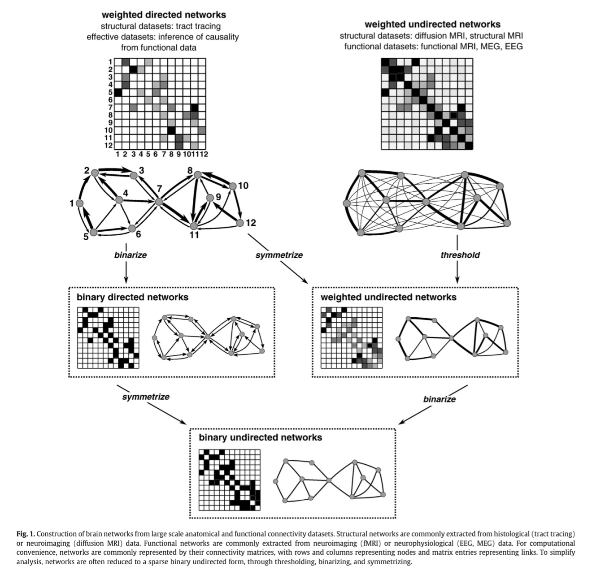

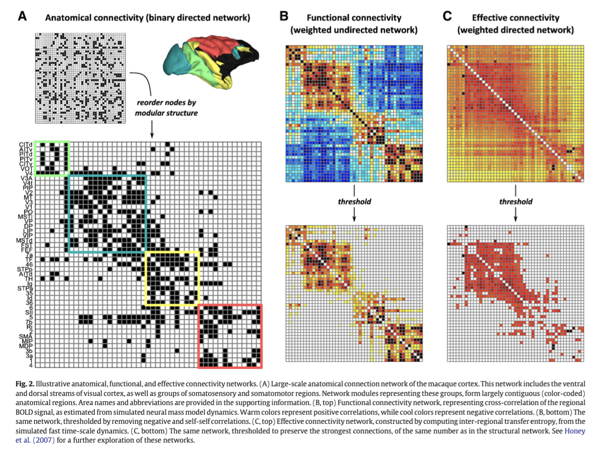

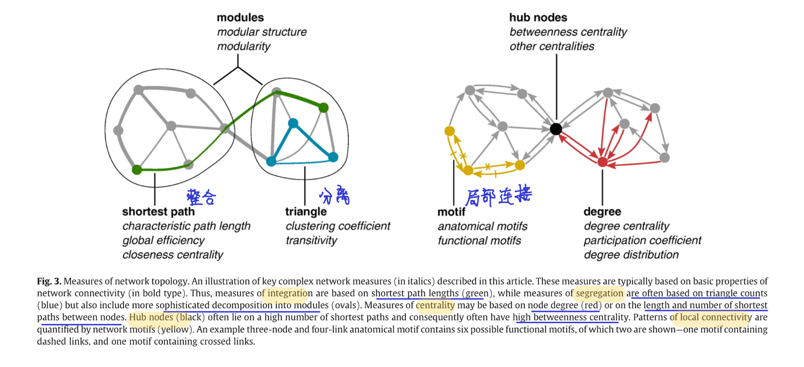

### 17. Decoding  EEG  by Visual-guided  Deep Neural  Networks

Decoding visual stimuli from brain activities is an interdisciplinary study of neuroscience and com- puter vision. With the emerging of Human-AI Col- laboration, Human-Computer Interaction, and the development of advanced machine learning mod- els, brain decoding based on deep learning attracts more attention. Electroencephalogram (EEG) is a widely used neurophysiology tool. Inspired by the success of deep learning on image representation and neural decoding, we proposed a visual-guided EEG decoding method that contains a decoding stage and a generation stage. In the classification stage, we designed a visual-guided convolutional neural network (CNN) to obtain more discrimina- tive representations from EEG, which are applied to achieve the classification results. In the genera- tion stage, the visual-guided EEG features are input to our improved deep generative model with a vi- sual consistence module to generate corresponding visual stimuli. With the help of our visual-guided strategies, the proposed method outperforms tradi- tional machine learning methods and deep learning models in the EEG decoding task.

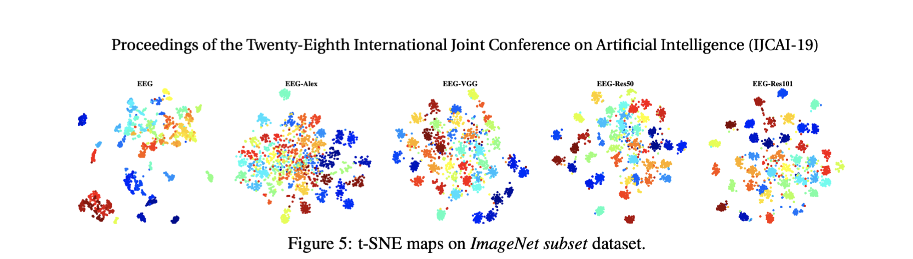

https://vimsky.com/article/4400.html

http://bindog.github.io/blog/2016/06/04/from-sne-to-tsne-to-largevis/

https://blog.csdn.net/xieshangxin/article/details/89682607

https://www.mathworks.com/help/stats/t-sne.html

https://www.mathworks.com/help/stats/visualize-high-dimensional-data-using-t-sne.html

https://distill.pub/2016/misread-tsne/

https://blog.csdn.net/xiaobian_/article/details/106131181?utm_medium=distribute.pc_aggpage_search_result.none-task-blog-2~all~first_rank_v2~rank_v25-15-106131181.nonecase

简单地理解，流形学习方法可以用来对高维数据降维，如果将维度降到2维或3维，我们就能将原始数据可视化，从而对数据的分布有直观的了解，发现一些可能存在的规律。

### 18. Multiclass Seizure Classification from EEG with Graph Convolutional Recurrent Neural Networks

#### Abstract

Traditionally, seizure classification from electroencephalogram (EEG) is performed by clinical experts’ visual analyses of EEG signals. Recent advances in deep learn- ing have enabled the development of automated seizure classification frameworks. Most of previous efforts on modeling EEG with deep learning utilized convolu- tional neural networks (CNNs) and/or recurrent neural networks (RNNs), ignoring the inherent graphical structure in EEG. In this paper, we propose to model the spatiotemporal dependencies in EEG data with a graph convolutional recurrent neural network. Specifically, the spatial dependency is characterized by graph convolutions on the EEG electrode graph, and the temporal dependency is captured by a recurrent neural network. We explore various graph structures, and show that our graph-based approach improves multiclass seizure classification compared to RNN or CNN-based methods.

#### Introduction

==Epileptic seizure is a transient occurrence of signs and symptoms due to abnormal excessive or synchronous neuronal activities in the brain==.Around 50 million people worldwide have epilepsy, making it one of the most common neurological diseases globally. Due to its unpredictable nature, patients with epilepsy and their family often suffer from low quality of life, stigma, and discrimination. However, it is estimated that up to 70% of people living with epilepsy could live seizure-free if properly diagnosed and treated [1]. 
The traditional method for epilepsy diagnosis and treatment is based on a clinical expert’s analysis of electroencephalogram (EEG) signals. However, seizure detection from time-series EEG signals is a challenging task that requires an experienced clinician’s knowledge and substantial amount of time. Classifying seizures into finer classes is even more challenging. ==In fact, it could take an experienced neurologist several hours to evaluate a single patient’s EEG record, not to mention the fact that EEG data is often collected over hours to days==[2]. As such, algorithms to automatically classify seizure types would be beneficial for overcoming the bottleneck in diagnosis of epilepsy and thus accelerating the clinical workflows. Automatic seizure type classification may also allow remote monitoring of patients, as well as timely diagnosis and treatment to improve patient care [3]. Although much effort has gone into developing seizure detection algorithms [4–6, 2], little has been done for seizure classification [7, 8].

Feature extraction from EEG signals is the most crucial step in building an automatic seizure classification system. Downstream classification task will benefit if the model can successfully extract features that capture discriminative characteristics of the neural patterns of different types of seizures. Previous works have used recurrent neural networks (RNNs) and/or convolutional neural networks (CNNs) to model EEG data [8, 9]. ==However, such methods either ignore spatial dependencies or assumes regular grid structures in EEG signals. In contrast, EEG signals are recorded from multiple electrodes placed on a patient’s scalp, and thus have an inherent graph structure. Hence, we hypothesize that a graph convolutional recurrent neural network would be better at capturing the spatiotemporal dependencies in EEG signals than CNNs or RNNs.==
In this study, we aim to develop a deep learning framework for multiclass seizure classification. We focus on the following seven common seizure classes: focal non-specific seizure (FN), generalized non-specific seizure (GN), simple partial seizure (SP), complex partial seizure (CP), absence seizure (AB), tonic seizure (TN) and tonic-clonic seizure (TC). We use graph convolutions [10, 11] to leverage the graph structure in EEG, and a recurrent neural network to capture the temporal dynamics. In the remainder of this paper, we use EEG electrodes, EEG channels and nodes interchangeably. 
Our main  contributions are as follows: 

- We  propose  to  model  the  EEG  signals  with  a  graph  convolutional  recurrent  neural  network, capturing  the spatial  and  temporal  dependencies  in EEG. 
- We investigate various graph structures, leveraging the physical structures in EEG electrodes and  correlations in  EEG signals. 
- We show that our graph-based models out-perform RNN or CNN-based models on the multiclass seizure classification task, demonstrating the benefits of modeling EEG data with graphs.

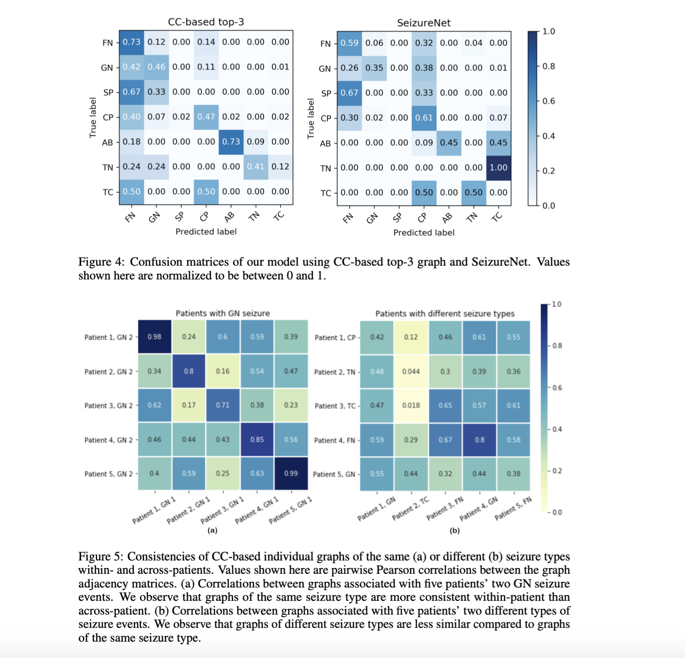

### 19. EEG-Based 3D Visual Fatigue Evaluation Using CNN

Abstract: Visual fatigue evaluation plays an important role in applications such as virtual reality since the visual fatigue symptoms always affect the user experience seriously. Existing visual evaluation methods require hand-crafted features for classification, and conduct feature extraction and classification in a separated manner. In this paper, we conduct a designed experiment to collect electroencephalogram (EEG) signals of various visual fatigue levels, and present a multi-scale convolutional neural network (CNN) architecture named MorletInceptionNet to detect visual fatigue using EEG as input, which exploits the spatial-temporal structure of multichannel EEG signals. Our MorletInceptionNet adopts a joint space-time-frequency features extraction scheme in which Morlet wavelet-like kernels are used for time-frequency raw feature extraction and inception architecture are further used to extract multi-scale temporal features. Then, the multi-scale temporal features are concatenated and fed to the fully connected layer for visual fatigue evaluation using classification. In experiment evaluation, we compare our method with five state-of-the-art methods, and the results demonstrate that our model achieve overally the best performance better performance for two widely used evaluation metrics, i.e., classification accuracy and kappa value. Furthermore, we use input-perturbation network-prediction correlation maps to conduct in-depth analysis into the reason why the proposed method outperforms other methods. The results suggest that our model is sensitive to the perturbation of β (14–30 Hz) and γ (30–40 Hz) bands. Furthermore, their spatial patterns are of high correlation with that of the corresponding power spectral densities which are used as evaluation features traditionally. This finding provides evidence of the hypothesis that the proposed model can learn the joint time-frequency-space features to distinguish fatigue levels automatically. 
Keywords:  EEG;  visual  fatigue; CNN

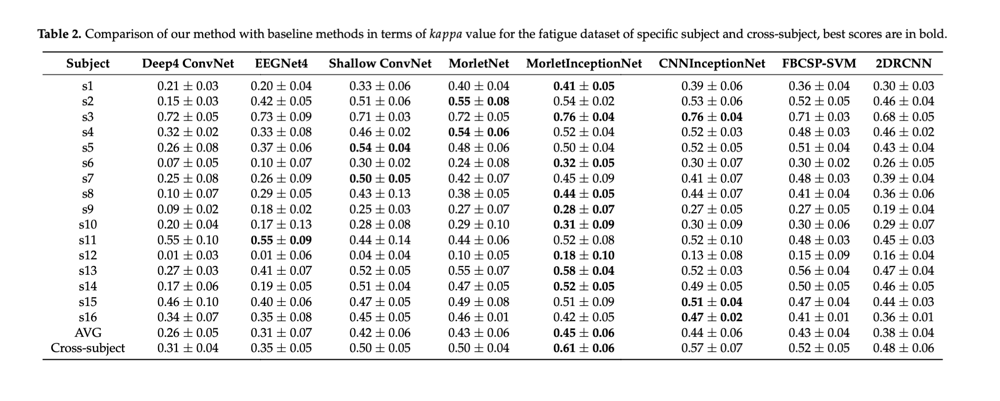

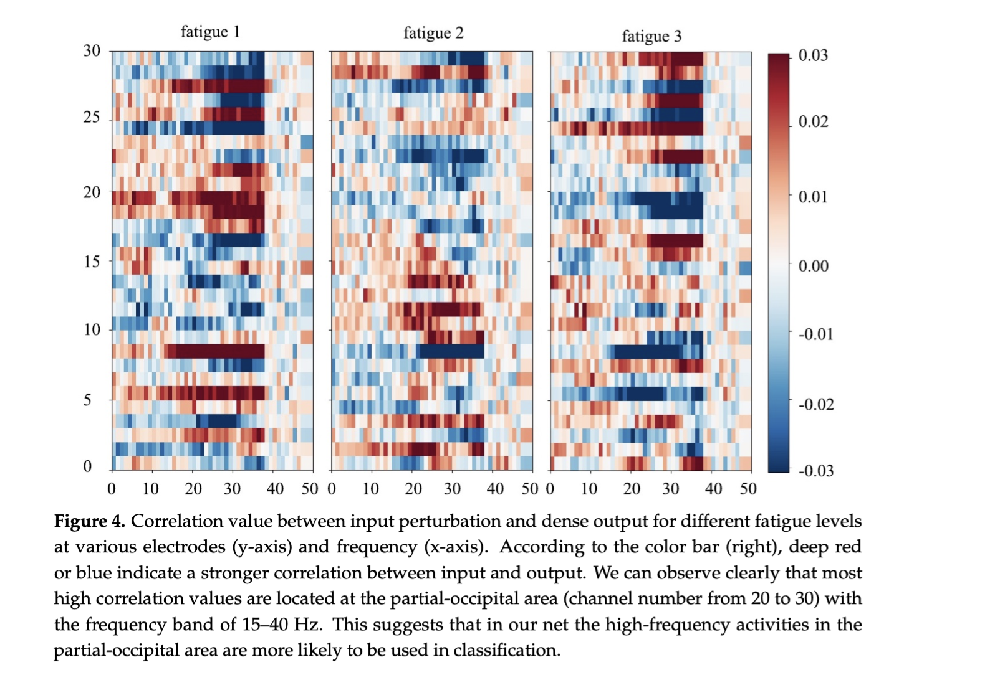

### 20. Novel functional brain network methods based on CNN with an application in proficiency evaluation

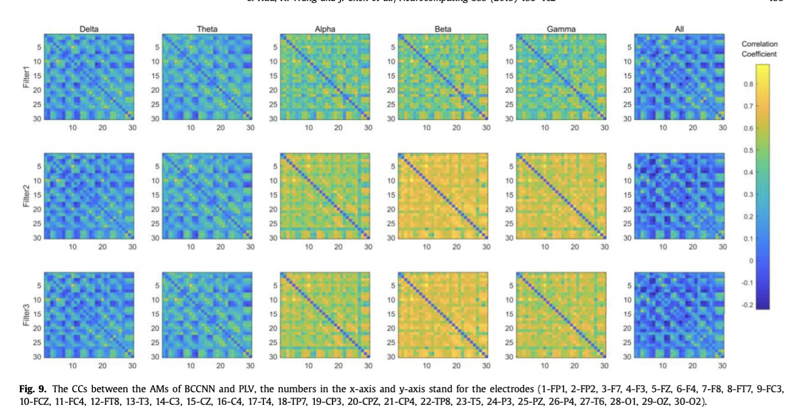

