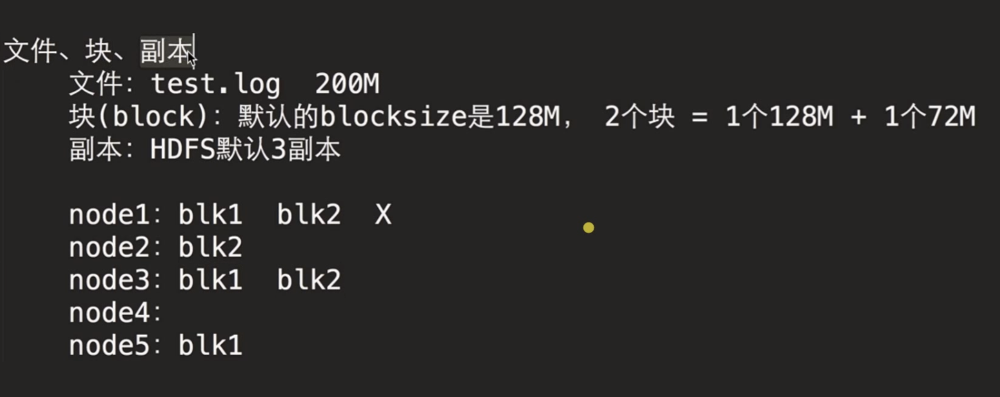
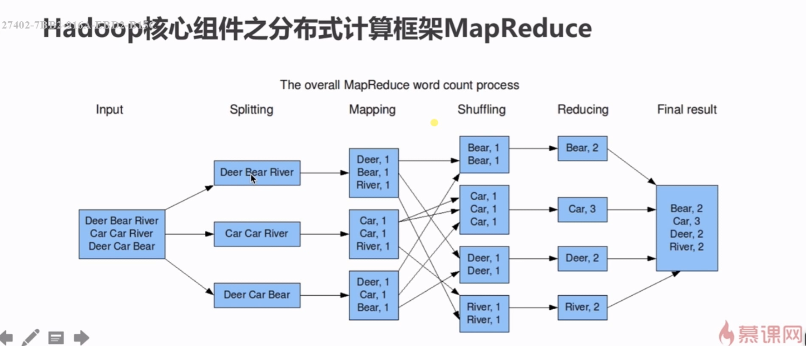
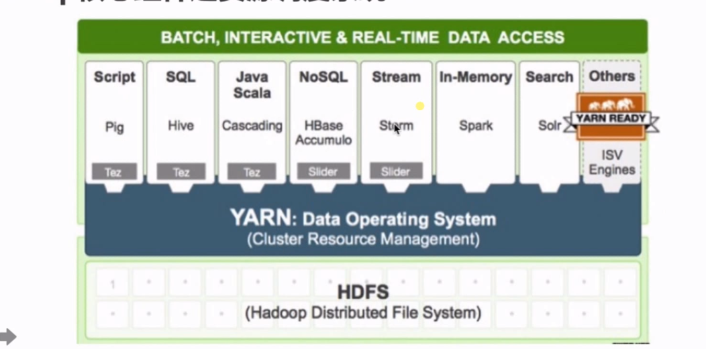
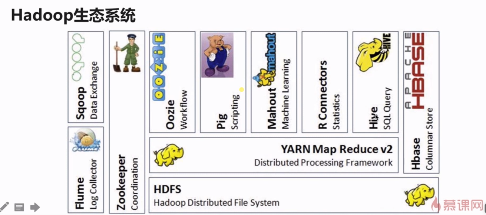
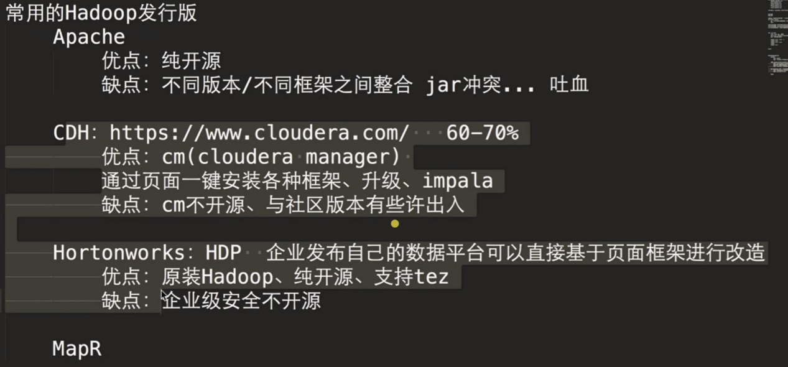
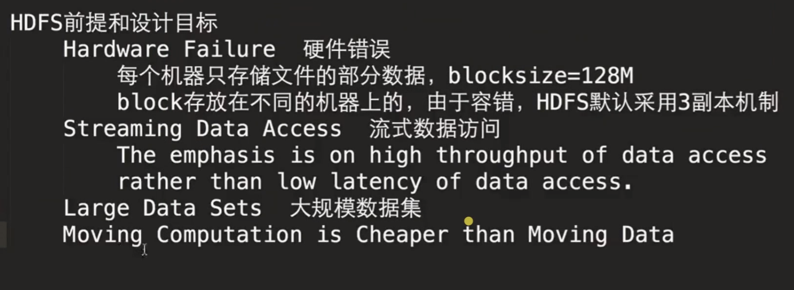
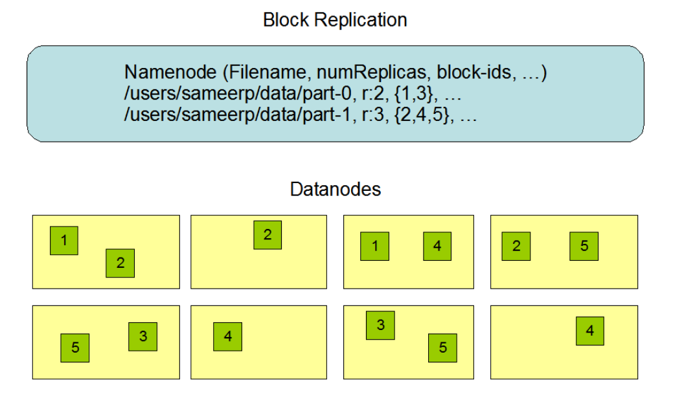
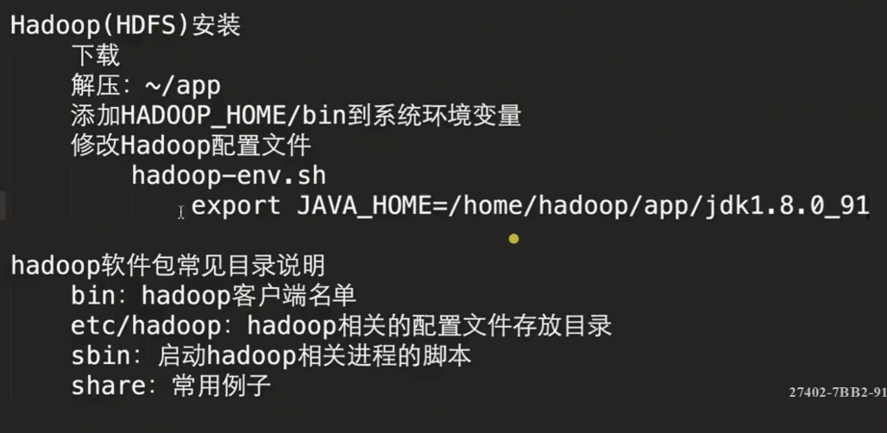

# 大数据入门——Hadoop基础

## 第一章 大数据基础

1. 大数据生态圈

   Hadoop生态圈、Spark生态圈

2. 课程安排

   

3. 大数据之4v特征

   - 数据量（Volunme）
   - 速度（Velocity）
   - 多样性，复杂性（Variety）
   - 基于高度分析的新价值（Value）

4. 大数据技术的概念

   

   

5. 如何对大数据进行存储和分析

   <center class="half">
      
   </center>

   Google只发表了技术论文，并没有开源代码，==一个模仿Google大数据技术的开源实现来了——Hadoop==。

   Hadoop有一个分布式文件系统：==HDFS==（Hadoop Distributed File System）

   YARN

6. 大数据的典型应用

   <center class="half">
       
   </center>


## 第二章 初识Hadoop 

### 1. Hadoop概述

Hadoop 提供分布式存储（一个文件被拆分成多个块，并且以副本的方式存储在各个节点中）和计算，是一个分布式的基础架构，用户可以在不了解分布式底层结构细节的情况下使用。

Hadoop contains：


### 2. Hadoop 核心组件之HDFS(存储)

- 源自于Google的GFS论文
- MapReduce是GFS的克隆版
- Hadoop特点：扩展性*&*容错性*&*海量数据存储

#### 工作机制：

- 将文件切分成指定大小的数据块，并以多副本的形式存储在多个机器上

  如下例，当node1挂掉后，blk1,blk2仍然存在

  

- 数据切分、多副本、容错等操作是用户透明的

### 3.  Hadoop 核心组件之MapReduce(计算)

- 源自于Google的MapReduce论文
- MapReduce是Google MapReduce的克隆版
- MapReduce特点：扩展性*&*容错性*&*海量数据离线处理



### 4. Hadoop 核心组件之YARN(资源调动)

- YARN：Yet Another Resource Negotiator

- 负责整个集群资源的管理和调度

- YARN特点：扩展性*&*容错性*&*多框架资源统一调度

  

### 5. Hadoop 优势

- 高可靠性
  - 数据存储：数据块多副本(容错，一个node挂掉后，block在其它节点还有)
  - 数据计算：一个node挂掉后，重新调度作业计算
- 高扩展性
  - 存储/计算资源不够时，可以横向线性扩展机器
  - 一个集群中可以包含数千的节点
- 其他
  - 存储在廉价机上，降低成本（去IoE）
  - 成熟的生态圈

### 6. Hadoop生态圈

<center class="half">
   
</center>




**生态系统的特点：**

- 开源、社区活跃
- 囊括了大数据处理的方方面面
- 是成熟的生态圈

### 7. Hadoop发行版选型




## 第三章 分布式文件系统HDFS

#### 1. 概述

<a href="https://hadoop.apache.org/docs/stable/hadoop-project-dist/hadoop-hdfs/HdfsDesign.html">HDFS Architecture</a>


#### 2. HDFS前提和目标




#### 3. HDFS架构*****

HDFS has a master/slave architecture. An HDFS cluster consists of a  single NameNode, a master server that manages the file system namespace  and regulates access to files by clients. In addition, there are a  number of DataNodes, usually one per node in the cluster, which manage  storage attached to the nodes that they run on. HDFS exposes a file  system namespace and allows user data to be stored in files. Internally, a file is split into one or more blocks and these blocks are stored in a set of DataNodes. The NameNode executes file system namespace  operations like opening, closing, and renaming files and directories. It also determines the mapping of blocks to DataNodes. The DataNodes are  responsible for serving read and write requests from the file system’s  clients. The DataNodes also perform block creation, deletion, and  replication upon instruction from the NameNode.

- NameNode(master) and DataNode(slave)

- master/slave的架构

- NN：

  ​        the file system namespace

  ​					/home/hadoop/software

  ​												/app

  ​		regulates access to files by clients

- DN: storage

- HDFS exposes a file  system namespace and allows user data to be stored in files

- a file is split into one or more blocks.

  blocksize:128M

  150M拆成2个block

- blocks are stored in a set of DataNodes（为了容错）

- NameNode executes file system namespace  operations：CRUD

- determines the mapping of blocks to DataNodes.

  a.txt  150M blocksize=128M

  a.txt 拆分成2个block block1=128M,block2=22M

  block1、block2存放在哪个DN？NN会保存拆分在哪个DN，信息如下：

  

  a.txt  

  ​		block1: 128M,192.168.199.1

  ​		block1:   22M,192.168.199.2

  get a.txt

- 拆分和合并信息的过程对用户来说是不感知的

  

#### 4. The File System Namespace

HDFS supports a traditional hierarchical file organization. A user or an application can create directories and store files inside these  directories. The file system namespace hierarchy is similar to most  other existing file systems; one can create and remove files, move a  file from one directory to another, or rename a file. HDFS supports [user quotas](https://hadoop.apache.org/docs/stable/hadoop-project-dist/hadoop-hdfs/HdfsQuotaAdminGuide.html) and [access permissions](https://hadoop.apache.org/docs/stable/hadoop-project-dist/hadoop-hdfs/HdfsPermissionsGuide.html). HDFS does not support hard links or soft links. However, the HDFS architecture does not preclude implementing these features.

While HDFS follows [naming convention of the FileSystem](https://hadoop.apache.org/docs/stable/hadoop-project-dist/hadoop-common/filesystem/model.html#Paths_and_Path_Elements), some paths and names (e.g. `/.reserved` and `.snapshot` ) are reserved. Features such as [transparent encryption](https://hadoop.apache.org/docs/stable/hadoop-project-dist/hadoop-hdfs/TransparentEncryption.html) and [snapshot](https://hadoop.apache.org/docs/stable/hadoop-project-dist/hadoop-hdfs/HdfsSnapshots.html) use reserved paths.

The NameNode maintains the file system namespace. Any change to the  file system namespace or its properties is recorded by the NameNode. An  application can specify the number of replicas of a file that should be  maintained by HDFS. The number of copies of a file is called the  replication factor of that file. This information is stored by the  NameNode.

#### 5. Data Replication

HDFS is designed to reliably store very large files across machines  in a large cluster. It stores each file as a sequence of blocks. The  blocks of a file are replicated for fault tolerance. The block size and  replication factor are configurable per file.

All blocks in a file except the last block are the same size, while  users can start a new block without filling out the last block to the  configured block size after the support for variable length block was  added to append and hsync.

An application can specify the number of replicas of a file. The  replication factor can be specified at file creation time and can be  changed later. Files in HDFS are write-once (except for appends and  truncates) and have strictly one writer at any time.

The NameNode makes all decisions regarding replication of blocks. It  periodically receives a Heartbeat and a Blockreport from each of the  DataNodes in the cluster. Receipt of a Heartbeat implies that the  DataNode is functioning properly. A Blockreport contains a list of all  blocks on a DataNode.




#### 6. Linux <a href="http://archive.cloudera.com/cdh5/cdh/5/hadoop-2.6.0-cdh5.9.3/hadoop-project-dist/hadoop-common/SingleCluster.html">Hadoop安装</a>

**Required Software** 

Required software for Linux include:

1. Java™ must be installed. Recommended Java versions are described at [ HadoopJavaVersions](http://wiki.apache.org/hadoop/HadoopJavaVersions).
2. ssh must be installed and sshd must be running to use the Hadoop scripts that manage remote Hadoop daemons.

**安装**

###### 6.1 Java安装

- 解压安装包到 ~/app

- 设置 JAVA_HOME

  到根目录下执行：

  ```shell
  $ vi .bash_profile
  ```

  设置 JAVA_HOME

  ```
  export JAVA_HOME=/home/cxy/Hdp/app/jdk1.8.0_231
  export PATH=$JAVA_HOME/bin:$PATH
  ```

  保存退出，使设置生效：

  ```shell
  $ source .bash_profile
  ```

  测试：

  ```shell
  $ cd $JAVA_HOME
  or
  $ java -version
  ```

###### 6.2  ssh免密登陆 

If your cluster doesn't have the requisite software you will need to install it.

For example on Ubuntu Linux:

```
  $ sudo apt-get install ssh
  $ sudo apt-get install rsync
```

`$ ssh localhost或者 $ ssh 主机名` （`$ exit退出`）都会要求输入密码，使得有些交互无法进行，故需要设置免密登陆。

免密配置：

```shell
$ ssh-keygen -t rsa
```

一路回车或yes

```shell
$ ls -a //-a查看隐藏文件夹，.开头的是隐藏文件夹
$ cd .ssh
$ ls
id_rsa  id_rsa.pub  known_hosts
$ ll
-rw-------  1 cxy cxy 1679 11月 29 19:16 id_rsa  私钥
-rw-r--r--  1 cxy cxy  389 11月 29 19:16 id_rsa.pub 公钥
-rw-r--r--  1 cxy cxy 2354 11月 29 19:15 known_hosts

$ cat id_rsa.pub >> authorized_keys //复制id_rsa.pub 到 authorized_keys
$ chmod 600 authorized_keys //设置权限

/**测试**/
$ ssh Cxy  //不用输密码了
```

###### 6.3 Hadoop安装



- 下载：http://archive.cloudera.com/cdh5/cdh/5/

  ​           hadoop-2.6.0-cdh5.9.3.tar.gz   hive-1.1.0-cdh5.9.3.tar.gz

- 解压到 ： ~/app

- **配置：**

  1)  **etc/hadoop-env.sh**

  ```
    # set to the root of your Java installation
    export JAVA_HOME=/usr/java/latest
  
    # Assuming your installation directory is /usr/local/hadoop
    export HADOOP_PREFIX=/usr/local/hadoop
  ```

  修改Hadoop配置文件, 添加HADOOP_HOME/bin到系统环境变量

  ```shell
  $ vi ~/app/hadoop-2.6.0-cdh5.9.3/etc/hadoop/hadoop-env.sh
  $ echo $JAVA_HOME //查看$JAVA_HOME（Linux系统自带Java）
  ```

  为了防止自动获取JAVA_HOME失败，手动添加。将原来的`export JAVA_HOME=${JAVA_HOME}`语句注释掉，改为(后面的地址写自己的JAVA_HOME地址)：

  ```shell
  export JAVA_HOME=/home/cxy/Hdp/app/jdk1.8.0_231
  ```

  2)  **etc/hadoop/core-site.xml**

  将下面<configuration></configuration>里的内容存到配置文件的<configuration></configuration>里

  ```
  <configuration>
      <property>
          <name>fs.defaultFS</name>
          <value>hdfs://localhost:8020</value>
      </property>
  </configuration>
  ```

  3) **etc/hadoop/hdfs-site.xml**

  ```
  <configuration>
      <property>
          <name>dfs.replication</name>
          <value>1</value>
      </property>
      
      <property>
          <name>hadoop.tmp.dir</name>
          <value>/home/cxy/Hdp/app/tmp</value>
      </property>
      
  </configuration>
  ```

  注：第二个属性中/home/cxy/Hdp/app/tmp路径用来存放临时文件，因为hadoop.tmp.dir的默认路径...tmp重启会被清空

  4)  **etc/hadoop/slaves**

  ```shell
  $ vi slaves
  ```

  将localhost改为你的主机名

  5) 到根目录下将Hadoop配置到环境变量

  ```shell
  $ vi ~/.bash_profile
  ```

  输入：

  ```
  export HADOOP_HOME=/home/cxy/Hdp/app/hadoop-2.6.0-cdh5.9.3
  export PATH=$HADOOP_HOME/bin:$PATH
  ```

  `:x`或`:wq`保存退出

  ```shell
   $ source ~/.bash_profile
  ```

  以上配置完成后，第一次启动Hadoop必须要格式化，格式化不要重复执行

  ```shell
  $ cd $HADOOP_HOME/bin
  $ hdfs namenode -format //格式化
  ```

  如果格式化没报错则配置完成

  ###### 6.4 启动集群

  执行$HADOOP_HOME/sbin/start-dfs.sh

  ```shell
  $ ./start-dfs.sh
  ```

  提示输入yes

  ```shell
  $ jps
  21364 DataNode
  28201 Jps
  21023 NameNode
  ```

  DataNode，NameNode创建成功，启动成功

