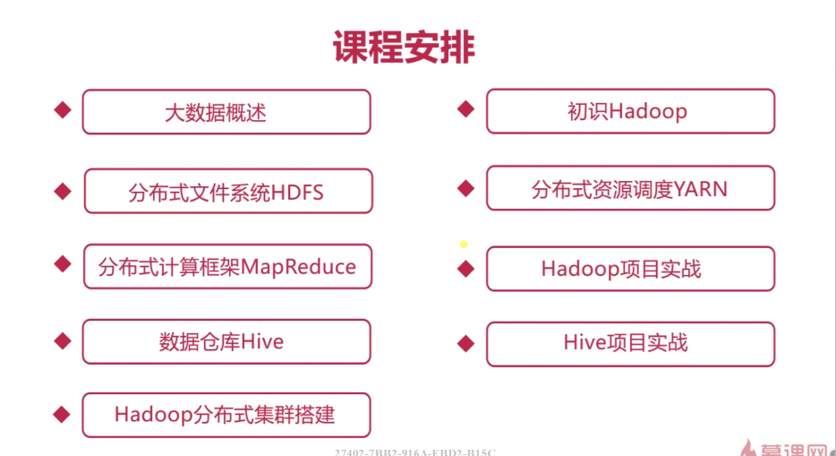
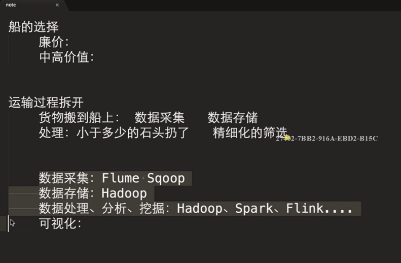
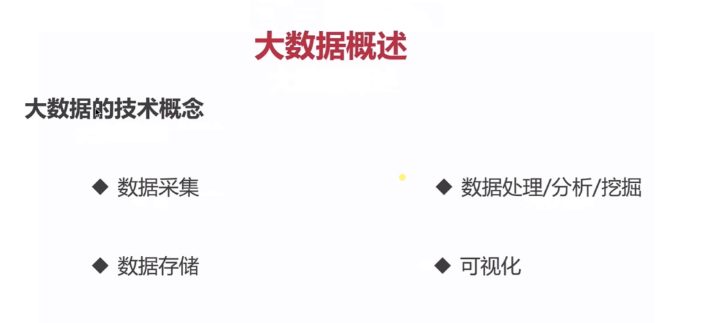
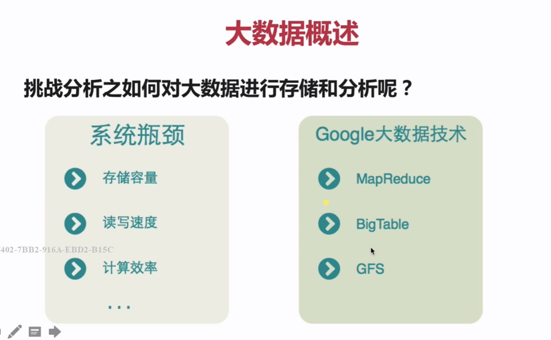
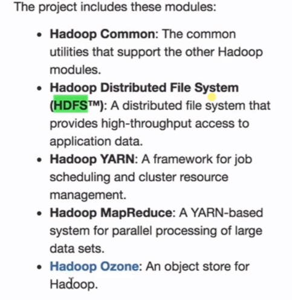

# 大数据入门——Hadoop基础

## 第一章 大数据基础

1. 大数据生态圈

   Hadoop生态圈、Spark生态圈

2. 课程安排

   

3. 大数据之4v特征

   - 数据量（Volunme）
   - 速度（Velocity）
   - 多样性，复杂性（Variety）
   - 基于高度分析的新价值（Value）

4. 大数据技术的概念

   

   

5. 如何对大数据进行存储和分析

   

      
   

   Google只发表了技术论文，并没有开源代码，==一个模仿Google大数据技术的开源实现来了——Hadoop==。

   Hadoop有一个分布式文件系统：==HDFS==（Hadoop Distributed File System）

   YARN

6. 大数据的典型应用

   

       
   

## 第二章 初识Hadoop 

### 1. Hadoop概述

Hadoop 提供分布式存储（一个文件被拆分成多个块，并且以副本的方式存储在各个节点中）和计算，是一个分布式的基础架构，用户可以在不了解分布式底层结构细节的情况下使用。

Hadoop contains：

### 2.

## 第三章