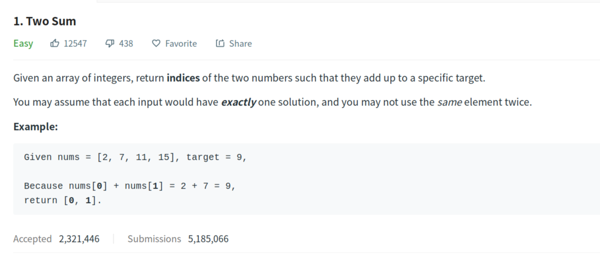
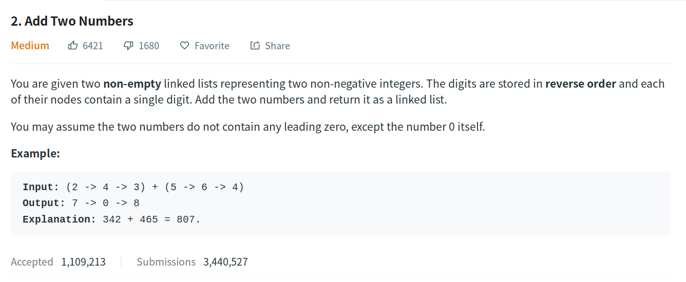
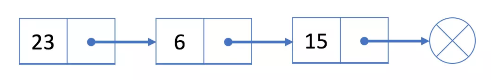
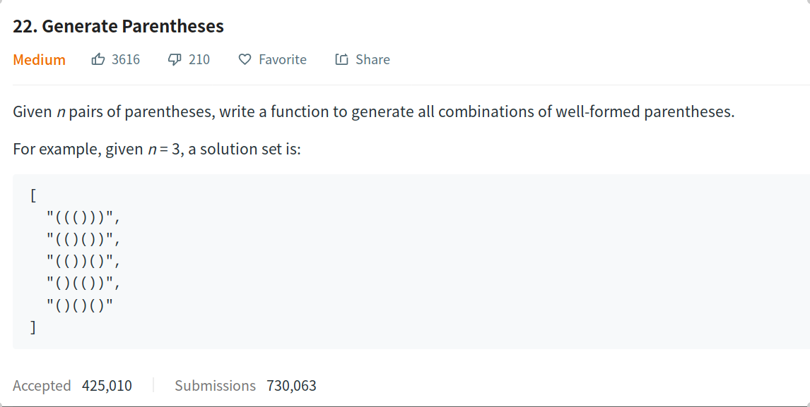

## 1. Two sum



```java
import java.util.HashMap;
class Soulution {
    public int[] twoSum(int[] nums, int target) 
	{
		HashMap<Integer,Integer> map = new HashMap<>();
		int[] res = new int[2];
		
		for(int i=0;i<=nums.length-1;i++)
		{
			map.put(nums[i], i);//存放键值对
			int t = target - nums[i];
			if(map.containsKey(t) && (map.get(t)!=i))
			{
				res[0] = map.get(t);//通过键拿值
				res[1] = i;
			}
		}
		return res;
	}
}
```

## 2. Add Two Numbers



**链表简介:**

- 单链表中的每个结点不仅包含值，**还包含链接到下一个结点的引用字段**。



- 与数组不同，我们无法在常量时间内访问单链表中的随机元素。

  如果我们想要获得第 i 个元素，我们**必须从头结点逐个遍历**。 我们按索引来访问元素平均要花费 O(N) 时间，其中 N 是链表的长度。

- 如果我们想在给定的结点 prev 之后添加新值，我们应该：

  - 使用给定值初始化新结点 cur；
  - 将 cur 的“next”字段链接到 prev 的下一个结点 next；
  - 将 prev 中的“next”字段链接到 cur 。

  与数组不同，我们**不需要将所有元素移动到插入元素之后**,因此，您可以在 O(1) 时间复杂度中将新结点插入到链表中，这非常高效。

- 如果我们想从单链表中删除现有结点 cur，可以分两步完成：
  - 找到 cur 的上一个结点 prev 及其下一个结点 next；
  - 接下来链接 prev 到 cur 的下一个节点 next。
  - 第一步中，我们需要找出 prev 和 next。使用 cur 的参考字段很容易找出 next，但是，我们必须从头结点遍历链表，以找出 prev，它的平均时间是 O(N)，其中 N 是链表的长度。因此，删除结点的时间复杂度将是 O(N)。
  - 空间复杂度为 O(1)，因为我们只需要常量空间来存储指针。

- 设计链表的实现。您可以选择使用单链表或双链表。

  单链表中的节点应该具有两个属性：val 和 next。 

  - val 是当前节点的值

- - next 是指向下一个节点的指针/引用

如果要使用双向链表，则还需要一个属性 prev 以指示链表中的上一个节点。假设链表中的所有节点都是 0-index 的


- get(index)：获取链表中第 index 个节点的值。如果索引无效，则返回-1。

- addAtHead(val)：在链表的第一个元素之前添加一个值为 val 的节点。插入后，新节点将成为链表的第一个节点。

- addAtTail(val)：将值为 val 的节点追加到链表的最后一个元素。

- addAtIndex(index,val)：在链表中的第 index 个节点之前添加值为 val  的节点。如果 index 等于链表的长度，则该节点将附加到链表的末尾。如果 index 大于链表长度，则不会插入节点。

- deleteAtIndex(index)：如果索引 index 有效，则删除链表中的第 index 个节点


## 22. Generate Parentheses




