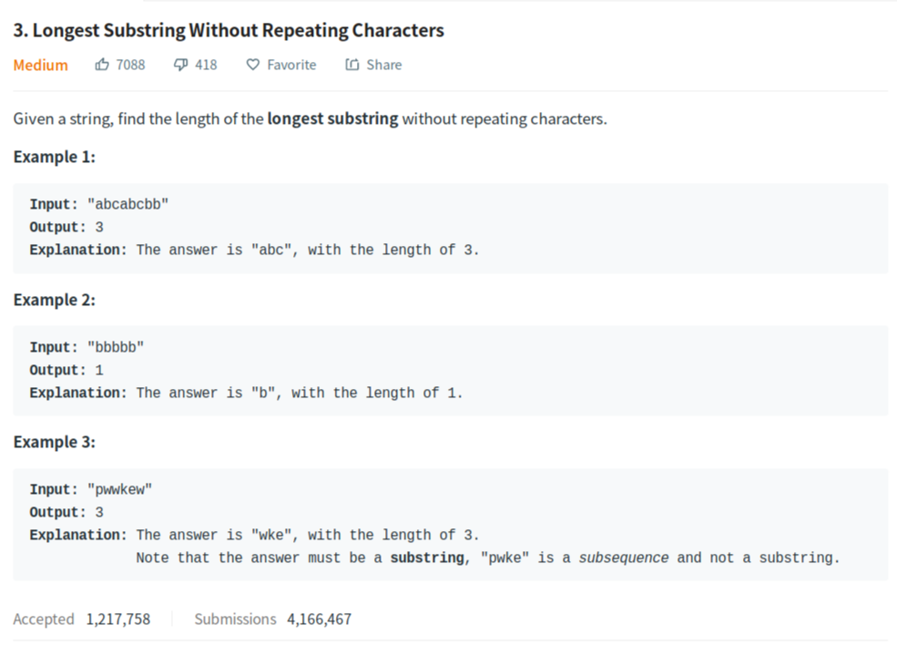
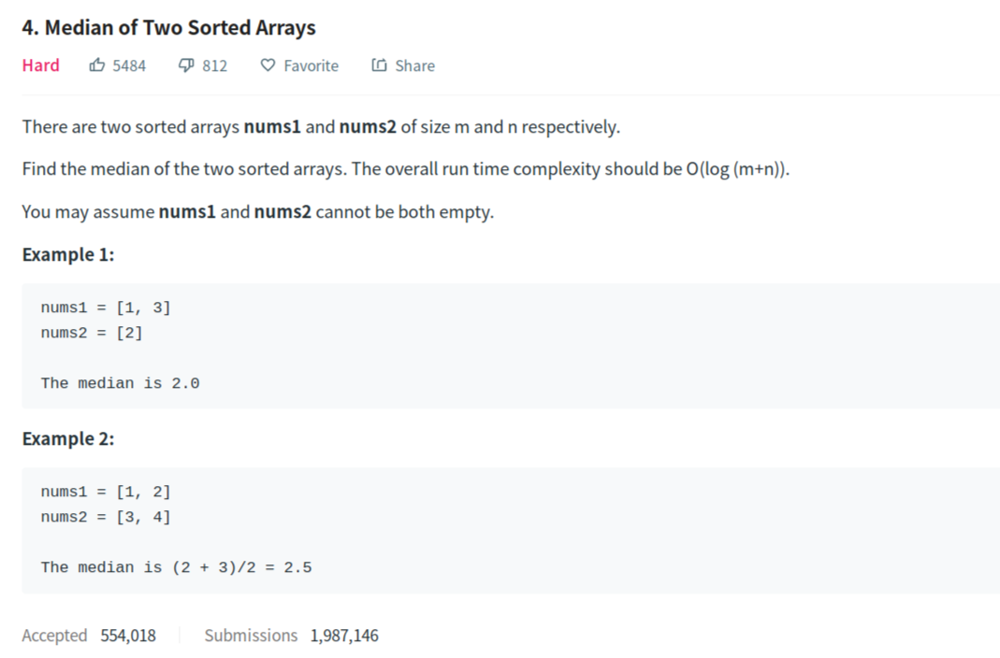

## 1. Two sum


```java
public class Solution {
    public int[] twoSum(int[] nums, int target) {
        HashMap<Integer, Integer> m = new HashMap<Integer, Integer>();
        int[] res = new int[2];
        for (int i = 0; i < nums.length; ++i) {
            if (m.containsKey(target - nums[i])) {
                res[1] = i;
                res[0] = m.get(target - nums[i]);
                break;
            }
            m.put(nums[i], i);
        }
        return res;
    }
}
```

## 2. Add Two Numbers


**链表简介:**

- 单链表中的每个结点不仅包含值，**还包含链接到下一个结点的引用字段**。


- 与数组不同，我们无法在常量时间内访问单链表中的随机元素。

  如果我们想要获得第 i 个元素，我们**必须从头结点逐个遍历**。 我们按索引来访问元素平均要花费 O(N) 时间，其中 N 是链表的长度。

- 如果我们想在给定的结点 prev 之后添加新值，我们应该：

  - 使用给定值初始化新结点 cur；
  - 将 cur 的“next”字段链接到 prev 的下一个结点 next；
  - 将 prev 中的“next”字段链接到 cur 。

  与数组不同，我们**不需要将所有元素移动到插入元素之后**,因此，您可以在 O(1) 时间复杂度中将新结点插入到链表中，这非常高效。

- 如果我们想从单链表中删除现有结点 cur，可以分两步完成：
  - 找到 cur 的上一个结点 prev 及其下一个结点 next；
  - 接下来链接 prev 到 cur 的下一个节点 next。
  - 第一步中，我们需要找出 prev 和 next。使用 cur 的参考字段很容易找出 next，但是，我们必须从头结点遍历链表，以找出 prev，它的平均时间是 O(N)，其中 N 是链表的长度。因此，删除结点的时间复杂度将是 O(N)。
  - 空间复杂度为 O(1)，因为我们只需要常量空间来存储指针。

- 设计链表的实现。您可以选择使用单链表或双链表。

  ==单链表中的节点应该具有两个属性：val 和 next==。 

  - val 是当前节点的值

- - next 是指向下一个节点的指针/引用

如果要使用==双向链表==，则还需要一个属性 prev 以指示链表中的上一个节点。假设链表中的所有节点都是 0-index 的


- get(index)：获取链表中第 index 个节点的值。如果索引无效，则返回-1。

- addAtHead(val)：在链表的第一个元素之前添加一个值为 val 的节点。插入后，新节点将成为链表的第一个节点。

- addAtTail(val)：将值为 val 的节点追加到链表的最后一个元素。

- addAtIndex(index,val)：在链表中的第 index 个节点之前添加值为 val  的节点。如果 index 等于链表的长度，则该节点将附加到链表的末尾。如果 index 大于链表长度，则不会插入节点。

- deleteAtIndex(index)：如果索引 index 有效，则删除链表中的第 index 个节点


```java
/**
 * Definition for singly-linked list.
 * public class ListNode {
 *     int val;
 *     ListNode next;
 *     ListNode(int x) { val = x; }
 * }
 */
public class Solution {
    public ListNode addTwoNumbers(ListNode l1, ListNode l2) {
        ListNode dummy = new ListNode(-1);
        ListNode cur = dummy;//link to head
        int carry = 0;
        while (l1 != null || l2 != null) {
            int d1 = l1 == null ? 0 : l1.val;
            int d2 = l2 == null ? 0 : l2.val;
            int sum = d1 + d2 + carry;
            carry = sum >= 10 ? 1 : 0;
            cur.next = new ListNode(sum % 10);
            cur = cur.next;
            if (l1 != null) l1 = l1.next;
            if (l2 != null) l2 = l2.next;
        }
        if (carry == 1) cur.next = new ListNode(1);
        return dummy.next;
    }
}
```

注：

- 不要把ListNode写成ListNote;
- 创建list need creat a head at first,then return this head.

## 3. Longest Substring Without Repeating Characters



```java
class Solution {
    public int lengthOfLongestSubstring(String s) {
        int n = s.length(),res = 0;
        Map<Character,Integer> map = new HashMap<>();
        for(int i=0,j=0;j<n;j++){
            if(map.containsKey(s.charAt(j)))
                i = Math.max(map.get(s.charAt(j)),i);
            
            res = Math.max(res,j-i+1);
            map.put(s.charAt(j),j+1);
        }
        return res;
    }
}
```

## 4. Median of Two Sorted Arrays



```java
class Solution {
    public double findMedianSortedArrays(int[] nums1, int[] nums2) {
        int N = nums1.length + nums2.length;
        int[] nums = new int[N];
        System.arraycopy(nums1, 0, nums,0,nums1.length);
        System.arraycopy(nums2, 0, nums, nums1.length,nums2.length);
        
        int temp = 0;
        double res = 0.0;
        
        for(int i=0;i<N;i++){
            for(int j=0;j<N-1;j++){
                if(nums[j]>nums[j+1]){
                    temp = nums[j];
                    nums[j] = nums[j+1];
                    nums[j+1] = temp;
                }   
            }
        }
        
        res = N%2==0 ? (nums[N/2-1] + nums[N/2])/2.0 : nums[N/2];
        
        return res; 
    }
}
```


## 5.

## 6.

## 7.

## 8.

## 9.

## 10.

## 11.h

## 22. Gener2ate Parentheses


