[TOC]

# 1. mplayer

- 安装

  用Ctrl+Alt+T或者直接鼠标右键打开一个终端

  输入指令下载安装mplayer

  ```
  $ sudo apt-get install mplayer
  ```

  安装完成后，输入指令,查看是否安装成功。

  ```
  $ mplayer
  ```

  好了，现在，我们就可以找到要播放的视频，查看一下视频所在路径


- 使用

  1.  播放

     ```
     $ mplayer 视频路径
     ```

  2.  快捷键

     ```
     [: 以0.1的步长减速
     ]: 以0.1的步长加速
     shift + [ : 以0.5的步长减速
     shift + ] : 以0.5的步长加速
     ```


# 2. anaconda + opencv + tensorflow

1. 安装anaconda

   在官网下载安装包，然后cd到安装包路径

   ```
   $ bash Anaconda3-5.3.1-Linux-x86_64.sh
   ```

   安装时可同意安装python和vscode

   **测试：** $ anaconda-navigator

2. 安装tensorflow

   anaconda-navigator中新建一个环境，在环境中安装tensorflow

3. 安装opencv

   一定要先安装opencv的依赖库：

   ```
   sudo apt-get install build-essential
   sudo apt-get install cmake git libgtk2.0-dev pkg-config libavcodec-dev libavformat-dev libswscale-dev
   sudo apt-get install python-dev python-numpy libtbb2 libtbb-dev libjpeg-dev libpng-dev libtiff-dev libjasper-dev libdc1394-22-dev
   ```

   在环境中安装opencv

4. vscode配置

   先新建工作环境，再配置debug，选择当前环境下的python为编译器

5. opencv报错解决

   1. 路径问题

   ```
   cv2.error: OpenCV(3.4.3) /io/opencv/modules/highgui/src/window.cpp:356: error: (-215:Assertion failed) size.width>0 && size.height>0 in function 'imshow'
   ```

   解决：注意路径为/home/cxy/... 

   2. 权限问题

      ```
      Cannot connect to X server :0.0
      ```

      - DISPLAY not set in the environment.
         **Solution**: 

        ```
        $ export DISPLAY=:0.0
        ```

      - Non-Authorised User trying to run the X Application
         **Solution** ( as X owning user, ie: yourself )

        ```
        $ xhost +$HOSTNAME
        ```

# 3. Java + IntelliJ

### Ubuntu

- #### Java

  1. 下载 Java <a href="https://www.oracle.com/technetwork/java/javase/downloads/jdk8-downloads-2133151.html">安装包</a>

  2. 解压并移动至/usr/local

     ```shell
     $ sudo mv jdk-8u231-linux-x64 /usr/local
     ```

  3. 配置环境

     使用如下命令打开~/.bashrc文件

     ```shell
     $ gedit ~/.bashrc
     ```

     在文件末尾加上Java信息

     ```shell
     export JAVA_HOME=/usr/local/jdk-8u231-linux-x64/jdk1.8.0_231
     export JRE_HOME=${JAVA_HOME}/jre
     export CLASSPATH=.:${JAVA_HOME}/lib:${JRE_HOME}/lib
     export PATH=${JAVA_HOME}/bin:$PATH
     ```

  4. 使用source命令使配置立即生效

     ```shell
     $ source ~/.bashrc
     ```

  5. 测试

     ```shell
     $ java -version
     ```

- #### IntelliJ

  1. 在官网下载<a href="https://www.jetbrains.com/idea/download/#section=linux">linux安装包</a>

  2. 解压到安装目录

  3. 安装包的bin目录下打开终端，执行：
  
     ```
      sh ./idea.sh
     ```
  
  4. <a href="https://zhile.io/2018/08/17/jetbrains-license-server-crack.html">激活</a>
  
     <a href="https://www.jetbrains.com/shop/eform/students">学生免费激活使用 </a>
  
  5. 设置部分自己视情况而定
  
     
  

#### **IntelliJ 配置**

- 鼠标滚轮放大字体

  Editor --> Genneral --> Mouse -->change fontsize(Zoom)....

- 鼠标悬浮提示

  Editor --> Genneral -->Show quick documentation on mouse move

- 自动导包

  Insert imports on paste:All

  Editor --> Genneral -->auto Import -->选择：

  Add unambiguous imports on the fly
  Optimize imports on the fly(for current project)

- 显示分隔符

  Editor --> Genneral -->Apperence-->Show method separators

- 设置取消单行显示tabs的操作

  Editor --> Genneral -->Editor Tabs -->取消勾选Show tabs in one row

- 注解

  Editor  -->File and Code Templates --> Include -->File Header -->输入：

  ```java
  /**
      @author cxy
      @create ${YEAR}-${MONTH}-${DAY}-${TIME}
  */
  ```

- 更改编码方式

  Editor --> Genneral -->Code Style -->File Encoding-->全部改为UTF-8

  勾选Transparent native-to-ascii conversion

- 自动编译

  Build,Execution,Deployment --> Compiler -->勾选

  Compile independent modules in parallel 
  Rebuild module on dependency change

### Mac

##### 安装

1. 在<a href="https://www.oracle.com/java/technologies/javase/javase-jdk8-downloads.html">官网</a>下载jdk1.8安装包

   需要登陆，账号为邮箱

   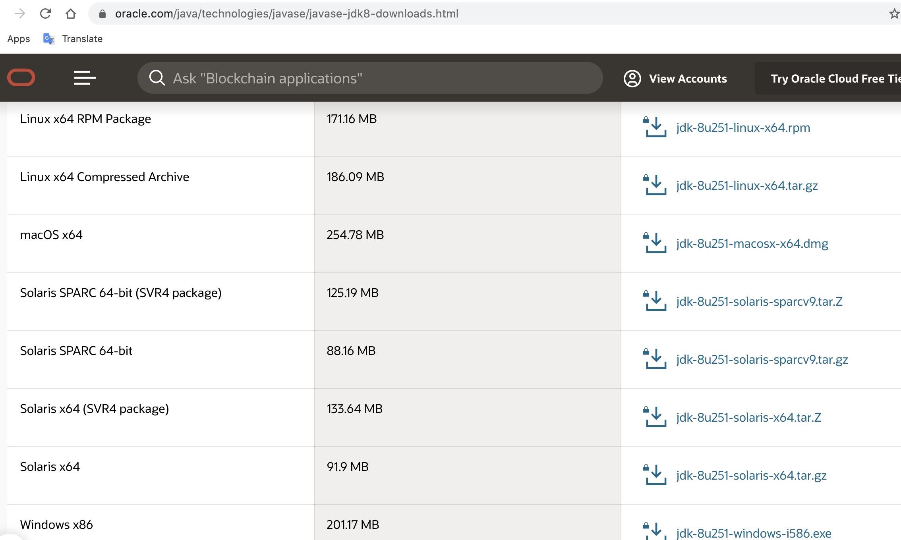

2. 安装jdk

   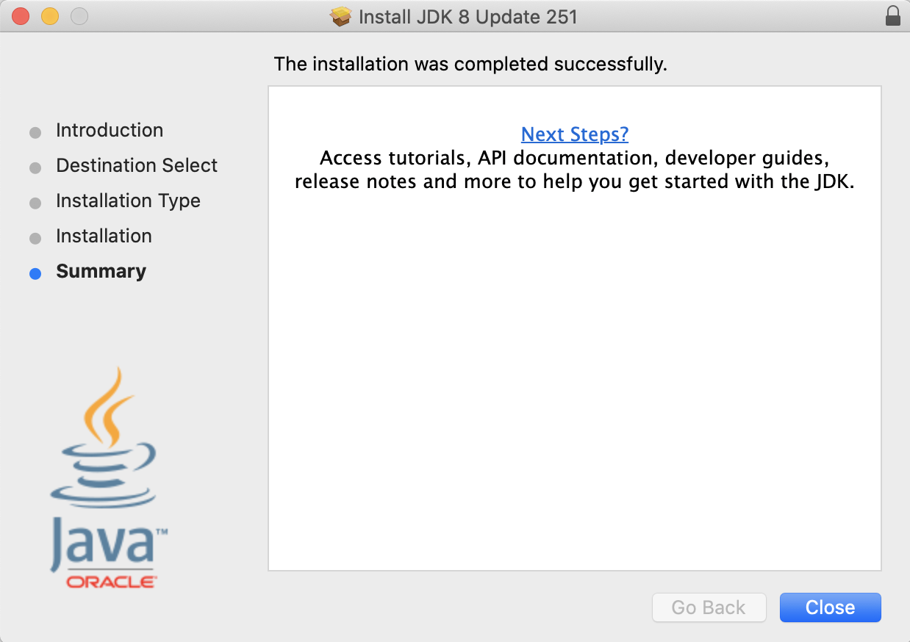

3. 如果不能安装，请打开Mac的安装权限，再重新安装

   1. 导航到**“System Preferences”（系统偏好设置）>“Security & Privacy”（安全性与隐私）>“General”（通用）**选项卡。
   2. 在对话框的底部，您将看到一条类似于如下的消息：
       "JDK 8 Update 251.pkg"was blocked from use because it is not from an identified developer.（“JDK 8 Update 251.pkg”被禁止使用，因为它不是来自被认可的开发者。）
   3. 单击**“Open Anyway”（仍然打开）**按钮。（如果“Open Anyway”（仍然打开）按钮未显示，请确保单击步骤 2 中对话框上的“OK”（确定）。）

   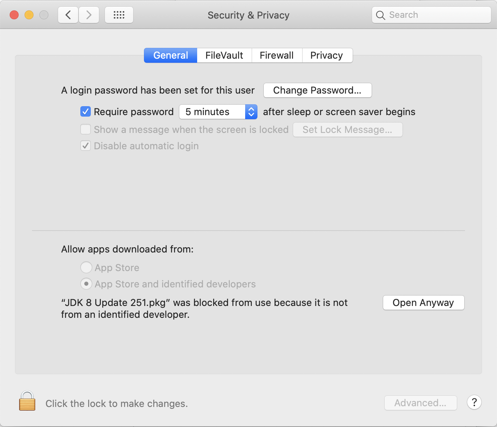

4. 查看是否安装成功

   ```shell
   xiyucai@xiyus-MacBook-Pro ~ % java -version
   java version "1.8.0_251"
   Java(TM) SE Runtime Environment (build 1.8.0_251-b08)
   Java HotSpot(TM) 64-Bit Server VM (build 25.251-b08, mixed mode)
   xiyucai@xiyus-MacBook-Pro ~ % 
   ```

##### 环境配置

1. 如果是第一次配置环境变量，需新建～/.bash_profile文件

   ```shell
   xiyucai@xiyus-MacBook-Pro ~ % vim .bash_profile
   ```

2. 配置环境变量

   在～/.bash_profile文件中加上：

   ```shell
   export JAVA_HOME=/Library/Java/JavaVirtualMachines/jdk1.8.0_251.jdk/Contents/Home
   export JRE_HOME=/Library/Java/JavaVirtualMachines/jdk1.8.0_251.jdk/Contents/Home/jre
   export CLASSPAHT=.:$JAVA_HOME/lib/dt.jar:$JAVA_HOME/lib/tools.jar
   export PATH=$JAVA_HOME/bin:$PATH
   ```

3. 使环境配置生效

   ```shell
   xiyucai@xiyus-MacBook-Pro ~ % source .bash_profile
   ```

4. 查看配置是否生效

   ```shell
   xiyucai@xiyus-MacBook-Pro ~ % echo $JAVA_HOME
   ```


# 4. 用git上传文件到Github

### Ubuntu

1. 在github中新建一个repositories，并命名

2. 安装git，ubantu上自带，若没有则：

   ```
   $ sudo apt-get install git
   ```

3. 生成密钥

   ```
   $ ssh-keygen -t rsa -C "946704740@qq.com"
   ```

   之后会要求确认路径和输入密码，默认一路回车就行。

4. 成功的话会在～/下生成.ssh文件夹，按住ctrl+h可以显示隐藏文件夹，点进去，打开id_rsa.pub，复制里面的key。

5. 回到github，进入Account Setting，左边选择SSH Keys，Add SSH，title随便填，粘贴key.

6. 在将本地仓库上传到github之前，需要设置username和email，因为github每次commit都会记录他们。

   ```
   $ git config --global user.name "onlyou2030"
   $ git config --global user.email 529647632@qq.com
   ```

7. cd到要上传的仓库路径，添加远程地址

   ```
   git remote add origin git@github.com:yourName/yourRepo.git
   ```

8. 添加，提交，上传

   ```
   $ git add README
   $ git add . //添加所有文件
   $ git commit -m "first commit"
   $ git push origin master
   ```

   git push命令将本地仓库推送到远程服务器，git pull相反。

9. 合并

   在上面提交命令后，可能会出现“因为您当前分支的最新提交落后于其对应的远程分支”等类似错误，需要先获取远端更新并与本地合并，再git push

   ```
   $ git fetch origin   //获取远程更新
   $ git merge origin/master
   $ git push origin master
   ```

### Mac

#### 安装git

1. 在终端输入git会提示安装

#### 创建ssh key、配置git

1. 设置username和email（github每次commit都会记录他们）

   ```shell
   git config --global user.name "knd11"
   git config --global user.email "946704740@qq.com"
   ```

2. 通过终端命令创建ssh key

   ```shell
   xiyucai@xiyus-MacBook-Pro ~ % ssh-keygen -t rsa -C "946704740@qq.com"
   Generating public/private rsa key pair.
   Enter file in which to save the key (/Users/xiyucai/.ssh/id_rsa): 
   Created directory '/Users/xiyucai/.ssh'.
   Enter passphrase (empty for no passphrase): 
   Enter same passphrase again: 
   Your identification has been saved in /Users/xiyucai/.ssh/id_rsa.
   Your public key has been saved in /Users/xiyucai/.ssh/id_rsa.pub.
   The key fingerprint is:
   SHA256:iB+Uvkpzxu0AFzM62vEPEFnbEhh1BDcWADb9OSDACd0 946704740@qq.com
   The key's randomart image is:
   +---[RSA 3072]----+
   |.+.+=**+B.       |
   |  +.E+oO .       |
   |    o.Oo..       |
   |     * *+        |
   |    B = S.       |
   |   o X +         |
   |  . + X .        |
   |   . = =         |
   |    .   o        |
   +----[SHA256]-----+
   ```

3. 在GitHub端添加刚刚生成的公钥，在id_rsa.pub中

   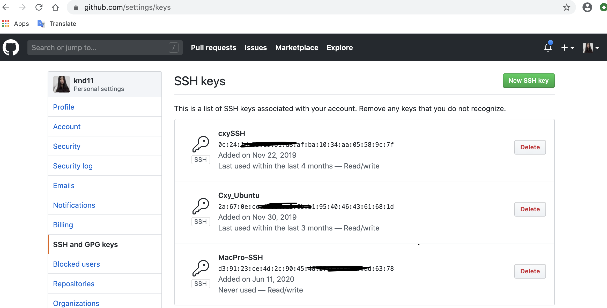

4. 添加远程仓库的地址

```shell
xiyucai@xiyus-MacBook-Pro Documents % git init
xiyucai@xiyus-MacBook-Pro Documents % git remote add origin git@github.com:knd11/learning.git
```

5. 添加文件/文件夹到本地库，提交，上传

   ```shell
   $ git add .
   $ git commit -m "first commit"
   $ git push origin master
   ```

   


# 5. Hadoop安装

## Ubuntu

### [5.1 Java安装](#3. linux Java + IntelliJ)

Hadoop官方网站：http://hadoop.apache.org/

**Required Software** 

Required software for Linux include:

1. Java™ must be installed. Recommended Java versions are described at [ HadoopJavaVersions](http://wiki.apache.org/hadoop/HadoopJavaVersions).
2. ssh must be installed and sshd must be running to use the Hadoop scripts that manage remote Hadoop daemons.

**安装**

### 5.2 ssh免密登陆

<a href="http://www.ruanyifeng.com/blog/2011/12/ssh_remote_login.html">什么是SSH</a>

<a href="https://baijiahao.baidu.com/s?id=1662669440853469635&wfr=spider&for=pc">什么是SSH</a>

==If your cluster doesn't have the requisite software== you will need to install it.

For example on Ubuntu Linux:

```shell
  $ sudo apt-get install ssh
  $ sudo apt-get install rsync
```

`$ ssh localhost或者 $ ssh 主机名` （`$ exit退出`）都会要求输入密码，使得有些交互无法进行，故需要设置免密登陆。

免密配置：

 ==如果已经生成过ssh-key则不用生成了否则将把原来的覆盖==，使有些操作失效。如git不能推送到远程仓库

```shell
$ ssh-keygen -t rsa
```

一路回车或yes

```shell
$ ls -a //-a查看隐藏文件夹，.开头的是隐藏文件夹
$ cd .ssh

$ ll
-rw-------  1 cxy cxy 1679 11月 29 19:16 id_rsa  #私钥
-rw-r--r--  1 cxy cxy  389 11月 29 19:16 id_rsa.pub #公钥
-rw-r--r--  1 cxy cxy 2354 11月 29 19:15 known_hosts

$ cat id_rsa.pub >> authorized_keys #复制id_rsa.pub 到 authorized_keys
$ chmod 600 authorized_keys #设置权限

/**测试**/
$ ssh Cxy  #不用输密码了
```

[若有报错](#报错:ssh: connect to host hadoop1 port 22: Connection refused)

### 5.3 Hadoop安装

<a href="https://hadoop.apache.org/docs/stable/hadoop-project-dist/hadoop-common/SingleCluster.html">参考官网</a>

#### <a href="http://archive.cloudera.com/cdh5/cdh/5/">1. 下载</a>(速度很慢)

```
hadoop-2.6.0-cdh5.9.3.tar.gz
```

#### 2. 解压到 /opt

####  3. 配置环境变量

到根目录下将Hadoop配置到环境变量

  ```shell
$ sudo vi /etc/profile
#$ sudo vi ~/.bash_profile #Mac配置此文件
#$ gedit ~/.bashrc #出问题
  ```

  输入：

  ```shell
export JAVA_HOME=/usr/local/jdk-8u231-linux-x64/jdk1.8.0_231
export PATH=$PATH:$JAVA_HOME/bin
#ubuntu
export HADOOP_HOME=/opt/hadoop-2.6.0-cdh5.9.3
export PATH=$PATH:$HADOOP_HOME/bin:$HADOOP_HOME/sbin

#Mac
export JAVA_HOME=/Library/Java/JavaVirtualMachines/jdk1.8.0_251.jdk/Contents/Home
export PATH=$JAVA_HOME/bin:$PATH
export HADOOP_HOME=/usr/local/Apache/hadoop-3.2.1
export PATH=$PATH:$HADOOP_HOME/bin:$HADOOP_HOME/sbin
  ```

  `:x`或`:wq`保存退出

  ```shell
# $ source ~/.bash_profile #配置这个重启后就失效了
# $ source ~/.bashrc #出问题
$ source /etc/profile
  ```

  以上配置完成后，查看是否安装成功:

```shell
$ hadoop version
```

#### 5.4 Hadoop客户端环境搭建

下面的依赖如果可以工作的话,就不用导入本地hadoop包了

```xml
    <dependencies>
              <dependency>
            <groupId>org.apache.hadoop</groupId>
            <artifactId>hadoop-common</artifactId>
            <version>2.8.5</version>
        </dependency>
        <!-- https://mvnrepository.com/artifact/org.apache.hadoop/hadoop-hdfs -->
        <dependency>
            <groupId>org.apache.hadoop</groupId>
            <artifactId>hadoop-hdfs</artifactId>
            <version>2.8.5</version>
        </dependency>
        <!-- https://mvnrepository.com/artifact/org.apache.hadoop/hadoop-mapreduce-client-core -->
        <dependency>
            <groupId>org.apache.hadoop</groupId>
            <artifactId>hadoop-mapreduce-client-core</artifactId>
            <version>2.8.5</version>
        </dependency>
        <!-- https://mvnrepository.com/artifact/org.apache.hadoop/hadoop-client -->
        <dependency>
            <groupId>org.apache.hadoop</groupId>
            <artifactId>hadoop-client</artifactId>
            <version>2.8.5</version>
        </dependency>
        <!-- https://mvnrepository.com/artifact/org.apache.hadoop/hadoop-yarn-api -->
        <dependency>
            <groupId>org.apache.hadoop</groupId>
            <artifactId>hadoop-yarn-api</artifactId>
            <version>2.8.5</version>
        </dependency>

    </dependencies>
```


#### 1. IDEA的配置

1. 选择Configure – > Settings


2. 配置Maven

   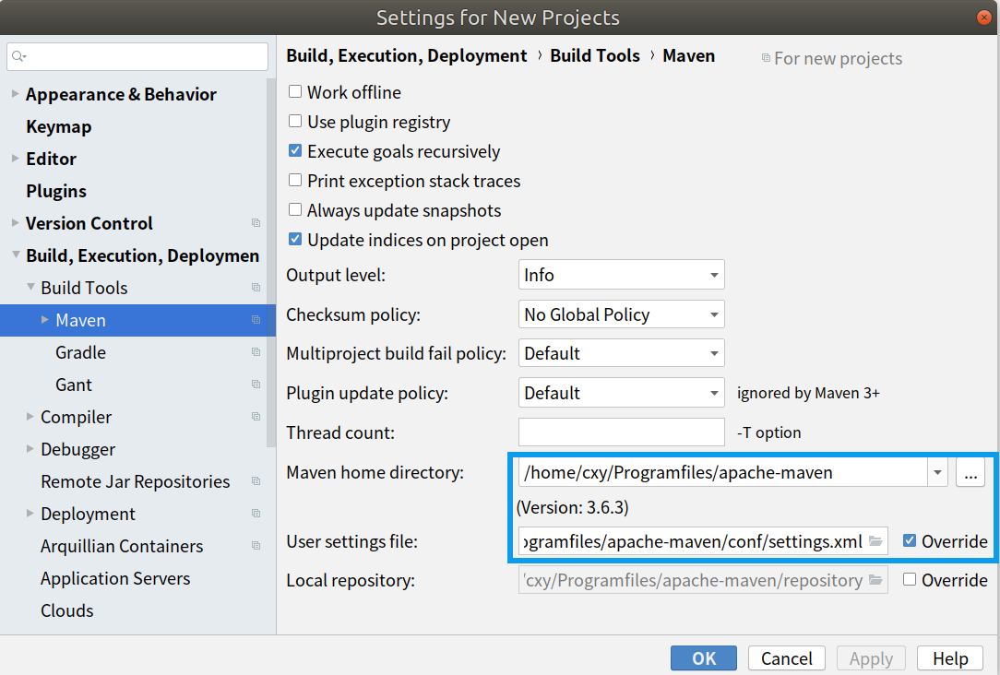

3. 设置Project structure

   上一步设置完成后又来到开始界面, Configure – > Structure for new Project

   **注:** 工程**创建后**所有位置(Java compiler, module中java language level…)的java版本都要改成一致

   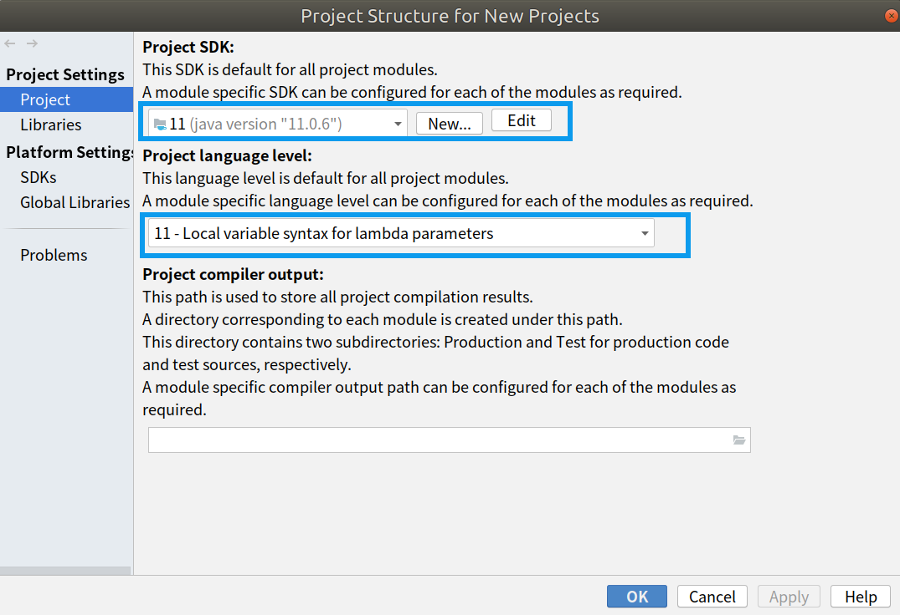

#### 2. 创建maven工程

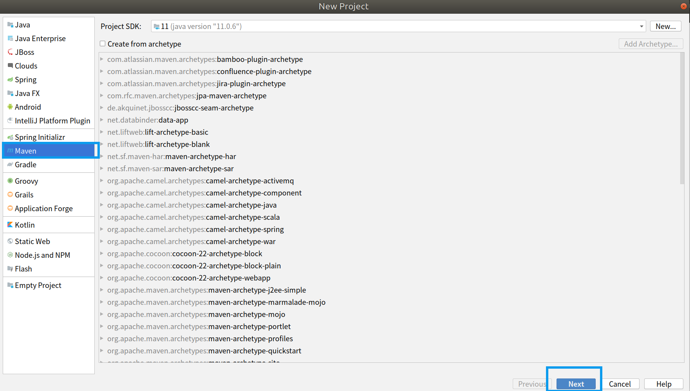

创建成功,设置java版本

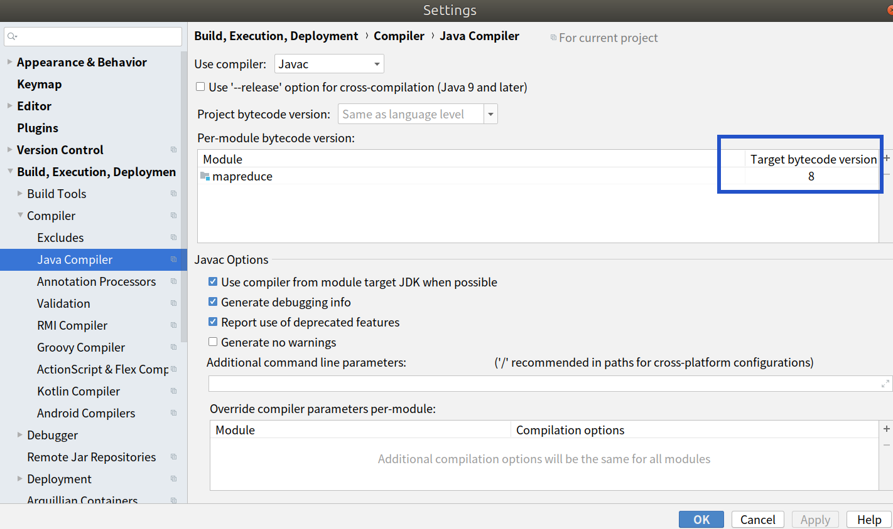

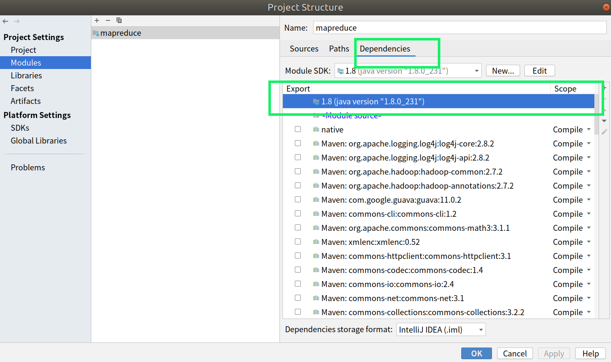

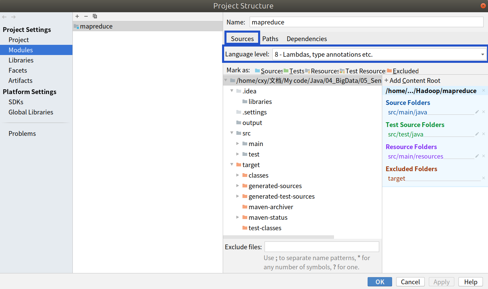

#### 3. 导入日志的依赖

- 创建成功之后在pom.xml中导入依赖

  

  ```xml
      <dependencies>
          <dependency>
              <groupId>org.apache.logging.log4j</groupId>
              <artifactId>log4j-core</artifactId>
              <version>2.8.2</version>
          </dependency>
      </dependencies>
  ```

- 项目的src/main/resources目录下，新建一个文件，命名为“log4j.properties”，在文件中填入:

```properties
log4j.rootLogger=INFO, stdout
log4j.appender.stdout=org.apache.log4j.ConsoleAppender
log4j.appender.stdout.layout=org.apache.log4j.PatternLayout
log4j.appender.stdout.layout.ConversionPattern=%d %p [%c] - %m%n
log4j.appender.logfile=org.apache.log4j.FileAppender
log4j.appender.logfile.File=target/spring.log
log4j.appender.logfile.layout=org.apache.log4j.PatternLayout
log4j.appender.logfile.layout.ConversionPattern=%d %p [%c] - %m%n
```

#### 4. 配置Hadoop依赖环境

- 选择**本地**hadoop安装目录中/share/hadoop目录

  即: /opt/hadoop-2.6.0-cdh5.9.3/share/hadoop

  下对应的的各种jar包

```
common
hdfs
mapreduce
yarn
comom/lib
```

- 安装目录下的lib/slave, 因为我安装的时候不是安装的编译好的,本地运行也需要自行下载此包.不导此包会报错: Unable to load native-hadoop library for your platform……


#### 5. 配置Hadoop配置文件的访问权限

在IDEA通过Docker集群执行MapReduce任务是会报一个异常，说本机的用户名没有权限访问Docker容器内的HDFS，此时需要**添加**容器内Hadoop的两个配置文件，通过master的终端执行

- vim $HADOOP_HOME/etc/hadoop/==core-site.xml==

```xml
<property>
    <name>hadoop.http.staticuser.user</name>
    <value>root</value>
</property>
```
- vim $HADOOP_HOME/etc/hadoop/==hdfs-site.xml==

```xml
    <property>
        <name>dfs.permissions</name>
        <value>false</value>
    </property>
```

docker端Hadoop设置好了本地客户端能访问的权限, 同时本地端也需知道服务器端的IP地址和主机名. 需要在hosts中加上

```shell
$cxy@Cxy:$ vim /etc/hosts

172.17.0.2       hadoop1
```

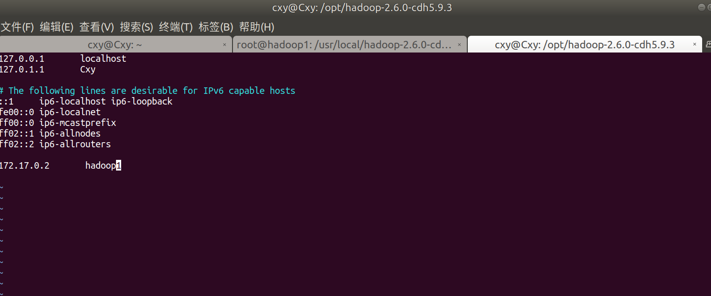

#### 6.测试上传文件

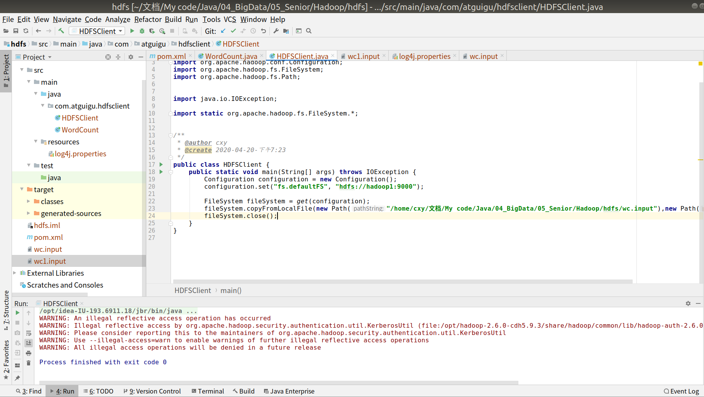

1. 在hdfs下创建文件wc.input

2. 新建class

   ```java
   package com.atguigu.hdfsclient;
   
   import org.apache.hadoop.conf.Configuration;
   import org.apache.hadoop.fs.FileSystem;
   import org.apache.hadoop.fs.Path;
   import java.io.IOException;
   import static org.apache.hadoop.fs.FileSystem.*;
   
   
   /**
    * @author cxy
    * @create 2020-04-20-下午7:23
    */
   public class HDFSClient {
       public static void main(String[] args) throws IOException {
           Configuration configuration = new Configuration();
           configuration.set("fs.defaultFS", "hdfs://hadoop1:9000");
   
           FileSystem fileSystem = get(configuration);
           fileSystem.copyFromLocalFile(new Path("/home/cxy/文档/My code/Java/04_BigData/05_Senior/Hadoop/hdfs/wc.input"),new Path("/"));
           fileSystem.close();
       }
   }
   ```

3. 运行

   在docker容器中启动hadoop服务

   ```shell
   root@hadoop1:/usr/local/hadoop-2.6.0-cdh5.9.3# start-dfs.sh
   ```

4. 在web端查看是否上传成功

   http://hadoop1:50070/explorer.html#/

## Mac

1. <a href="https://mirror.bit.edu.cn/apache/hadoop/common/">官方镜像</a>

   官方网站：http://hadoop.apache.org/

   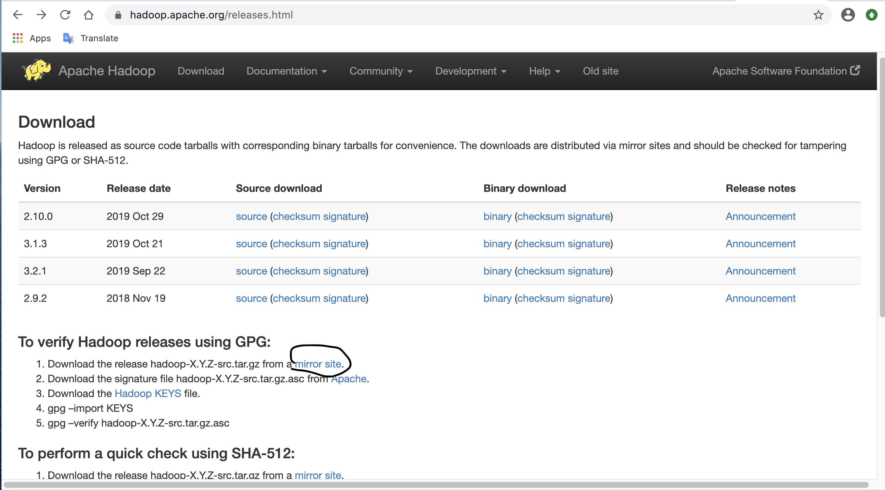

   

2. 解压到/usr/local/Apache

   ```shell
   $ tar -zxvf hadoop-3.2.1.tar.gz -C /usr/local/Apache
   ```

3. Mac 安装 brew

   ```shell
   $/usr/bin/ruby -e "$(curl -fsSL https://raw.githubusercontent.com/Homebrew/install/master/install)"  
   ```

   *回车（这里有提示目录不存在，要创建需要按return键，如果用的windows键盘，就是回车键）*

   *它的用法*

4. 安装ssh

   ```shell
   $ brew install ssh
   ```

5. 其余的参考[Ubuntu安装Hadoop](#5.2 ssh免密登陆)

# 6. VS Code + Java开发

## 6.1 Maven

环境搭建：

extension：

Maven for Java;

创建project：

Ctrl + shift + p 或者左侧浏览器MAVEN PROJECT 处点 +  --> 选择 maven-archetype-quicksstart  --> 选择目录地址 --> 选择版本1.0 --> 选择包名

# 7. 如何使用VS Code创建SpringBoot项目

#### 1. 安装扩展(Ctrl+Shift+X)

- [Java Extension Pack (Java 扩展包)](https://marketplace.visualstudio.com/items?itemName=vscjava.vscode-java-pack)
- Spring Boot Extension Pack


#### 2. 配置Maven：

点左下角的设置图标->设置，打开设置内容筛选框，输入maven，然后点击右侧的打开json格式setting：


然后把:

- maven的可执行文件路径配置
- maven的setting路径配置
- java.home的路径配置

拷贝到右侧的用户设置区域并且设置为自己电脑的实际路径


也可以直接在设置界面中设置，记住两边都要配置好

#### 3. 创建Maven项目

使用快捷键(Ctrl+Shift+P)命令窗口，输入 Spring 选择创建 Maven 项目。 效果如下：


选择需要使用的语言、Group Id、项目名称等，这里选择Java：


选择Spring Boot版本：


选择需要引入的包，引入如下几个包即可满足web开发：

DevTools（代码修改热更新，无需重启）、Web（集成tomcat、SpringMVC）、Lombok（智能生成setter、getter、toString等接口，无需手动生成，代码更简介）、Thymeleaf （模板引擎）。


选择好要引入的包后直接回车，在新弹出的窗口中选择项目路径，至此Spring Boot项目创建完成

#### 4. 打开项目

创建好后vscode右下角会有如下提示，点击Open it 即可打开刚才创建的Spring Boot项目


####  5. 项目运行跟调试

项目创建后会自动创建DemoApplication.java文件，在DemoApplication 文件目录下新建文件夹 Controller，新建文件HomeController.java。效果如下：


Ps:SpringBoot项目的Bean装配默认规则是根据DemoApplication类所在的包位置从上往下扫描。所以必须放在同一目录下否则会无法访问报如下所示错误：

启动工程之前还需要配置下运行环境，如下图，点左边的小虫子图标，然后点上面的下拉箭头，选择添加配置，第一次设置时VS Code会提示选择需要运行的语言环境，选择对应环境后自动创建 launch.json 文件。


launch.json 调试配置文件如下，默认不修改配置也可使用：


选择对应的配置环境调式项目如下，默认端口为8080。


启动后可在控制台输出面板查看启动信息，显示如下后，访问：http://localhost:8080即可


最终效果如下：


#### 6. 访问HTML页面

在spring boot 中访问html需要引入Thymeleaf （模板引擎）包，在创建项目时已引用该包这里不需在重复引用。在resources-->templates目录下创建Index.html文件，效果如下：


html内容：

```
<!DOCTYPE html>
<html lang="en" xmlns:th="http://www.w3.org/1999/xhtml">
<head>
    <meta charset="UTF-8"/>
    <title>第一个HTML页面</title>
</head>
<body>
<h1>Hello Spring Boot!!!</h1>
<p th:text="${hello}"></p>
</body>
</html>
```

 在controller目录下新建TestController.java文件，代码如下：

```
@Controller
public class TestController {

    /**
     * 本地访问内容地址 ：http://localhost:8080/hello
     * @param map
     * @return
     */
    @RequestMapping("/hello")
    public String helloHtml(HashMap<String, Object> map) {
        map.put("hello", "欢迎进入HTML页面");
        return "/index";
    }
}
```

Ps:如果要访问html页面注解必须为Controller不能为RestController。否则无法访问。

**RestController和Controller的区别：**

@RestController is a stereotype annotation that combines @ResponseBody and @Controller.
意思是：
@RestController注解相当于@ResponseBody ＋ @Controller合在一起的作用。
1)如果只是使用@RestController注解Controller，则Controller中的方法无法返回jsp页面，配置的视图解析器InternalResourceViewResolver不起作用，返回的内容就是Return 里的内容。

例如：本来应该到success.html页面的，则其显示success.

2)如果需要返回到指定页面，则需要用 @Controller配合视图解析器InternalResourceViewResolver才行。

3)如果需要返回json或者xml或者自定义mediaType内容到页面，则需要在对应的方法上加上@ResponseBody注解

效果展示如下：


到处基础配置结束，可以愉快的玩耍Spring Boot!


# 8. Tomcat安装

## Windows 环境

[下载地址](#<http://tomcat.apache.org/>)

1. 解压到安装目录

2. 配置环境变量

   | 变量名        | 变量值                                       |
   | ------------- | -------------------------------------------- |
   | CATALINA_BASE | D:\Program files\Apache\apache-tomcat-8.5.51 |
   | CATALINA_HOME | D:\Program files\Apache\apache-tomcat-8.5.51 |
   | Path          | %CATALINA_HOME%\bin                          |

3. 启动

   命令行中输入`startup` 或 `catalina run`，然后在浏览器地址栏输入如下验证：

   ```html
   localhost:8080
   //或
   127.0.0.1:8080
   ```

## Linux 环境

```shell
#将压缩包移动到新建文件夹，解压，删除压缩包
sudo cp apache-tomcat-9.0.33.tar.gz /home/cxy/Programfiles
sudo tar -zxvf apache-tomcat-9.0.33.tar.gz
sudo rm apache-tomcat-9.0.33.tar.gz

#设置权限，进入解压路径下的bin目录
sudo chmod 755 -R apache-tomcat-9.0.33
cd apache-tomcat-9.0.33/bin

#启动Tomcat
sudo ./startup.sh

#验证，通过在浏览器中输入下面地址，如果进入Tomcat首页即安装成功
localhost:8080
```

## Mac 环境

1. 到<a href="https://tomcat.apache.org/download-90.cgi#9.0.36">官网下载</a>安装包

   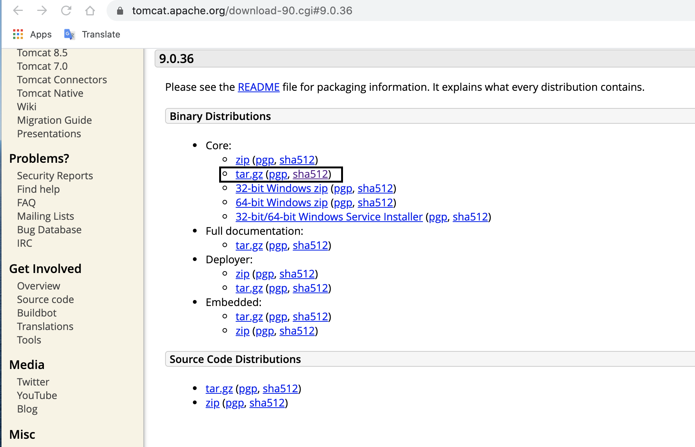

2. 解压tomcat文件，把它放入/usr/local目录（或其它目录）

   ```shell
   xiyucai@xiyus-MacBook-Pro Downloads % tar -zxf apache-tomcat-9.0.36.tar.gz 
   xiyucai@xiyus-MacBook-Pro Downloads % sudo cp -r apache-tomcat-9.0.36 /usr/local/Apache
   ```

3. 授权bin目录下的所有操作

   ```shell
   $ cd /usr/local/Apache/apache-tomcat-9.0.36/bin
   $ sudo chmod 755 *.sh
   ```

4. 启动Tomcat

   ```shell
   xiyucai@xiyus-MacBook-Pro bin % ./startup.sh 
   Using CATALINA_BASE:   /usr/local/Apache/apache-tomcat-9.0.36
   Using CATALINA_HOME:   /usr/local/Apache/apache-tomcat-9.0.36
   Using CATALINA_TMPDIR: /usr/local/Apache/apache-tomcat-9.0.36/temp
   Using JRE_HOME:        /Library/Java/JavaVirtualMachines/jdk1.8.0_251.jdk/Contents/Home
   Using CLASSPATH:       /usr/local/Apache/apache-tomcat-9.0.36/bin/bootstrap.jar:/usr/local/Apache/apache-tomcat-9.0.36/bin/tomcat-juli.jar
   Tomcat started.
   ```

5. 在浏览器端访问 http://localhost:8080/ 

   

6. 


# 9. Mysql 安装

### Windows 环境

1. 在官网下载 [MySQL](https://dev.mysql.com/downloads/mysql/) ， [安装版MySQL](https://link.zhihu.com/?target=https%3A//link.jianshu.com/%3Ft%3Dhttp%3A//dev.mysql.com/downloads/installer/)

2. 配置初始化的my.ini文件的文件

   解压后的目录并没有的my.ini文件，没关系可以自行创建在安装根目录下添加的my.ini（新建文本文件，将文件类型改为的.ini），写入基本配置： 记得改路径，Data文件夹会自动生成，无需创建

   ```ini
   [client]
   # 设置mysql客户端默认字符集
   default-character-set=utf8
    
   [mysqld]
   # 设置3306端口
   port = 3306
   # 设置mysql的安装目录
   basedir=D:\\Program files\\Oracle\\mysql-8.0.19-winx64
   # 设置 mysql数据库的数据的存放目录，MySQL 8+ 不需要以下配置，系统自己生成即可，否则有可能报错
   # datadir=D:\\Program files\\Oracle\\mysql-8.0.19-winx64\\Data
   # 允许最大连接数
   max_connections=20
   # 服务端使用的字符集默认为8比特编码的latin1字符集
   character-set-server=utf8
   # 创建新表时将使用的默认存储引擎
   default-storage-engine=INNODB
   ```

   配置文件中的路径要和实际存放的路径一致

3. 初始化MySQL

   > 运行`mysqld --initialize-insecure`自动生成无密码的root用户。
   > 运行`mysqld --initialize`自动生成带随机密码的root用户
   >
   > 
   >
   > 以==管理员的方式打开cmd==， 切换到安装目录下的bin目录下，执行：
   >
   > ```shell
   > mysqld --initialize --console
   > ```
   >
   > 输出：
   >
   > ```shell
   > ...
   > 2020-03-11T02:38:19.492703Z 5 [Note] [MY-010454] [Server] A temporary password is generated for root@localhost: OWMyd1?KzWj4
   > ```
   >
   > 记录下密码：OWMyd1?KzWj4
   >
   > 一定要以管理员的方式打开，不然会报错：Install/Remove of the Service Denied

4. 安装MySQL服务 + 启动MySQL 服务

   >安装：
   >
   >```shell
   >mysqld --install [服务名]（服务名可以不加默认为mysql）
   >```
   >
   >启动：
   >
   >```shell
   >net start mysql
   >```

5. 连接 MySQL

   > 下载 [Navicat](https://www.navicat.com.cn/download/navicat-premium)
   >
   > [安装与破解](#11. Navicat 安装与激活)
   >
   > MySQL的服务已经开启了就直接打开的Navicat去连接
   >
   > 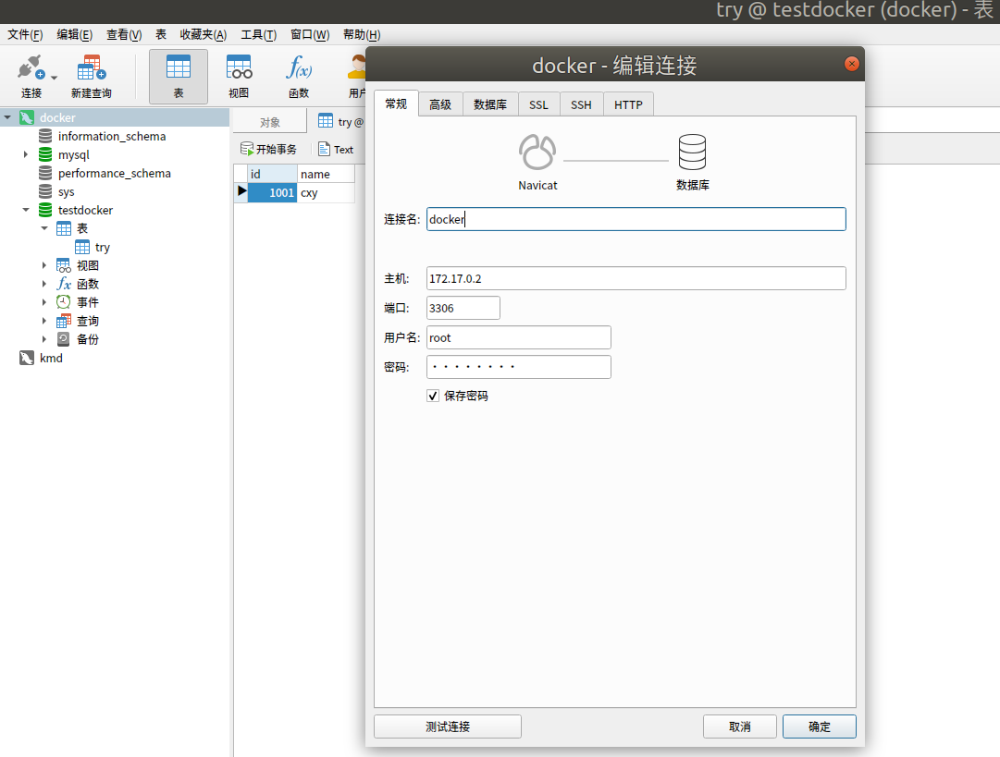
   >
   > **还记得刚刚让你复制的root @ localhost：后面的初始密码了吗？现在要用到它了复制粘贴上去！**
   >
   > 

6. 修改密码

   在 Navicat 中双击连接名，修改密码

### Linux 环境

<a href = "https://dev.mysql.com/downloads/mysql/">MySQL下载</a>

#### mysql 安装

http://www.coozhi.com/youxishuma/g4/86480.html

```mysql
# 安装MySQL的依赖库
sudo apt install yum
sudo apt install numactl
sudo apt install libaio-dev

#解压mysql压缩包到 /usr/local/mysql 下
tar -zxvf mysql-8.0.19-linux-glibc2.12-x86_64.tar.xz  /usr/local/mysql
#也可解压后重命名为mysql，再移动到/usr/local/
sudo mv mysql /usr/local

#给Ubuntu系统添加一个mysql的用户组
groupadd mysql

#添加一个mysql用户到mysql用户组中
useradd -r -g mysql -s /bin/false mysql

#切换到/usr/local/mysql目录
cd /usr/local/mysql

#然后给移动后的文件夹添加目录权限到mysql用户组
sudo mkdir mysql-files
sudo chown mysql:mysql mysql-files
sudo chmod 750 mysql-files

#对mysql数据库执行初始化命令
$ bin/mysqld --initialize --user=mysql
2020-05-30T12:37:26.837048Z 6 [Note] [MY-010454] [Server] A temporary password is generated for root@localhost: IX=KXe2wZc:B

#开启MySQL服务
bin/mysqld_safe --user=mysql&
```

测试是否安装成功

```shell
mysqladmin --version
```

 linux上该命令将输出以下结果，该结果基于你的系统信息：

```shell
mysqladmin  Ver 8.42 Distrib 5.7.29, for Linux on x86_64
```

 如果以上命令执行后未输出任何信息，说明你的Mysql未安装成功。 

登录:

```mysql
#输入初始化时得到的密码
root@hadoop2:/usr/local/mysql/data# mysql -uroot -p
Enter password: 
Welcome to the MySQL monitor.  Commands end with ; or \g.
Your MySQL connection id is 9
Server version: 8.0.20

Copyright (c) 2000, 2020, Oracle and/or its affiliates. All rights reserved.

Oracle is a registered trademark of Oracle Corporation and/or its
affiliates. Other names may be trademarks of their respective
owners.

Type 'help;' or '\h' for help. Type '\c' to clear the current input statement.

mysql>
```

重置密码:

```mysql
mysql> use mysql;
ERROR 1820 (HY000): You must reset your password using ALTER USER statement before executing this statement.
mysql> alter user 'root'@'localhost' identified by '12345c';
Query OK, 0 rows affected (0.02 sec)
```


卸载与在线安装:

```shell
$ sudo apt-get --yes autoremove --purge mysql-server-5.7
$ sudo apt-get --yes autoremove --purge mysql-client-5.7
$ sudo apt-get --yes autoremove --purge mysql-common
$ sudo rm -rf /var/lib/mysql /etc/mysql ~/.mysql


$ sudo deluser mysql
$ sudo apt-get autoclean
$ sudo apt-get update && sudo apt-get upgrade
$ sudo apt-get install mysql-server-5.7 mysql-client-5.7

```

##### 报错:

1. bash: mysqladmin: command not found

   解决:

   原因:这是由于系统默认会查找/usr/bin下的命令，如果这个命令不在这个目录下，当然会找不到命令，我们需要做的就是映射一个链接到/usr/bin目录下，相当于建立一个链接文件。
    首先得知道mysql命令或mysqladmin命令的完整路径，比如mysql的路径是：/usr/local/mysql/bin/mysql，我们则可以这样执行命令：

   ```shell
   root@hadoop2:~# ln -s /usr/local/mysql/bin/mysqladmin /usr/bin
   ```


#### 使用 MySQL Client(Mysql客户端) 执行简单的SQL命令

 你可以在 MySQL Client(Mysql客户端) 使用 mysql 命令连接到 MySQL 服务器上，默认情况下 MySQL 服务器的登录密码为空，所以本实例不需要输入密码。

命令如下：

```
[root@host]# mysql
```

 以上命令执行后会输出 mysql>提示符，这说明你已经成功连接到Mysql服务器上，你可以在 mysql> 提示符执行SQL命令：

```mysql
mysql> SHOW DATABASES;
```

#### Mysql安装后需要做的

 Mysql安装成功后，默认的root用户密码为空，你可以使用以下命令来创建root用户的密码：

```mysql
[root@host]# mysqladmin -u root password "new_password";
```

 现在你可以通过以下命令来连接到Mysql服务器：

```mysql
[root@host]# mysql -u root -p
Enter password:*******

use mysql;
update user set host = '%' where user = 'root'; 
select host, user from user; 
flush privileges;#授权之后必须刷新权限才生生效
```

 **注意：**在输入密码时，密码是不会显示了，你正确输入即可。

#### MySQL提示ERROR 1698 (28000): Access denied for user 'root'@'localhost'错误解决办法

##### Step1：修改mysqld.cnf配置文件

在ubuntu的terminal（也即终端）上输入

```shell
sudo vim /etc/mysql/mysql.conf.d/mysqld.cnf
```

进入到配置文件后在这个配置文件中的 **[mysqld]** 这一块中加入skip-grant-tables这句话。

[](javascript:void(0);)

```
 [mysqld]
#
# * Basic Settings
#
user            　 = mysql
pid-file        　 = /var/run/mysqld/mysqld.pid
socket        　　 = /var/run/mysqld/mysqld.sock
port            　 = 3306
basedir        　　= /usr
datadir       　　 = /var/lib/mysql
tmpdir       　　　= /tmp
lc-messages-dir   = /usr/share/mysql
skip-external-locking
character-set-server=utf8
collation-server=utf8_general_ci
skip-grant-tables　　　　<-- add here
```

**保存:wq，退出**。

```mysql
service mysql restart #重新启动mysql
```

##### step2：设置root密码

在终端上输入mysql -u root -p，遇见输入密码的提示直接回车即可,进入mysql后，分别执行下面三句话：

```mysql
use mysql;
update user set authentication_string=password("12345c") where user="root"; 
flush privileges;

select user, plugin from user;

#如果plugin root的字段是auth_socket，那我们改掉它
#改为下面的 mysql_native_password，如果和该字段内其它值一样，就直接quit
update user set authentication_string = password("12345c"),plugin = 'mysql_native_password' where user='root';

flush privileges;
select user,plugin from user;

quit;#退出mysql 
```

##### step3：注释掉skip-grant-tables

```shell
sudo vim /etc/mysql/mysql.conf.d/mysqld.cnf  
# 然后注释掉skip-grant-tables
#保存退出

service mysql restart #重新启动mysql
mysql -u root -p
#输入刚设置的密码，进入mysql
```


#### navicat Can't connect to local MySQL server through socket '/var/lib/mysqld/mysqld.sock的解决办法

navicat上报错的路径var/lib/mysqld/mysqld.sock和mysql配置环境的路径不一样，在配置环境中改一下[mysqld]下的sock路径，并给大权限

```
sudo chmod 777 /var/lib/mysql/
```


#### ERROR 2002 (HY000): Can’t connect to local MySQL server through socket ‘/var/run/mysqld/mysqld.sock’

对于这类错误，要么找到/tmp/mysql.sock文件 进行修改(但是比较麻烦)。但是我没找到这个文件 于是就用下面的方法了比较暴力但是很实用，直接==卸载重装==

```shell
首先查看版本号:
sudo mysql -V  
下面是版本号:
mysql  Ver 14.14 Distrib 5.7.18, for Linux (x86_64) using  EditLine wrapper
执行:
apt-get autoremove --purge mysql-server-5.7 // 这一步执行不了,继续下面的;

需要删除很多文件:
依次执行这三步:
sudo apt-get autoremove mysql-server
sudo apt-get remove mysql-common 
sudo dpkg -l |grep ^rc|awk '{print $2}' |sudo xargs dpkg -P 

重新安装:
sudo apt-get install mysql-server mysql-client 
执行mysql :
mysql -u root -p

#登录不上去，没有设置密码，前面有重置密码的方法
```

#### ERROR 2002 (HY000): Can't connect to local MySQL server through socket '/var/run/mysqld/mysqld.sock' (2)

客户端：终端和navicat的socket地址不一样，没有制定客户端所以两个不能同时登录。可以在配置文件中添加如下配置：

`sudo vim /etc/mysql/mysql.conf.d/mysqld.cnf`

```cfg
[client]
default-character-set = utf8
socket          = /var/lib/mysql/mysql.sock
```

#### 服务管理

```mysql
#服务管理
#启动
sudo service mysql start
#停止
sudo service mysql stop
#服务状态
sudo service mysql status
```

#### 卸载

```mysql
#首先使用以下命令删除MySQL服务器：
sudo apt-get remove mysql-server
#然后，删除随MySQL服务器自动安装的任何其他软件：
sudo apt-get autoremove
#卸载其他组件：
sudo apt-get remove <<package-name>>
#查看从MySQL APT存储库安装的软件包列表：
dpkg -l | grep mysql | grep ii
```

### Mac

参考 ： https://www.cnblogs.com/nickchen121/p/11145123.html

<a href = "https://dev.mysql.com/downloads/mysql/">MySQL下载</a> 

直接双击安装 ： mysql-8.0.20-macos10.15-x86_64.dmg

#### 设置环境变量

1. 配置环境变量 ：编辑~/.bash_profile文件

```shell
$ sudo vim ~/.bash_profile
```

2. 输入

```shell
export PATH=$PATH:/usr/local/mysql/bin
export PATH=$PATH:/usr/local/mysql/support-files
```

3. 使配置文件的修改生效，并查看环境变量是否设置成功

```shell
$ source ~/.bash_profile 
$ echo $PATH
```

4. MySQL服务的启停和状态的查看

   ```shell
   #停止MySQL服务
   $ sudo mysql.server stop
   
   #重启MySQL服务
   $ sudo mysql.server restart
   
   #查看MySQL服务状态
   $ sudo mysql.server status
   ```

5. 启动mysql服务

   ```shell
   $ sudo mysql.server start
   ```

6. 登陆服务

   ```mysql
   xiyucai@xiyus-MacBook-Pro mysql % mysql -uroot -p 
   Enter password: 
   Welcome to the MySQL monitor.  Commands end with ; or \g.
   Your MySQL connection id is 8
   Server version: 8.0.20 MySQL Community Server - GPL
   
   Copyright (c) 2000, 2020, Oracle and/or its affiliates. All rights reserved.
   
   Oracle is a registered trademark of Oracle Corporation and/or its
   affiliates. Other names may be trademarks of their respective
   owners.
   
   Type 'help;' or '\h' for help. Type '\c' to clear the current input statement.
   
   mysql> 
   ```


# 10. IDEA 部署 Tomcat

使用Idea的时候，修改了代码，需要反复的重启Tomcat，查看效果，是不是贼烦？还记得刚上手idea的时候，瞎配置部署Tomcat，结果最后修改一个jsp都要重新启动服务器，我这金牛座程序员能忍？~这个时候就必须砸电脑了~这个时候就可以在项目中加入热部署，这样才会大大节省开发效率！

#### Tomcat 下载~

官网地址-点击进入 <http://tomcat.apache.org/>

#### Tomcat 安装

解压即可，安装就over了，但解压路径最好不要是C盘，可能会出现拒绝访问等各种奇葩问题，还有解压路径不要有中文和特殊字符，切记！！！

#### Tomcat 热部署到IDEA

intellij idea默认文件是自动保存的，但是手头有个项目jsp文件改动后，在tomcat中不能立即响应变化
这时就需要热部署。

> 看过来 ： 如果各位觉得烦可以不看下面一大串文字~当我在放P~，直接按图操作也是完全OK滴！！！

在idea tomcat 中server的配置里，有个on frame deactivation，选择update classes and resources。另外有个配置on update action，就是手动操作的时候采取什么动作，可以重启服务器，也可以像上面一样更新类和资源文件，我选的是Redeploy。可是当前项目没有update classes and resources这个选项，有个Hot Swap classes。这是由于服务器添加的Artifact类型问题，一般一个module对应两种类型的Artifact，一种是war，一种是war explored。war就是已war包形式发布，当前项目是这种形式，在这种形式下on frame deactivation配置没有update classes and resources选项。war explored是发布文件目录，选择这种形式，on frame deactivation中就出现update classes and resources选项了。具体操作如下：


 server 的配置里，找到 ==on frame deactivation 条目，选择 update classes and resources==


注：==Artifact==在project structure里设置，如果没有 系统会自动提示。artifact放的是服务器从项目中copy的web目录的内容，建议保存目录写到服务器安装目录的 webapps 下

## idea两种热部署设置方法

第二种方法：在pom.xml添加相应依赖（不太建议使用），至于为什么不建议是因为之后开发没有那么多闲功夫注重有没有引入热部署坐标依赖，还不如直接在idea上配置，所谓一劳百益嘛！！！具体操作类似入下

```
 <!--支持热部署依赖-->
        <dependency>
            <groupId>org.springframework.boot</groupId>
            <artifactId>spring-boot-devtools</artifactId>
            <scope>runtime</scope>
            <optional>true</optional>
        </dependency>
```

到这里，两种方法也讲完了，哎哎这不就讲了一种吗，我顶你个肺....兄弟别冲动别急着顶我个fei，第一种方法就是idea自带的设置，上面已经配好了！挥爪，告辞~那个要顶我fei的同学放学别走啊~...

# 11. Navicat 安装与激活

Navicat 可以说是众多程序猿小伙伴的忠爱了，因为界面简洁且操作简单，让我们爱不释手；最近Navicat Premium 15发布了， 让我们来看看如何安装永久激活版哦（简称白嫖版）

## Windows 环境

### 1. Navicat Premium 15 安装

安装软件包和注册机：

链接：https://pan.baidu.com/s/1C1CkGtVhWMz-VEhS80HSVw

提取码：6umm

 

进入安装页面直接疯狂点下一步直到安装成功即可，当然你可以自己选择安装目录

[](https://img2018.cnblogs.com/i-beta/1680705/202001/1680705-20200122141329061-521874380.png)

### 2. Navicat Premium 15 激活

使用注册机先退出所有杀毒软件，再打开注册机，否则会一直报错哦！

[](https://img2018.cnblogs.com/i-beta/1896874/202001/1896874-20200123203653934-1905719632.png)

##### **1.Patch**

****

 

在 1) Patch 中选择Backup、Host、Navicat v15这三个，默认也是选择了这三个；勾选这三个后点击Patch

点击Patch按钮并找到Navicat Premium 15的安装目录的navicat.exe文件

[](https://img2018.cnblogs.com/i-beta/1680705/202001/1680705-20200122135623740-1819333424.png)

出现以下提示说明Patch成功了，但别高兴的太早，这还只是第一步。

[](https://img2018.cnblogs.com/i-beta/1680705/202001/1680705-20200122124513888-771093616.png)

##### **2. License. Product and Language**

License里选中Enterprise、在Produce里选择Premium、在Languages里选择Simplified Chinese(简体中文)

##### **3. Resale License**

保持默认选择即可

[](https://img2018.cnblogs.com/i-beta/1896874/202001/1896874-20200123203939098-214143870.png)

 

##### **4. Keygen / Offline Activation**

点击Generate按钮就会生成一个许可证秘钥，将许可证秘钥复制后就打开Navicat Premium 15

****

然后打开Navicat Premium 15，一个是试用14天，一个是注册，这里我们点击注册

[](https://img2018.cnblogs.com/i-beta/1896874/202001/1896874-20200123204653788-657172093.png)

 

粘贴刚刚注册机生成的许可证秘钥,然后激活

[](https://img2018.cnblogs.com/i-beta/1896874/202001/1896874-20200123204233217-1350995875.png)

 

 点击激活后会提示因为激活服务器暂时不可用,所以你的许可证未能激活，我们就选择手动激活。

[](https://img2018.cnblogs.com/i-beta/1896874/202001/1896874-20200123204254272-44884750.png)

点击手动激活后会生成一个请求码

复制请求码到注册机中的Request Code里面，之后点击Activation Code下面的Generate按钮就会生成一个激活码

[](https://img2018.cnblogs.com/i-beta/1896874/202001/1896874-20200123204510101-401514966.png)

 

将激活码复制到Navicat Premium 15中的激活码框框里，点击激活即可完成激活

[](https://img2018.cnblogs.com/i-beta/1896874/202001/1896874-20200123204524902-1348525559.png)


## Linux 环境

### 1. <a heref="https://www.navicat.com.cn/download/navicat-premium">Navicat下载</a>

### 2. 官方安装

```shell
####### 官方安装步骤 #########
# 1 
$ chmod +x navicat15.AppImage
# 2
$ ./navicat15.AppImage
```

```
NAVB-LXGS-EES6-RZFI
```

### 3. 实际安装与破解

- 在官网下载软件，注意不是for Mysql版的，激活工具不能激活

- 下载wine，运行激活工具激活

  下面等等方式测试失败

  ---

  

#### 3.1 提取AppImage文件到文件夹里

```shell
$ su
mount -o loop navicat15.AppImage navicat15-mysql-cs
cp -r navicat15-mysql-cs navicat15-mysql-cs-patched
umount navicat15-mysql-cs
rm -rf navicat15-mysql-cs
取AppImage文件到文件夹里

$ su
# mkdir navicat15-premium-cs
# mount -o loop navicat.AppImage navicat15-premium-cs
# cp -r navicat15-premium-cs navicat
# umount navicat15-premium-cs
# rm -rf navicat15-premium-cs

```

如果 `$su` 密码错误，可参见<a href="https://www.cnblogs.com/xuliangxing/p/7427121.html">这里</a>，可以用`$sudo passwd`，先输入当前用户密码，再输入新密码。

#### 3.2 编译安装（如果你觉得git下载太慢 [keystone-master.zip](https://rmc.ink/?go&url=aHR0cDovL29zcy5ybWMuaW5rL3R5cGVjaG8vMjAyMC8wMy8xNi85NDAxMzU4MDU0NTAzNy56aXA=)）

```shell
# 编译patcher-keygen需要以下几个库支持
sudo apt-get install libcapstone-dev
sudo apt-get install cmake
sudo apt-get install rapidjson-dev

git clone https://github.com/keystone-engine/keystone.git
cd keystone
mkdir build
cd build
../make-share.sh
sudo make install
sudo ldconfig
```

#### 3.3 生成私钥 (下载navicat-patcher和navicat-keygen  [激活工具.zip](https://rmc.ink/?go&url=aHR0cDovL29zcy5ybWMuaW5rL3R5cGVjaG8vMjAyMC8wMy8xNi85Mzg2OTM5MDc3MDA1MTAuemlw))

```shell
cd active_tool
chmod +x navicat-patcher
./navicat-patcher navicat
```

#### 3.4 激活

```shell
navicat-keygen --text ./RegPrivateKey.pem
```

1）选择类别
2）选择语语言
3）主版本号
4）输入用户名)
5）输入组织名
6）在navicat中找到注册 输入序列号
7）点击 激活
8）选择 手动激活
9）复制 请求码 到keygen，连按两次回车结束
10）最终你会得到一个base64编码的 激活码
11）将之复制到 手动激活 的窗口，然后点击 激活

# 12 wine

**sudo apt-get autoremove --purge**

.文件在/home/cxy下

```shell
apt-get install wine

apt install yum-utils

yum-config-manager --enable wine

winecfg 配置wine
```

Wine安装成功后Linux系统上会有一个wine命令，wine命令的使用方法是这样的，：
运行一个exe文件：
wine exe文件在linux上的路径

### 报错

0052:err:mscoree:CLRRuntimeInfo_GetRuntimeHost Wine Mono is not installed

### Solution： Winetricks

I decided to go old school and fall back to this neat little  		[wrapper script](https://www.dedoimedo.com/computers/winetricks.html), which you can use to install tons of common Windows 		applications, libraries and utilities, and hopefully, not have to deal with any fancy errors. I 		installed the script from the repos, and then installed dotNET 4.5 using it.

```shell
sudo apt-get install winetricks

winetricks dotnet45
```

The UI launched, and I started clicking buttons. Progress was made. Errors came up, but the wizard did not crash. The errors are far from helpful, and unless they block the installation, they should not be  shown.


**Ubuntu 18.04下给Wine设置微软雅黑字体（4步操作）**

2、新新建一个空文本，取名为msyh_font.reg（后缀是reg即可，文件名随便取的），终端命令操作：

sudo gedit msyh_font.reg

再把下面内容复制进去（注意Tahoma Bold那一行我是对应的之前复制过来的msyh粗体，如果你只复制了常规字体，下面应该全部填msyh.ttc）：

```reg
REGEDIT4
[HKEY_LOCAL_MACHINE\Software\Microsoft\Windows NT\CurrentVersion\FontLink\SystemLink]
"Lucida Sans Unicode"="msyh.ttc"
"Microsoft Sans Serif"="msyh.ttc"
"MS Sans Serif"="msyh.ttc"
"Tahoma"="msyh.ttc"
"Tahoma Bold"="msyhbd.ttc"
"msyh"="msyh.ttc"
"Arial"="msyh.ttc"
"Arial Black"="msyh.ttc"
```


保存好之后，终端执行命令才能生效：

regedit msyh_font.reg

3、进入wine目录，编辑system.reg配置文件：

sudo gedit ~/.wine/system.reg

查找关键词FontSubstitutes，把它下面挨着的“MS Shell Dlg”=”SimSun”改为“MS Shell Dlg”=”msyh”。

改完记得保存。

4、终端执行命令打开wine配置管理：

winecfg

选中默认设置，再把系统改成Windows 10或者Win 7，这个随意，只要不是Windows XP什么的就行，因为老系统上没有雅黑这个字体，所以会看不到效果。

最好是重启下系统或者注销一下，搞定。既能解决乱码问题，又美观。

# 13 Maven 安装

#### 1. 下载压缩包

<a href="http://maven.apache.org/download.cgi">官网地址</a> 

注意下载二进制包（binary），不要选择源码包（source）

#### 2. 解压

提取到想要安装的目录

#### 3. 配置环境变量

```shell
$ gedit ~/.bashrc
```

配置 MAVEN_HOME 和 PATH，如果没有配置JAVA_HOME，也加上

```shell
JAVA_HOME=/usr/local/jdk-8u231-linux-x64/jdk1.8.0_231
export MAVEN_HOME=/home/cxy/Programfiles/apache-maven-3.6.3
export PATH=$MAVEN_HOME/bin:$PATH
#Mac下安装路径： /usr/local/Apache/apache-maven-3.6.3
```

#### 4.使配置生效

```shell
$source ~/.bashrc
```

#### 修改配置文件

```xml
<localRepository>/home/cxy/Programfiles/apache-maven/repository</localRepository>


 <!-- 阿里云仓库 -->
        <mirror>
            <id>alimaven</id>
            <mirrorOf>central</mirrorOf>
            <name>aliyun maven</name>
            <url>http://maven.aliyun.com/nexus/content/repositories/central/</url>
        </mirror>
        <mirror>
            <id>nexus-aliyun</id>
            <mirrorOf>*</mirrorOf>
            <name>Nexus aliyun</name>
            <url>http://maven.aliyun.com/nexus/content/groups/public</url>
        </mirror>
        <!-- 中央仓库1 -->
        <mirror>
            <id>repo1</id>
            <mirrorOf>central</mirrorOf>
            <name>Human Readable Name for this Mirror.</name>
            <url>http://repo1.maven.org/maven2/</url>
        </mirror>
    
        <!-- 中央仓库2 -->
        <mirror>
            <id>repo2</id>
            <mirrorOf>central</mirrorOf>
            <name>Human Readable Name for this Mirror.</name>
            <url>http://repo2.maven.org/maven2/</url>
        </mirror>
```

#### 5. 验证安装是否成功

```shell
mvn -v
```


# 14. GitLab安装

<a href="https://mirrors.tuna.tsinghua.edu.cn/gitlab-ce/ubuntu/pool/trusty/main/g/gitlab-ce/">镜像地址</a>

#### 1.安装依赖包

```shell
sudo apt-get update
sudo apt-get install -y curl openssh-server ca-certificates
```

#### 2. 邮件配置

> 选择Internet那一项,不带Smarthost的

```shell
sudo apt-get install -y postfix
```

安装期间，可能会出现配置屏幕。选择“Internet Site”，按回车键。使用您的服务器的外部DNS 'mail name' :==gitlab.atguigu.com==和按回车。如果出现其他屏幕，继续按enter以接受默认设置。如果点确定没有反应就按Tab键


#### 3.  安装方式一：镜像安装

免费版
 `curl https://packages.gitlab.com/install/repositories/gitlab/gitlab-ce/script.deb.sh | sudo bash`
 企业版
 `curl https://packages.gitlab.com/install/repositories/gitlab/gitlab-ee/script.deb.sh | sudo bash`

```shell
sudo apt-get update
sudo apt-get install gitlab-ce
或者 
sudo apt-get install gitlab-ee
```

#### 4. 安装方式二：下载安装

```shell
dpkg -i /home/cxy/下载/Java/gitlab-ce_11.9.0-ce.0_amd64.deb
```

#### 5. 配置访问路径

```shell
sudo vim /etc/gitlab/gitlab.rb

#写入：
external_url 'http://gitlab.atguigu.com'
```

#### 6. 更新配置

```shell
sudo gitlab-ctl reconfigure
```

#### 7. 重新启动gitlab

```shell
sudo gitlab-ctl restart
```

 **结果如下图**


#### 8. 打开 sshd 和 postfix 服务

```shell
service sshd start
service postfix start
```

#### 9. 查看gitlab服务器状态

```shell
sudo gitlab-ctl status
```

#### 10. 结果

**在浏览器中访问http://gitlab.atguigu.com**

#### 参考：

https://www.jianshu.com/p/2eef885b4aed

https://www.jianshu.com/p/907bd880761c


# 15. Redis安装

### Ubuntu

#### 安装

```shell
$sudo apt-get update
$sudo apt-get install redis-server
```

#### 启动 Redis

```shell
$ redis-server
```

#### 查看 redis 是否启动？

```shell
$ redis-cli
#阻塞态
```

以上命令将打开以下终端：

```shell
redis 127.0.0.1:6379>
```

127.0.0.1 是本机 IP ，6379 是 redis 服务端口。现在我们输入 PING 命令。

```shell
redis 127.0.0.1:6379> ping
PONG
```

whereis redis 查看redis的安装位置

### Mac

```shell
$ brew install redis
```

其余的同Ubuntu

# 16. Xmind安装

#### 1.下载安装包

#### 2. 安装相关依赖

```shell
#将安装包解压复制到安装路径
sudo cp -r xmind-8-update9-linux /opt/

#找到setup.sh,执行:

apt-get update
sudo /opt/xmind-8-update9-linux/setup.sh
```

注: 后面步骤可以视情况而定,如果直接能打开了就不用后面的步骤

#### 3. 修改配置文件

```shell
sudo vim /opt/xmind-8-update9-linux/XMind_amd64/XMind.ini
```

>  将相对路径改为绝对路径 :

```ini
-configuration
/opt/xmind-8-update9-linux/XMind_amd64/configuration
-data
/opt/xmind-8-update9-linux/workspace
-startup
/opt/xmind-8-update9-linux/plugins/org.eclipse.equinox.launcher_1.3.200.v20160318-1642.jar
--launcher.library
/opt/xmind-8-update9-linux/plugins/org.eclipse.equinox.launcher.gtk.linux.x86_64_1.1.400.v20160518-1444
--launcher.defaultAction
openFile
--launcher.GTK_version
2
-eclipse.keyring
@user.home/.xmind/secure_storage_linux
-vmargs
-Dfile.encoding=UTF-8
```

#### 4. 配置环境变量

```
export PATH=$PATH:/opt/xmind-8-update9-linux/XMind_amd64/
```

#### 5. 创建桌面图标

打开目录 /usr/share/applications
创建appname.desktop文件（需要管理员权限，名称任意，不影响在开始菜单中的名称）
添加下面代码

```desktop
[Desktop Entry]
Exec=/opt/xmind-8-update9-linux/XMind_amd64/XMind
Icon=/opt/xmind-8-update9-linux/XMind_amd64/xmind.png
Type=Application
Terminal=false
Name=Xmind
GenericName=Development
Categories=Development;IDE;
InitialPreference=9
```
------------------------------------------------

# 17. 安装gif制作工具

### 安装

```shell
apt install ffmpeg imagemagick
```

### 应用

####把图片放缩为640x480

```shell
$ mogrify -resize 640x480 \*.jpg
```


####图片生成动态 GIF

如果你有静态的 jpg 图片序列，在 Linux 中也可轻松生成动态 GIF，而不必动用到 Windows 中像 Photoshop 这样的神器。先将所有 JPG 放到同一文件夹，再在终端中执行如下命令即可：

```shell
convert -delay 120 -loop 0 *.jpg linux.gif
```

> - -delay 120 表示 GIF 动画速度
> - -loop 0 表示无限循环


#### 视频生成GIF

要将视频转换为 GIF 只使用到 ffmpeg 命令，格式如下：

```
ffmpeg -ss 00:00:20 -i input.mp4 -to 10 -r 10 -vf scale=200:-1 output.gif
```

> - -ss 表示起始点
> - -i 后面跟要操作的那个视频文件
> - -to 表示文件的终止点
> - -r 帧速率，可以增大这个值输出更画质更优的 GIF 文件
> - -vf 图形筛选器，GIF 的缩放大小


# 18. 虚拟环境配置

#### 1. 安装虚拟机

```shell
sudo apt-get install virtualbox
```


virtualbox就可以打开

https://www.cnblogs.com/luengmingbiao/p/10859905.html

https://www.jianshu.com/p/9cc4622d11f6


# 19. [集群环境搭建](#7. 集群环境搭建)

### 1. 删除所有dump.rdb文件

```shell
sudo rm -rf /var/lib/redis/dump*
```

### 2. 安装ruby

```shell
sudo apt-get install ruby-full # Debian 或 Ubuntu 系统
```

### 3. 安装Hadoop

​	[Hadoop安装](#5. Hadoop安装)

### 4. 启动YARN并运行MapReduce程序

配置见BigData.md

# 20. 双系统下对Ubuntu系统扩容

#### 1. 在Windows系统下对磁盘分区

核心:想要从哪个磁盘分出空间,就在那个盘右键选择压缩卷,设置要压缩的空间. 然后在新的未分配区上右键,新建分区,后面的就根据情况设置,基本是默认


---


1-3 计算机–>管理–>管理磁盘:

右键单击所要分区的硬盘，在菜单中选择“压缩卷”。


4、分配分区大小，点击“压缩”。


5、接着会出现一个未分配的分区，即刚刚压缩的，在此盘符上单击右键，在弹出的菜单中选择“新建简单卷”。


6、新建简单卷向导。


7、指定简单卷大小，此处默认即可，下一步。


8、分配以下驱动器号，即盘符号，可在出现的各字母中任意选择，下一步。


9、格式化分区，一般设置默认即可，下一步。


10、单击完成，稍等片刻。


11、正在格式化ing……


12、格式化成功！


13、新建好的E盘，可以存储数据了！


#### 2. 在Ubuntu系统下安装Gparted

```shell
#安装
$ sudo apt-get install gparted
#启动
$ sudo gparted
```

#### 3. 用Gparted分区

前提: 交换空间和/根目录都是带锁的

核心: 先分区,将分出的盘符一步步移动到交换空间上面, 卸载交换空间,得以和当前盘符交换,交换后启动交换空间.此时分出的盘符在Linux swap交换空间下面. 继续移动到/根目录前面,不能交换了,制作虚拟硬盘,按F12 or F10进入bios 启动USB启动盘, 选择try Ubuntu,进去再打开Gparted就可以将当前的未分区盘符合并到根目录上了. z

注意: 注意要把操作应用到系统才能生效


别人的教程: 过程是看了多个教程自己琢磨的, 具体看上面的分析


点击右上角, 选择当前磁盘(小C这里是250G固态和1T机械,ubuntu装在机械硬盘里),如下图:


在这里插入图片描述可以看到320G未分配区域,这块区域是小C从windows系统下腾出来(也可以不用腾),要一步步挪到/根目录上方,最后与根目录合并的.后面给出合并过程.在此之前,我们需要将ext4前面的小钥匙去掉,有它存在,我们就不能对根目录操作了呢~
接着,制作ubuntu16.04的U盘启动盘,从U盘启动,进入安装ubuntu界面,选择"try ubuntu"(切记不要安装),直接进入试用ubuntu界面,如下:


进入GParted,发现小钥匙不见了!

接下来,选中linux-swap,右键,选择"禁用交换空间/swapoff",小钥匙又不见了! 终于可以放心合并空间了.


右键fat32,选择"调整大小/移动":


这里有三个编辑框，分别是：

- Free Space Preceding: 代表从sda4压缩出未分配空间，并将其放在sda4的上方，即sda4与sda3之间
- New Size: 表示sda4的容量，若要从sda4压缩出未分配空间，该处为减去压缩值后的值
- Free Space following : 代表从sda4压缩出未分配空间，并将其放在sda4的下方，即sda4与sda5之间

由于小C已经提前压缩了未分配空间,这里只需将Free Space Preceding的容量剪切到Free Space following里,然后选择"resize/move"就可以了.
tip:若没有提前压缩,选择你想腾出空间的磁盘,只需将Free Space Preceding或Free Space following里填入需要压缩的容量(New Size里会自动计算剩余值),再把未分配空间一步步挪到根目录上方或下方就可以了.


可以看到未分配空间已经挪到了sdb4和sdb5之间,中间提示的警告可以忽略.同样的方法将其挪到根目录上方.如下:


右键ext4,选择"调整大小/移动":


将上方的条形框拉到最大,此时Free Space Preceding和Free Space following都为0,选择"resize/move".如下:


至此,调整工作完成! 如下图(根目录扩充到了490G). 但是别急,后面还有重要的


如果发现调整的不对,不用担心,点击上方橙色的箭头可以撤销,检查没有问题,点击绿色对号,将调整结果应用到整个系统.


进度条走完后,还有项非常重要的工作,敲小黑板啦~ 将linux-swap的小钥匙添加回来(右键-启动交换空间/swapon), 否则,重启系统会出错!

------------------------------------------------


# 21. Docker安装

<a href="https://docs.docker.com/engine/install/ubuntu/">官方文档</a>

### Ubuntu

sudo apt-get install docker-ce=5:19.03.8~3-0~ubuntu-bionic docker-ce-cli=5:19.03.8~3-0~ubuntu-bionic containerd.io

**Docker Engine-Community 支持以下的 Ubuntu 版本：**

- Xenial 16.04 (LTS)
- Bionic 18.04 (LTS)
- Cosmic 18.10
- Disco 19.04
- 其他更新的版本……

Docker Engine - Community 支持上 x86_64（或 amd64）armhf，arm64，s390x （IBM Z），和 ppc64le（IBM的Power）架构。

------

### 卸载旧版本

Docker 的旧版本被称为 docker，docker.io 或 docker-engine 。如果已安装，请卸载它们：

```shell
$ sudo apt-get remove docker docker-engine docker.io containerd runc
```

当前称为 Docker Engine-Community 软件包 docker-ce 。

安装 Docker Engine-Community，以下介绍两种方式。

------

### 使用 Docker 仓库进行安装

在新主机上首次安装 Docker Engine-Community 之前，需要设置 Docker 仓库。之后，您可以从仓库安装和更新 Docker 。

#### 设置仓库

更新 apt 包索引。

```shell
$ sudo apt-get update
```

安装 apt 依赖包，用于通过HTTPS来获取仓库:

```shell
$ sudo apt-get install \
    apt-transport-https \
    ca-certificates \
    curl \
    gnupg-agent \
    software-properties-common
```

添加 Docker 的官方 GPG 密钥：

```shell
$ curl -fsSL https://download.docker.com/linux/ubuntu/gpg | sudo apt-key add -
```

9DC8 5822 9FC7 DD38 854A E2D8 8D81 803C 0EBF CD88 通过搜索指纹的后8个字符，验证您现在是否拥有带有指纹的密钥。

```shell
$ sudo apt-key fingerprint 0EBFCD88
   
pub   rsa4096 2017-02-22 [SCEA]
      9DC8 5822 9FC7 DD38 854A  E2D8 8D81 803C 0EBF CD88
uid           [ unknown] Docker Release (CE deb) <docker@docker.com>
sub   rsa4096 2017-02-22 [S]
```

使用以下指令设置稳定版仓库

```shell
$ sudo add-apt-repository \
   "deb [arch=amd64] https://download.docker.com/linux/ubuntu \
  $(lsb_release -cs) \
  stable"
```

#### 安装 Docker Engine-Community

更新 apt 包索引。

```shell
$ sudo apt-get update
```

安装最新版本的 Docker Engine-Community 和 containerd ，或者转到下一步安装特定版本：

```shell
$ sudo apt-get install docker-ce docker-ce-cli containerd.io
```

要安装特定版本的 Docker Engine-Community，请在仓库中列出可用版本，然后选择一种安装。列出您的仓库中可用的版本：

```shell
$ apt-cache madison docker-ce

  docker-ce | 5:18.09.1~3-0~ubuntu-xenial | https://download.docker.com/linux/ubuntu  xenial/stable amd64 Packages
  docker-ce | 5:18.09.0~3-0~ubuntu-xenial | https://download.docker.com/linux/ubuntu  xenial/stable amd64 Packages
  docker-ce | 18.06.1~ce~3-0~ubuntu       | https://download.docker.com/linux/ubuntu  xenial/stable amd64 Packages
  docker-ce | 18.06.0~ce~3-0~ubuntu       | https://download.docker.com/linux/ubuntu  xenial/stable amd64 Packages
  ...
```


使用第二列中的版本字符串安装特定版本，例如 `5:19.03.8~3-0~ubuntu-bionic`

```shell
$ sudo apt-get install docker-ce=<VERSION_STRING> docker-ce-cli=<VERSION_STRING> containerd.io
$sudo apt-get install docker-ce=5:19.03.8~3-0~ubuntu-bionic docker-ce-cli=5:19.03.8~3-0~ubuntu-bionic containerd.io
```

测试 Docker 是否安装成功，输入以下指令，打印出以下信息则安装成功

```shell
$ sudo docker run hello-world

Unable to find image 'hello-world:latest' locally
latest: Pulling from library/hello-world
1b930d010525: Pull complete                                                                                                                                  Digest: sha256:c3b4ada4687bbaa170745b3e4dd8ac3f194ca95b2d0518b417fb47e5879d9b5f
Status: Downloaded newer image for hello-world:latest

Hello from Docker!
This message shows that your installation appears to be working correctly.

To generate this message, Docker took the following steps:
 1. The Docker client contacted the Docker daemon.
 2. The Docker daemon pulled the "hello-world" image from the Docker Hub.
    (amd64)
 3. The Docker daemon created a new container from that image which runs the
    executable that produces the output you are currently reading.
 4. The Docker daemon streamed that output to the Docker client, which sent it
    to your terminal.

To try something more ambitious, you can run an Ubuntu container with:
 $ docker run -it ubuntu bash

Share images, automate workflows, and more with a free Docker ID:
 https://hub.docker.com/

For more examples and ideas, visit:
 https://docs.docker.com/get-started/
```

#### 设置镜像加速器

国内从 DockerHub 拉取镜像有时会遇到困难，此时可以配置镜像加速器。Docker 官方和国内很多云服务商都提供了国内加速器服务，例如：

- 网易：**https://hub-mirror.c.163.com/**
- 阿里云：**https://<你的ID>.mirror.aliyuncs.com**
- 七牛云加速器：**https://reg-mirror.qiniu.com**

当配置某一个加速器地址之后，若发现拉取不到镜像，请切换到另一个加速器地址。国内各大云服务商均提供了 Docker 镜像加速服务，建议根据运行  Docker 的云平台选择对应的镜像加速服务。

阿里云镜像获取地址：https://cr.console.aliyun.com/cn-hangzhou/instances/mirrors，登陆后，左侧菜单选中镜像加速器就可以看到你的专属地址了：


之前还有 Docker 官方加速器 **https://registry.docker-cn.com** ，现在好像已经不能使用了，我们可以多添加几个国内的镜像，如果有不能使用的，会切换到可以使用个的镜像来拉取

对于使用 systemd 的系统，请在 /etc/docker/daemon.json 中写入如下内容（如果文件不存在请新建该文件）：

```shell
$ sudo mkdir -p /etc/docker
$ sudo tee /etc/docker/daemon.json <<-'EOF'
#写入:
{
  "registry-mirrors": ["https://stw9770k.mirror.aliyuncs.com"]
}
EOF
```

之后重新启动服务：

```shell
$sudo systemctl daemon-reload
$sudo systemctl restart docker
```

测试是否安装成功:

```shell
$ docker run hello-world
```


### Docker卸载

1. 删除某软件,及其安装时自动安装的所有包

```shell
sudo apt-get autoremove docker docker-ce docker-engine  docker.io  containerd runc
```

2. 删除docker其他没有没有卸载

```shell
dpkg -l | grep docker
```

3.卸载没有删除的docker相关插件(结合自己电脑的实际情况)

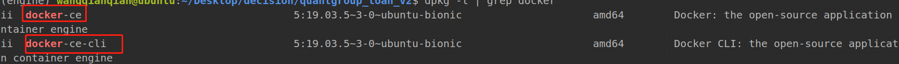

```shell
sudo apt-get autoremove docker-ce-*
```

4. 删除docker的相关配置&目录

```shell
 sudo rm -rf /etc/systemd/system/docker.service.d
 sudo rm -rf /var/lib/docker
```

5. 确定docker卸载完毕

```shell
docker --version
```

### Mac

<a href="https://www.docker.com/get-started">下载docker desktop</a>

拖动Docker 移动至Applications 完成安装

如果启动Hadoop容器报错：WARNING: Error loading config file: /Users/xiyucai/.docker/config.json: EOF

解决：

1. Locate the `config.json` file located under the `.docker` folder in your `Users` folder.
2. If the file is empty, add `{ }` to the file and save it.
3. Try the Docker task or command again.


# 22.Docker 内安装实例

## 1. Docker安装Tomcat

### 1. 通过docker pull tomcat

查找 [Docker Hub](https://hub.docker.com/_/tomcat?tab=tags) 上的 Tomcat 镜像:

[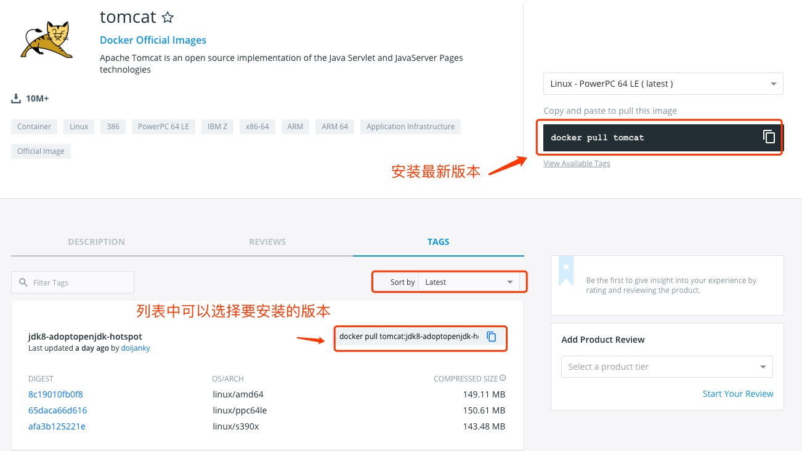](https://www.runoob.com/wp-content/uploads/2016/06/F5FE5252-6FD3-4DE3-880B-808477E45676.jpg)

可以通过 Sort by 查看其他版本的 tomcat，默认是最新版本 **tomcat:latest**。

此外，我们还可以用 docker search tomcat 命令来查看可用版本：

```shell
cxy@Cxy:~$ docker search tomcat
NAME                          DESCRIPTION                                     STARS               OFFICIAL            AUTOMATED
tomcat                        Apache Tomcat is an open source implementati…   2694                [OK]                
tomee                         Apache TomEE is an all-Apache Java EE certif…   77                  [OK]                
dordoka/tomcat                Ubuntu 14.04, Oracle JDK 8 and Tomcat 8 base…   53                                      [OK]
bitnami/tomcat                Bitnami Tomcat Docker Image                     31                                      [OK]
kubeguide/tomcat-app          Tomcat image for Chapter 1                      28                                      
consol/tomcat-7.0             Tomcat 7.0.57, 8080, "admin/admin"              17                                      [OK]
cloudesire/tomcat             Tomcat server, 6/7/8                            15                                      [OK]
aallam/tomcat-mysql           Debian, Oracle JDK, Tomcat & MySQL              12 
```

这里我们拉取官方的镜像：

```shell
cxy@Cxy:~$ docker pull tomcat
```

等待下载完成后，我们就可以在本地镜像列表里查到 REPOSITORY 为 tomcat 的镜像。

```shell
cxy@Cxy:~$ docker images tomcat
REPOSITORY          TAG                 IMAGE ID            CREATED             SIZE
tomcat              latest              6ab907c973d2        4 days ago          528MB
```

查看镜像的版本号并修改

```shell
$ docker image inspect tomcat:latest | grep -i version

$ docker tag tomcat:latest tomcat:9.0.36 
```


### 2. 通过 Dockerfile 构建

#### 1. 创建 tomcat 目录

首先，创建目录tomcat(==仓库的路径必须不含有大写字母==),用于存放后面的相关东西。

```shell
cxy@Cxy:~/文档/docker$ mkdir -p ./tomcat/webapps ./tomcat/logs ./tomcat/conf
```

> - webapps 目录将映射为 tomcat 容器配置的应用程序目录
> - logs 目录将映射为 tomcat 容器的日志目录
> - conf 目录里的配置文件将映射为 tomcat 容器的配置文件。

将安装包复制到tomcat目录

```shell
$ cp /home/cxy/下载/Java/apache-tomcat-9.0.33.tar.gz  ./
#xiyucai@xiyus-MacBook-Pro big data % cp apache-tomcat-9.0.36.tar.gz ~/Documents/MyCode/docker/tomcat
```


#### 2. 进入创建的 tomcat 目录，创建 Dockerfile

Ubuntu:

```dockerfile
FROM ubuntu
FROM openjdk
MAINTAINER cxy<946704740@qq.com>

#下载镜像加速
#RUN sed -i 's/archive.ubuntu.com/mirrors.ustc.edu.cn/g' /etc/apt/sources.list
#RUN sed -i 's#http://archive.ubuntu.com/#http://mirrors.tuna.tsinghua.edu.cn/#' /etc/apt/sources.list
#RUN sed -i 's/mirrors.ustc.edu.cn/archive.ubuntu.com/g' /etc/apt/sources.list

#安装vim编辑器,-y表示不询问直接安装
#RUN apt-get update
#RUN apt-get install -y vim

#把安装包添加到容器中
ADD apache-tomcat-9.0.33.tar.gz /usr/local

#配置 java 和 tomcat 环境变量
#ENV JAVA_HOME /usr/local/jdk
ENV CATALINA_HOME /usr/local/apache-tomcat-9.0.33
#ENV CATALINA_BASE  /usr/local/apache-tomcat-9.0.33
ENV PATH $PATH:$JAVA_HOME/bin:$CATALINA_HOME/lib:$CATALINA_HOME/bin

#设置工作时访问的WORKDIR, 即登录落脚点
#ENV MYPATH /usr/local
#WORKDIR $MYPATH
RUN mkdir -p "$CATALINA_HOME"
WORKDIR $CATALINA_HOME

#容器运行时监听的端口
EXPOSE 8080

#启动时运行tomcat
# ENTRYPOINT ["/usr/local/apache-tomcat-9.0.33/bin/startup.sh"]
# CMD ["/usr/local/apache-tomcat-9.0.33/bin/startup.sh"]
# ENTRYPOINT ["/usr/local/apache-tomcat-9.0.33/bin/catalina.sh","run"]
CMD /usr/local/apache-tomcat-9.0.33/bin/startup.sh && tail -F /usr/local/apache-tomcat-9.0.33/bin/logs/catalina.out
```

Mac :

```dockerfile
FROM ubuntu
FROM openjdk
MAINTAINER cxy<946704740@qq.com>

#下载镜像加速
#RUN sed -i 's/archive.ubuntu.com/mirrors.ustc.edu.cn/g' /etc/apt/sources.list
#RUN sed -i 's#http://archive.ubuntu.com/#http://mirrors.tuna.tsinghua.edu.cn/#' /etc/apt/sources.list
#RUN sed -i 's/mirrors.ustc.edu.cn/archive.ubuntu.com/g' /etc/apt/sources.list

#安装vim编辑器,-y表示不询问直接安装
#RUN apt-get update
#RUN apt-get install -y vim

#把安装包添加到容器中
ADD apache-tomcat-9.0.36.tar.gz /usr/local

#配置 java 和 tomcat 环境变量
#ENV JAVA_HOME /usr/local/jdk
ENV CATALINA_HOME /usr/local/apache-tomcat-9.0.36
#ENV CATALINA_BASE  /usr/local/apache-tomcat-9.0.33
ENV PATH $PATH:$JAVA_HOME/bin:$CATALINA_HOME/lib:$CATALINA_HOME/bin

#设置工作时访问的WORKDIR, 即登录落脚点
#ENV MYPATH /usr/local
#WORKDIR $MYPATH
RUN mkdir -p "$CATALINA_HOME"
WORKDIR $CATALINA_HOME

#容器运行时监听的端口
EXPOSE 8080

#启动时运行tomcat
# ENTRYPOINT ["/usr/local/apache-tomcat-9.0.33/bin/startup.sh"]
# CMD ["/usr/local/apache-tomcat-9.0.33/bin/startup.sh"]
# ENTRYPOINT ["/usr/local/apache-tomcat-9.0.33/bin/catalina.sh","run"]
CMD /usr/local/apache-tomcat-9.0.36/bin/startup.sh && tail -F /usr/local/apache-tomcat-9.0.36/bin/logs/catalina.out
```

#### 3. 构建

```shell
#在tomcat路径
cxy@Cxy:~/文档/docker/tomcat$ docker build -t cxytomcat9 .
#xiyucai@xiyus-MacBook-Pro tomcat % docker build -t tomcat-bydfile . 
#在其它任意路径, 镜像命名为cxy/tomcat
$docker build -f ~/文档/docker/tomcat/Dockerfile -t cxytomcat9 .
#xiyucai@xiyus-MacBook-Pro tomcat % docker build -f ~/Documents/MyCode/docker/tomcat/Dockerfile -t tomcat-bydfile .
#给镜像改名
$ docker tag 70ff7873d7cd 新名字:旧名字
#xiyucai@xiyus-MacBook-Pro tomcat % docker tag tomcat-bydfile:latest tomcat-bydfile:9.0.36
```

#### 4. run

```shell
cxy@Cxy:~/文档/docker/tomcat9$ docker run -d -p 8080:8080 --name mytomcat9 -v $PWD/test:/usr/local/apache-tomcat-9.0.33/webapps/test -v $PWD/logs:/usr/local/apache-tomcat-9.0.33/logs --privileged=true cxytomcat9

#docker run -d -p 8080:8080 --name tomcat-bydfile -v $PWD/test:/usr/local/apache-tomcat-9.0.36/webapps/test -v $PWD/logs:/usr/local/apache-tomcat-9.0.36/logs --privileged=true tomcat-bydfile:9.0.36
```

> 命令说明：
>
> >  **-p 8080:8080：**将容器的 8080 端口映射到主机的 8080 端口。
> >
> > **-v $PWD/test:/usr/local/tomcat/webapps/test：**将主机中当前目录下的 test 挂载到容器的 /test。

查看容器启动情况:

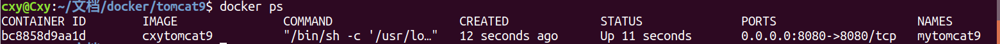

#### 5. 通过浏览器访问

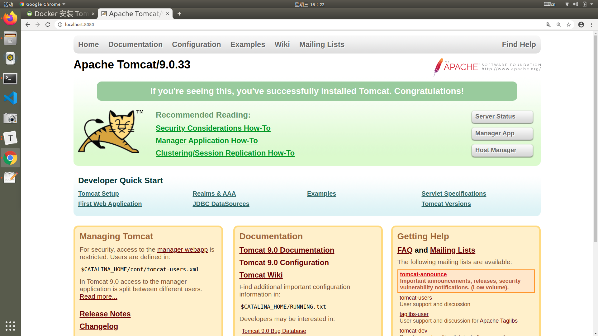

在容器外面操作:

```shell
cxy@Cxy:~/文档/docker/tomcat9$ docker exec b74599cedfc2 ls -l /usr/local
total 44
drwxr-xr-x 1 root root 4096 Apr 15 08:48 apache-tomcat-9.0.33
drwxr-xr-x 2 root root 4096 Mar 11 21:03 bin
drwxr-xr-x 2 root root 4096 Mar 11 21:03 etc
drwxr-xr-x 2 root root 4096 Mar 11 21:03 games
drwxr-xr-x 2 root root 4096 Mar 11 21:03 include
drwxr-xr-x 7 uucp  143 4096 Oct  5  2019 jdk1.8.0_231
drwxr-xr-x 2 root root 4096 Mar 11 21:03 lib
lrwxrwxrwx 1 root root    9 Mar 11 21:03 man -> share/man
drwxr-xr-x 2 root root 4096 Mar 11 21:04 sbin
drwxr-xr-x 3 root root 4096 Mar 11 21:03 share
drwxr-xr-x 2 root root 4096 Mar 11 21:03 src
```

#### 注意事项

1. 仓库的路径必须不含有大写字母
2. 如果想要修改镜像,可删掉本地的logs文件夹,再修改Dockerfile文件 重新build 和 run 即可

### 在Tomcat上的发布演示

1. 假设当前在tomcat9目录下, 在宿主机上test目录下新建 $PWD/test/WEB-INFO/web.xml

```xml
<?xml version="1.0" encoding="UTF-8"?>
<web-app xmlns="http://xmlns.jcp.org/xml/ns/javaee"
         xmlns:xsi="http://www.w3.org/2001/XMLSchema-instance"
         xsi:schemaLocation="http://xmlns.jcp.org/xml/ns/javaee http://xmlns.jcp.org/xml/ns/javaee/web-app_4_0.xsd"
         version="4.0">
</web-app>
```

2. 在宿主机上当前目录下新建 $PWD/test/a.jsp

```javascript
<%@ page contentType="text/html;charset=UTF-8" language="java" %>
<html>
  <head>
    <title>$Title$</title>
  </head>
  <body>
				----------------------welcome-----------------------
  <%="I am my docker tomcat,我显示在前端"%>
  <br>
  <br>
  <%System.out.println("=========my docker tomcat,我打印在后台============");%>
  </body>
</html>
```

3. 查看服务器端是否有宿主机上刚刚上传的文件

   ```shell
   cxy@Cxy:~/文档/docker/tomcat9/$ docker exec b74599cedfc2 ls -l /usr/local/apache-tomcat-9.0.33/webapps/test
   ```

4. 重启容器(tomcat服务器)

```shell
cxy@Cxy:~/文档/docker/tomcat9/test$docker restart b74599cedfc2
```

5. 在网页上查看a.jsp

   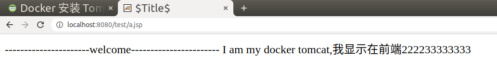

6. 修改a.jsp, 刷新网页, 也跟着变了

7. 查看logs

   ```shell
   cxy@Cxy:~/文档/docker/tomcat9/logs$ sudo cat catalina.out
   .......
   15-Apr-2020 09:28:12.326 INFO [main] org.apache.coyote.AbstractProtocol.start Starting ProtocolHandler ["http-nio-8080"]
   15-Apr-2020 09:28:12.339 INFO [main] org.apache.catalina.startup.Catalina.start Server startup in [840] milliseconds
   =========my docker tomcat,??????============
   =========my docker tomcat,??????============
   ```

   可以看到a.jsp里写的代码中后台打印的内容

   

## 2. Docker 安装MySQL

```shell
#搜索镜像
$ docker search mysql
#拉取镜像
$ docker pull mysql
```

#### 运行镜像

因为我宿主端安装过MySQL,所以3306端口被占用,将服务器端的端口改为3307了

```shell
$ docker run -itd --name mysql-d -p 3307:3306 -e MYSQL_ROOT_PASSWORD=12345c mysql
```

> - -p 3307:3306 : 将主机的

#### 查看是否安装成功

```shell
cxy@Cxy:~$ docker ps
cxy@Cxy:~$ docker exec -it c8e08e794ae2 /bin/bash

root@c8e08e794ae2:/# mysql -h localhost -u root -p
Enter password: 
Welcome to the MySQL monitor.  Commands end with ; or \g.
Your MySQL connection id is 8
Server version: 8.0.19 MySQL Community Server - GPL

Copyright (c) 2000, 2020, Oracle and/or its affiliates. All rights reserved.

Oracle is a registered trademark of Oracle Corporation and/or its
affiliates. Other names may be trademarks of their respective
owners.

Type 'help;' or '\h' for help. Type '\c' to clear the current input statement.

mysql> 
```

#### 用宿主机的Navicat连接Docker内的MySQL

```mysql
mysql> create database testdocker;
Query OK, 1 row affected (0.02 sec)

mysql> use testdocker
Database changed

mysql> create table try(id int,name varchar(20));
Query OK, 0 rows affected (0.08 sec)

mysql> insert into try values(1001,"cxy");
Query OK, 1 row affected (0.02 sec)

mysql> select * from try
    -> ;
+------+------+
| id   | name |
+------+------+
| 1001 | cxy  |
+------+------+
1 row in set (0.00 sec)
```

退出mysql,退出容器后,查看容器结构,复制容器的IP地址

```shell
cxy@Cxy:~$ docker inspect c8e08e794ae2
```

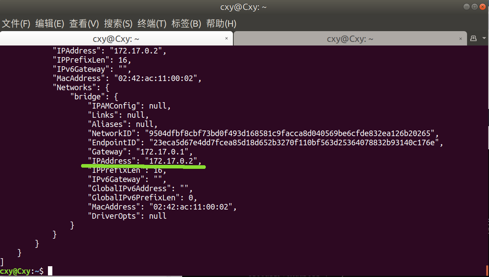


## 3. Docker安装Redis

```shell
#搜索镜像
$ docker search redis
#拉取镜像
$ docker pull redis
#查看本地镜像
$ docker images
```

#### 运行容器

安装完成后，我们可以使用以下命令来运行 redis 容器：

```shell
#运行 redis 容器, 因为我宿主端安装过Redis,所以6079端口被占用,将服务器端的端口改为6380了
$ docker run -itd --name redis-d -p 6380:6379 redis
#查看容器运行状态
$ docker ps
```

> **-p 6379:6379**：映射容器服务(服务器端)的 6379 端口到宿主机(客户端)的 6379 端口。外部可以直接通过宿主机ip:6379 访问到 Redis 的服务

#### 测试redis服务

接着我们通过 redis-cli 连接测试使用 redis 服务。

```shell
cxy@Cxy:~/文档/docker$ docker exec -it redis-d /bin/bash
root@1694ce85d640:/data# redis-cli
127.0.0.1:6379> ping
PONG
127.0.0.1:6379> set test 1
OK
127.0.0.1:6379> get test
"1"
```

## 4. 安装Hadoop

具体参照[本机安装](#5. Linux Hadoop安装)

### 1. 配置Dockerfile

```dockerfile
#Ubuntu
FROM ubuntu:18.04
VOLUME ["/dataVolumeContainer1","/dataVolumeContainer2"]

MAINTAINER cxy<946704740@qq.com>

#把安装包添加到容器中
ADD hadoop-2.6.0-cdh5.9.3.tar.gz /usr/local
ADD jdk-8u231-linux-x64.tar.gz /usr/local

#安装vim编辑器,-y表示不询问直接安装
RUN apt-get update
RUN apt-get install -y vim
#RUN apt-get install ruby
#RUN apt-get install ssh
#RUN apt-get insatll rsync

#设置工作时访问的WORKDIR, 即登录落脚点
ENV MYPATH /usr/local
WORKDIR $MYPATH

#配置环境变量
ENV JAVA_HOME /usr/local/jdk1.8.0_231
ENV CLASSPATH $JAVA_HOME/lib/dt.jar:$JAVA_HOME/lib/tools.jar

ENV HADOOP_HOME /usr/local/hadoop-2.6.0-cdh5.9.3
ENV PATH $PATH:$JAVA_HOME/bin:$HADOOP_HOME/bin:$HADOOP_HOME/sbin

#容器运行时监听的端口
#EXPOSE 50070
#EXPOSE 8088

#启动时运行
# ENTRYPOINT ["/usr/local/apache-tomcat-9.0.33/bin/startup.sh"]
# CMD ["/usr/local/apache-tomcat-9.0.33/bin/startup.sh"]
# ENTRYPOINT ["/usr/local/apache-tomcat-9.0.33/bin/catalina.sh","run"]
CMD /bin/bash
```

### 2. 构建镜像

```shell
cxy@Cxy:~/文档/docker/hadoop$ docker build -f Dockerfile -t hadoop1:2.6.0-cdh5.9.3 .
```

### 3. 运行镜像

```shell
#每次启动容器会重置/etc/hosts下的主机名和IP地址,
#以下方式可在创建容器时就加入多个主机名和地址
#docker run -itd --name hadoop1 --hostname hadoop1  --ip 172.17.3 --add-host hadoop2:172.17.4 --add-host hadoop3:172.17.5 -P -p 50070:50070 -p 8088:8088 ubuntu:18.04

#cxy@Cxy:~$ docker run -it --name standalone_hadoop ubuntu:18.04 /bin/bash
#登录时加上主机名,在后面配置的时候少出错
cxy@Cxy:~/文档/docker/hadoop$ docker run -it --name hadoop1 --hostname hadoop1 --ip 172.17.3 -P -p 50070:50070 -p 8088:8088 hadoop1:2.6.0-cdh5.9.3
```

### 4. 配置环境变量

```shell
#检查Hadoop和java有没有安装成功
root@hadoop1:/usr/local# hadoop version
root@hadoop1:/usr/local# java -version

#若没有安装,执行以下步骤
root@hadoop1:/usr/local# vim ~/.bashrc
#在末尾添加
export JAVA_HOME=/usr/local/jdk1.8.0_231
export PATH=$PATH:$JAVA_HOME/bin

export HADOOP_HOME=/usr/local/hadoop-2.6.0-cdh5.9.3
export PATH=$PATH:$HADOOP_HOME/bin:$HADOOP_HOME/sbin

root@hadoop1:/usr/local# hadoop version
root@hadoop1:/usr/local# java -version
```

### 5. 安装ruby

```shell
root@hadoop1:/usr/local# apt-get install ruby
```

### 6. 安装ssh

```shell
#如果已经生成过ssh-key则不用生成了否则将把原来的覆盖，使有些操作失效。如git不能推送到远程仓库
root@hadoop1:/usr/local# apt-get install ssh --fix-missing
root@hadoop1:/usr/local# apt-get install rsync
root@hadoop1:/usr/local#  ssh-keygen -t rsa
#一路回车或yes
......
+---[RSA 2048]----+
| ooo.++oO*       |
|  = o+o=+ .      |
| . +.oo  o       |
|    +.....       |
|   . o oS .      |
|  ... .. O .     |
|   .+ o E +      |
|   o.+ * o       |
|    oo=o=        |
+----[SHA256]-----+

root@hadoop1:/usr/local# ll -a  ~/.ssh/      
total 20
drwx------ 2 root root 4096 Apr 17 08:31 ./
drwx------ 1 root root 4096 Apr 17 08:31 ../
-rw------- 1 root root 1675 Apr 17 08:28 id_rsa
-rw-r--r-- 1 root root  394 Apr 17 08:28 id_rsa.pub

root@hadoop1:~/.ssh# cat id_rsa.pub >> authorized_keys
root@hadoop1:~/.ssh# cat authorized_keys 

/**测试**/
root@hadoop1:/usr/local#  ssh hadoop1  #不用输密码了
```

##### 报错:ssh: connect to host hadoop1 port 22: Connection refused

Install `openssh` server.    

For Ubuntu command is :     

```shell
$ apt-get install openssh-server
```

In hadoop-env.sh file ( present in /etc/hadoop) add the following line :

```shell
export HADOOP_SSH_OPTS="-p 22"      
```

Start SSH server:

```shell
$ service ssh start
```

Try again:

```shell
$ ssh hadoop1
he authenticity of host 'hadoop1 (172.17.0.3)' can't be established.
ECDSA key fingerprint is SHA256:zH7AF9MxoN86NWcpY6Hq8WprOQlwQmnaSFYvWYMwE9U.
Are you sure you want to continue connecting (yes/no)? yes
Warning: Permanently added 'hadoop1,172.17.0.3' (ECDSA) to the list of known hosts.
Welcome to Ubuntu 18.04.4 LTS (GNU/Linux 4.15.0-96-generic x86_64)

 * Documentation:  https://help.ubuntu.com
 * Management:     https://landscape.canonical.com
 * Support:        https://ubuntu.com/advantage
This system has been minimized by removing packages and content that are
not required on a system that users do not log into.

To restore this content, you can run the 'unminimize' command.

The programs included with the Ubuntu system are free software;
the exact distribution terms for each program are described in the
individual files in /usr/share/doc/*/copyright.

Ubuntu comes with ABSOLUTELY NO WARRANTY, to the extent permitted by
applicable law.
```

### 7. 集群环境搭建

详见标题19,以及BigData.md,以下只贴代码

#### 1. 单机模式/本地模式(Standalone Operation)

这种模式在一台单机上运行，没有分布式文件系统，而是直接读写本地操作系统的文件系统，一般仅用于本地MR程序的调试

1. 官方Grep案例

```shell
$ mkdir input
$ cp etc/hadoop/*.xml input
$ bin/hadoop jar share/hadoop/mapreduce/hadoop-mapreduce-examples-2.6.0-cdh5.9.3.jar grep input output 'dfs[a-z.]+'
$ cat output/*
```

2. 官方WordCount案例

```shell
$ mkdir wcinput
$ vim wcinput/wc.input
#输入:
hadoop yarn
hadoop mapreduce
atguigu
atguigu

$ hadoop jar share/hadoop/mapreduce/hadoop-mapreduce-examples-2.6.0-cdh5.9.3.jar wordcount wcinput wcoutput
#查看结果
$ cat wcoutput/part-r-00000
atguigu	2
hadoop	2
mapreduce	1
yarn	1
```

#### 2. 伪分布模式(不要求掌握)

这种模式也是在一台单机上运行(一个节点)，但用不同的Java进程模仿分布式运行中的各类结点: (NameNode,DataNode,JobTracker,TaskTracker,SecondaryNameNode)
 　请注意分布式运行中的这几个结点的区别：

##### 1. 启动HDFS并运行MapReduce程序

- **配置集群**

  ==注意java和Hadoop的HOME目录和缓存不要错了,localhost根据需要想要登录的主机名(要改就全部地方都改)==

  切换到$HADOOP_HOME/etc/hadoop路径下:

  1. ==hadoop-env.sh==

     ```shell
     root@hadoop1:/usr/local/hadoop-2.6.0-cdh5.9.3/etc/hadoop# vim hadoop-env.sh
     #输入:
     
     export JAVA_HOME=/usr/local/jdk1.8.0_231
     export HADOOP_HOME=/usr/local/hadoop-2.6.0-cdh5.9.3
     
     #export HADOOP_SSH_OPTS="-p 22"
     ```

  2. ==core-site.xml==

     将下面<configuration></configuration>里的内容存到配置文件的<configuration></configuration>里

       ```xml
     <configuration>
       
           <property>
             <name>fs.defaultFS</name>
               <value>hdfs://hadoop1:9000</value>
           </property>
             
       		<property>
                       <name>hadoop.tmp.dir</name>
                       <value>/usr/local/hadoop-2.6.0-cdh5.9.3/temp</value>
           </property>  
       </configuration>
       ```

  3. ==hdfs-site.xml==

     ```xml
     <configuration>
         
           <property>
                       <name>dfs.replication</name>
                       <value>1</value>
            </property>
          
       </configuration>
     ```

      注：第二个属性中/home/cxy/Hdp/app/tmp路径用来存放临时文件，因为hadoop.tmp.dir的默认路径...tmp重启会被清空

  4. /opt/hadoop-2.6.0-cdh5.9.3/etc/hadoop/==slaves==

     ```shell
     root@hadoop1:/usr/local/hadoop-2.6.0-cdh5.9.3/etc/hadoop# vim slaves 
     #localhost
     hadoop1
     ```

       将localhost改为主机名.==只有在群起的时候slaves才发挥作用==,其余都不用配置slaves

     

- **启动集群**(后面的操作都在HADOOP_HOME目录下)

  1. 第一次启动Hadoop必须要格式化，格式化不要重复执行, 如果格式化没报错则配置完成

     ```shell
     $ bin/hdfs namenode -format
      #格式化
     #看到最后某行显示如下,即格式化成功
     INFO common.Storage: Storage directory /opt/hadoop-2.6.0-cdh5.9.3/temp/dfs/name has been successfully formatted
     ```

  2. 启动NameNode

     ```shell
     $ sbin/hadoop-daemon.sh start namenode
     ```

  3. 启动DataNode

     ```shell
     $ sbin/hadoop-daemon.sh start datanode
     ```


- **查看集群**

  1. 查看是否启动成功 :

  ```shell
  $ jps
  14913 Jps
  14650 NameNode
  15260 DataNode
  ```

  ​	注意：jps是JDK中的命令，不是Linux命令。不安装JDK不能使用jps

  

  2. web端查看HDFS文件系统

     http://localhost:50070/dfshealth.html#tab-overview

     如果是docker上的Hadoop,请将localhost改为仓库的ip地址(可用docker inspect [容器ID] 查看ip),如:

     http://172.17.0.2:50070/dfshealth.html#tab-overview

     注意自己设置的端口号

     http://localhost:50071/dfshealth.html#tab-overview

     看到如下图则配置成功:
     
     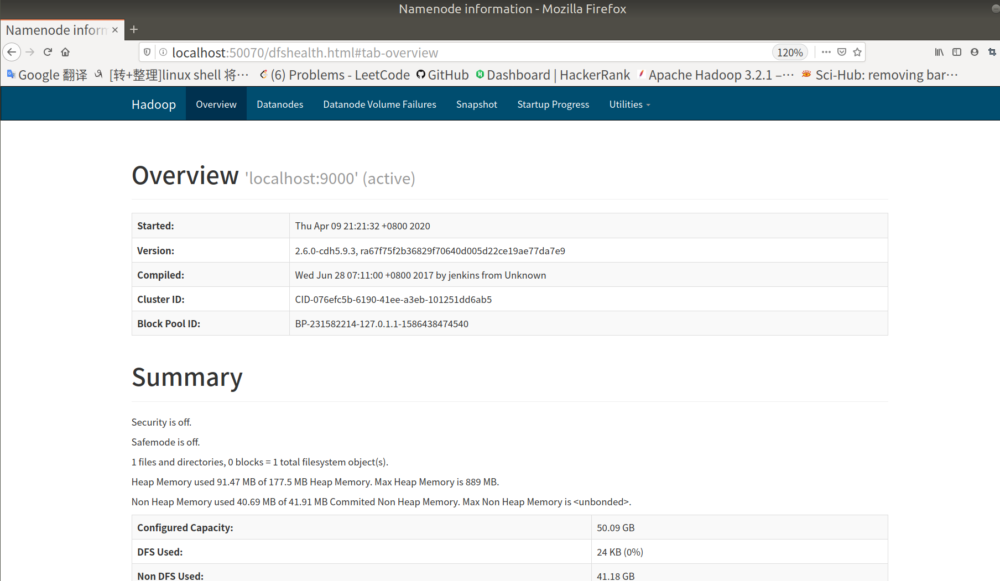
     
     

- **操作集群**

  1. 在HDFS文件系统上**创建**一个input文件夹

     ```shell
     $ bin/hdfs dfs -mkdir -p /user/input
     ```

  2. 将测试文件内容**上传**到文件系统上

     ```shell
     $bin/hdfs dfs -put wcinput/wc.input  /user/input/
     ```

  3. **查看**上传的文件是否正确

     ```shell
     $ bin/hdfs dfs -ls  /user/input/
     $ bin/hdfs dfs -cat  /user/input/wc.input
     ```

  4. **运行**MapReduce程序

  ```shell
  $ bin/hadoop jar share/hadoop/mapreduce/hadoop-mapreduce-examples-2.6.0-cdh5.9.3.jar wordcount /user/input /user/output
  ```

  5. 查看**输出**结果

  ```shell
  $ bin/hdfs dfs -cat /user/output/*
  
  20/04/17 09:03:35 WARN util.NativeCodeLoader: Unable to load native-hadoop library for your platform... using builtin-java classes where applicable
  atguigu	2
  hadoop	2
  mapreduce	1
  yarn	1
  
  #再开一个终端从宿主机拷lib文件夹
  $cxy@Cxy:~/下载/lib$ docker cp native/ 4c403e963503:/usr/local/hadoop-2.6.0-cdh5.9.3/lib
  #再查看结果就没有提示了
  $bin/hdfs dfs -cat /user/output/* 
  atguigu	2
  hadoop	2
  mapreduce	1
  yarn	1
  ```

  

  6. 将测试文件内容**下载**到本地

  ```shell
  $ hdfs dfs -get /user/output/part-r-00000 ./wcoutput/
  ```

  7. **删除**输出结果

  ```shell
  $ hdfs dfs -rm -r /user/output
  ```

##### 2. 启动YARN并运行MapReduce程序

1. **配置YARN**

==注意java和Hadoop的HOME目录和缓存不要错了,localhost根据需要想要登录的主机名(要改就全部地方都改)==/usr/local/hadoop-2.6.0-cdh5.9.3

1. ==yarn-env.sh==

   ```shell
   root@hadoop1:/usr/local/hadoop-2.6.0-cdh5.9.3# vim etc/hadoop/yarn-env.sh
   
   #输入:
   export JAVA_HOME=/usr/local/jdk1.8.0_231
   ```

2. ==yarn-site.xml==

   将下面<configuration></configuration>里的内容存到配置文件的<configuration></configuration>里

     ```xml
   <configuration>
     
   <property>
    		<name>yarn.nodemanager.aux-services</name>
    		<value>mapreduce_shuffle</value>
   </property>
   
   <property>
   			<name>yarn.resourcemanager.hostname</name>
   			<value>hadoop1</value>
   </property>
     
     </configuration>
     ```

3. ==mapred-env.sh==

   ```shell
   root@hadoop1:/usr/local/hadoop-2.6.0-cdh5.9.3# vim etc/hadoop/mapred-env.sh
   #输入:
   export JAVA_HOME=/usr/local/jdk1.8.0_231
   ```

4. ==mapred-site.xml==

   ```shell
   root@hadoop1:/usr/local/hadoop-2.6.0-cdh5.9.3/etc/hadoop# cp mapred-site.xml.template mapred-site.xml          
   root@hadoop1:/usr/local/hadoop-2.6.0-cdh5.9.3/etc/hadoop# vim mapred-site.xml
   
   <property>
   		<name>mapreduce.framework.name</name>
   		<value>yarn</value>
   </property>
   ```

   

2.**启动集群**(以下命令在$HADOOP_HOME下运行)

1. 启动前必须保证NameNode和DataNode已经启动

2. 启动ResourceManager

   ```shell
   $ sbin/yarn-daemon.sh start resourcemanager
   ```

3. 启动NodeManager

   ```shell
   $ sbin/yarn-daemon.sh start nodemanager
   ```

   

3. **查看集群**

1. 查看是否启动成功 :

```shell
$ jps
16194 ResourceManager
5557 DataNode
17189 Jps
17015 NodeManager
5454 NameNode
```

4. **操作集群**

1. YARN的浏览器页面

   http://localhost:8088/cluster

   or (docker inspect [containerID])查看自己的ip

   http://172.17.0.2:8088/cluster

   查看，如图2-35所示

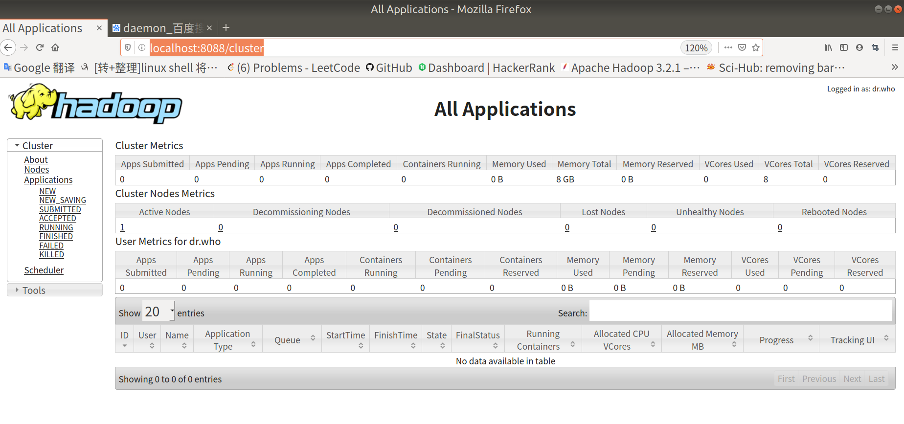

```shell
hadoop fs -put wcinput /

hadoop jar share/hadoop/mapreduce/hadoop-mapreduce-examples-2.6.0-cdh5.9.3.jar wordcount /wcinput /wcoutput

hadoop fs -cat /wcoutput/*
```

2. 删除文件系统上的output文件

   ```shell
   $ bin/hdfs dfs -rm -R /user/output
   ```

3. 执行MapReduce程序

   ```shell
   $ bin/hadoop jar share/hadoop/mapreduce/hadoop-mapreduce-examples-2.6.0-cdh5.9.3.jar wordcount /user/input  /user/output
   ```

4. 查看运行结果

   ```shell
   $  bin/hdfs dfs -cat /user/output/*
   ```


#### 3. 完全分布模式

Docker Ubuntu容器安装ping

```shell
apt-get update
apt-get install iputils-ping
apt-get install net-tools
```

##### 3.1 开启3个容器实例

https://cr.console.aliyun.com/repository/cn-chengdu/cxy_explore

1. 如果集群是第一次启动，需要格式化NameNode（注意格式化之前，一定要先停止上次启动的所有namenode和datanode进程，然后再==删除data和log数据==）

   ```shell
   root@hadoop1:/usr/local/hadoop-2.6.0-cdh5.9.3# rm -rf temp/ logs/
   ```

2. 生成镜像并推送到Registry

```shell
#生成镜像,提交到本地库
$ docker commit -a cxy -m "Hadoop environment with Standalone Mode and Pseudo-Distributed Mode" f33d8841c3fd cxy/hadoop:2.6.0-cdh5.9.3-2

#推送到远端
$ sudo docker login --username=xyxc202 registry.cn-chengdu.aliyuncs.com
$ sudo docker tag a8bde387779b registry.cn-chengdu.aliyuncs.com/cxy_explore/cxy-hadoop:2.6.0-cdh5.9.3-2
$ sudo docker push registry.cn-chengdu.aliyuncs.com/cxy_explore/cxy-hadoop:2.6.0-cdh5.9.3-2
```

2. 开启3个hadoop的实例

   –hostname 和–ip中的配置会加载到 /etc/hosts中,但是当容器关闭,/etc/hosts中的自己配置的内容就会清掉,建议不要随便关掉容器. 

   ```shell
   #$docker run -it --name hadoop1 --hostname hadoop1 --ip 172.17.2 -P -p 50070:50070 -p 8088:8088 --privileged=true cxy/hadoop:2.6.0-cdh5.9.3-2
   
   $docker run -it --name hadoop2 --hostname hadoop2 --ip 172.17.2 -P -p 50071:50070 -p 8089:8088 --privileged=true cxy/hadoop:2.6.0-cdh5.9.3-2
   
   $docker run -it --name hadoop3 --hostname hadoop3 --ip 172.17.3 -P -p 50072:50070 -p 8090:8088 --privileged=true cxy/hadoop:2.6.0-cdh5.9.3-2
   
   $docker run -it --name hadoop4 --hostname hadoop4 --ip 172.17.4 -P -p 50073:50070 -p 8091:8088 --privileged=true cxy/hadoop:2.6.0-cdh5.9.3-2
   
   #$ docker run -it --name hadoop5 --hostname hadoop5 --ip 172.17.5 -P -p 50074:50070 -p 8092:8088 --privileged=true cxy/hadoop:2.6.0-cdh5.9.3-2
   ```

3. 改配置中的主机名和设置hosts(vim /etc/hosts),==容器和宿主机的hosts都要将所有ip加进去==

   - core-site.xml
   - yarn-site.xml
   - slaves
   - ==/etc/hosts== : 因为后面要实现服务器之间传文件,所以在各自的主机中都要把所有的主机名和ip地址加上

   

##### 3.2 编写集群分发脚本

- > **如果是==虚拟机==,可以用scp在虚拟机间传数据**
  >
  > ```shell
  > $ scp -r source destination #scp可以实现服务器与服务器之间的数据拷贝
  > #e.g.
  > root@hadoop1:~# scp -r hadoop1:/usr/local/hadoop-2.6.0-cdh5.9.3/new.txt hadoop2:/usr/local/hadoop-2.6.0-cdh5.9.3/
  > scp -r hadoop1:/usr/local/hadoop-2.6.0-cdh5.9.3/new.txt hadoop2:/usr/local/hadoop-2.6.0-cdh5.9.3/
  > 
  > ```
  >
  > **如果是==docker==, 需要要宿主机作中介**
  >
  > - 从容器内拷贝文件到宿主机上
  >
  > ```shell
  > $ docker cp 容器ID : 容器路径 目标主机路径
  > $docker cp 99b4b4762023:/usr/local/hadoop-2.6.0-cdh5.9.3/input ~/文档/
  > ```
  >
  > - 从宿主机拷文件到容器里
  >
  > ```shell
  > $ docker cp 宿主机文件路径 容器:要拷贝到容器里面对应的路径  
  > docker cp ~/文档/input c5a4ac7f43cb:/usr/local/hadoop-2.6.0-cdh5.9.3
  > ```
  >

- rsync 远程同步工具

  > rsync主要用于备份和镜像。具有**速度快**、**避免复制相同内容**和支持符号链接的优点。
  >
  > rsync和scp区别：用rsync做文件的复制要比scp的速度快，rsync只对**差异**文件做更新。scp是把所有文件都复制过去。输入文件夹和输出文件夹必须是同一路径
  >
  > 开启ssh(此步骤可在rsync之前)
  >
  > ```shell
  > #将传输文件的所有主机的ssh服务开启再尝试链接
  > root@hadoop2:~# service ssh start
  > #注:想测试xsync要先注意看每个主机的hosts有没有配置好
  > ```
  >
  > ```shell
  > root@hadoop2# rsync -av hadoop2:/usr/local/hadoop-2.6.0-cdh5.9.3/input /usr/local/hadoop-2.6.0-cdh5.9.3/
  > ```
  >
  > | 选项 | 功能                                               |
  > | ---- | -------------------------------------------------- |
  > | -a   | 归档拷贝(修改时间,权限,所有者等信息和原来完全一致) |
  > | -v   | 显示复制过程                                       |
  >
  > 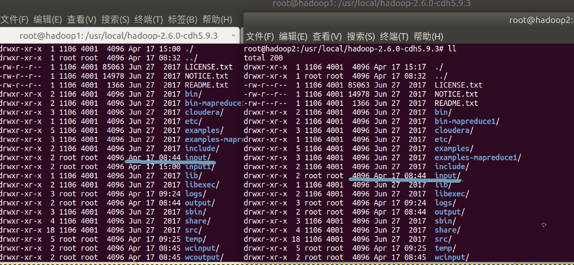

- xsync集群分发脚本

  （1）需求：循环复制文件到所有节点的相同目录下

  （2）需求分析：

  > - 期望脚本：xsync要同步的文件名称
  >
  > - ==说明：在/home/xxx/bin或/usr/local/bin 这个目录下存放的脚本，用户可以在系统任何地方直接执行==。
  >
  >   > 脚本实现:
  >   >
  >   > 在/usr/local/bin 目录下创建 *xsync* 文件
  >   >
  >   > ==注意看每个主机的hosts有没有配置好==
  >   >
  >   > ```shell
  >   > root@hadoop2:/usr/local/bin# vim xsync
  >   > 
  >   > #!/bin/bash
  >   > #1 获取输入参数个数，如果没有参数，直接退出
  >   > pcount=$#
  >   > if ((pcount==0)); then
  >   > echo no args;
  >   > exit;
  >   > fi
  >   > 
  >   > #2 获取文件名称
  >   > p1=$1
  >   > fname=`basename $p1`
  >   > echo fname=$fname
  >   > 
  >   > #3 获取上级目录到绝对路径,-P可追踪软连接到绝对路径
  >   > pdir=`cd -P $(dirname $p1); pwd`
  >   > echo pdir=$pdir
  >   > 
  >   > #4 获取当前用户名称,注意看每个主机的hosts有没有配置好
  >   > user=`whoami`
  >   > 
  >   > #5 循环, 注意起始位置不要把自己算进去了
  >   > for((host=3; host<5; host++)); do
  >   >   echo ------------------- hadoop$host --------------
  >   >   rsync -av $pdir/$fname $user@hadoop$host:$pdir
  >   > done
  >   > ```
  >   >
  >   > ```shell
  >   > #设置权限
  >   > root@hadoop1:/usr/local/bin# chmod 777 xsync
  >   > #xsync集群分发
  >   > root@hadoop1:~# xsync /usr/local/bin/xsync
  >   > 
  >   > #在其它主机上查看有没有收到文件
  >   > root@hadoop2:~# ll /usr/local/bin/
  >   > .......
  >   > -rwxrwxrwx 1 root root  337 Apr 18 04:36 xsync*
  >   > 
  >   > root@hadoop3:~/.ssh# ll /usr/local/bin/
  >   > ......
  >   > -rwxrwxrwx 1 root root  337 Apr 18 04:36 xsync*
  >   > ```
  >   >
  >   > 同理,创建jpsall:
  >   >
  >   > ```shell
  >   > #!/bin/bash
  >   > for i in hadoop2 hadoop3 hadoop4
  >   > do
  >   > echo --------------------- $i -------------------------------
  >   > ssh $i  "source /etc/profile && jps | grep -v Jps "
  >   > done
  >   > ```
  >   >
  >   > 如果报错：<a href="https://www.52pojie.cn/thread-1108853-1-1.html">bash: jps: command not found</a>,可输入jps命令下的绝对路径：
  >   >
  >   > ```shell
  >   > #!/bin/bash
  >   > for((host=2;host<5;host++));
  >   > do
  >   > echo --------------------- hadoop$host -------------------------------
  >   > ssh hadoop$host "/usr/local/jdk1.8.0_231/bin/jps"
  >   > done
  >   > ```
  >
  > 注意：如果将xsync放到/home/xxx/bin目录下仍然不能实现全局使用，可以将xsync移动到/usr/local/bin目录下

​	

- 快速分发Hadoop和java

  ```shell
  #/usr/local/bin是添加到环境变量的,所以,此时分发不一定要把文件放在/usr/local/sbin目录下
  root@hadoop1:~/.ssh# echo $PATH
  /usr/local/sbin:/usr/local/bin:/usr/sbin:/usr/bin:/sbin:/bin:/usr/games:/usr/local/games:/usr/local/jdk1.8.0_231/bin:/usr/local/hadoop-2.6.0-cdh5.9.3/bin:/usr/local/hadoop-2.6.0-cdh5.9.3/sbin
  
  root@hadoop1:/usr/local/hadoop-2.6.0-cdh5.9.3# ll
  total 200
  .......
  -rwxr-xr-x  1 root root   337 Apr 18 06:37 xsync*
  #查看修改xsync文件中分发的主机
  $ vim /usr/local/bin/xsync
  #此时就可以把hadoop1的Hadoop和java安装包分发到其他主机,
  #注意如果主机不同,先删除~/.ssh下的known_hosts
  root@hadoop1:/usr/local/hadoop-2.6.0-cdh5.9.3# xsync xsync 
  ```

  

##### 3.3 集群配置

1. 集群部署规划

   |      | hadoop2                   | hadoop3                             | hadoop4                            |
   | ---- | ------------------------- | ----------------------------------- | ---------------------------------- |
   | HDFS | DataNode<br/>==NameNode== | DataNode                            | DataNode<br/>==SecondaryNameNode== |
   | YARN | NodeManager               | NodeManager<br/>==ResourceManager== | NodeManager                        |


2. 配置集群(先在主机hadoop2在配置再分发出去)

   - core-site.xml

     指定HDFS中NameNode的地址(如上表): hadoop2

     ```xml
             <property>
                     <name>fs.defaultFS</name>
                     <value>hdfs://hadoop2:9000</value>
             </property>
     
             <property>
                     <name>hadoop.tmp.dir</name>
                     <value>/usr/local/hadoop-2.6.0-cdh5.9.3/temp</value>
             </property>
     ```

   - slaves

     slaves文件只作用在NameNode上面,比如我在slaves里面配置了
      host1
      host2
      host3
      三台机器，这时候如果突然间新增了一台机器，比如是host4，会发现在NN上host4也自动加入到集群里面了，HDFS的磁盘容量上来了，这下子不是出问题了？假如host4不是集群的机器，是别人的机器，然后配置的时候指向了NN，这时候NN没有做判断岂不是把数据也有可能写到host4上面？这对数据安全性影响很大。所以可以在hdfs-site.xml里面加限制

   - yarn-site.xml

     ```xml
     <!-- Reducer获取数据的方式 -->
     <property>
     		<name>yarn.nodemanager.aux-services</name>
     		<value>mapreduce_shuffle</value>
     </property>
     
     <!-- 指定YARN的ResourceManager的地址 -->
     <property>
     		<name>yarn.resourcemanager.hostname</name>
     		<value>hadoop3</value>
     </property>
     ```

   - hdfs-site.xml

     ```xml
     <!-- 指定HDFS副本的数量(节点数): 3 -->
     <property>
     		<name>dfs.replication</name>
     		<value>3</value>
     </property>
     
     <!-- 指定Hadoop辅助名称节点主机配置 -->
     <property>
           <name>dfs.namenode.secondary.http-address</name>
           <value>hadoop4:50090</value>
     </property>
     ```

   - mapred-env.sh, hadoop-env.sh, yarn-env.sh

     只配置JAVA_HOME, 生成镜像时已配

   

3. 在集群上分发配置好的Hadoop配置文件

   ```shell
   root@hadoop2:/usr/local/hadoop-2.6.0-cdh5.9.3#xsync etc/
   ```

   **注:** 直接将HDFS的主机hadoop1的etc文件夹分发给从机即可

4. 查看文件分发情况

5. 配置完成,保存镜像

```shell
$ docker commit -a cxy -m "Hadoop environment,Fully-Distributed Mode,hadoop2" e9f409e5eaf9 cxy/hadoop:2.6.0-cdh5.9.3-3_hadoop2
#推送到远端
$ sudo docker login --username=xyxc202 registry.cn-chengdu.aliyuncs.com
$ sudo docker tag 86402274886b registry.cn-chengdu.aliyuncs.com/cxy_explore/cxy-hadoop:2.6.0-cdh5.9.3-3_hadoop2
$ sudo docker push registry.cn-chengdu.aliyuncs.com/cxy_explore/cxy-hadoop:2.6.0-cdh5.9.3-3_hadoop2


$ docker commit -a cxy -m "Hadoop environment,Fully-Distributed Mode,hadoop3" 8cad0e953ab1 cxy/hadoop:2.6.0-cdh5.9.3-3_hadoop3
#推送到远端
$ sudo docker tag 662b7479902d registry.cn-chengdu.aliyuncs.com/cxy_explore/cxy-hadoop:2.6.0-cdh5.9.3-3_hadoop3
$ sudo docker push registry.cn-chengdu.aliyuncs.com/cxy_explore/cxy-hadoop:2.6.0-cdh5.9.3-3_hadoop3

$ docker commit -a cxy -m "Hadoop environment,Fully-Distributed Mode,hadoop4" d5a5681e1c3e cxy/hadoop:2.6.0-cdh5.9.3-3_hadoop4
#推送到远端
$ sudo docker tag b07c8dd4b05d registry.cn-chengdu.aliyuncs.com/cxy_explore/cxy-hadoop:2.6.0-cdh5.9.3-3_hadoop4
$ sudo docker push registry.cn-chengdu.aliyuncs.com/cxy_explore/cxy-hadoop:2.6.0-cdh5.9.3-3_hadoop4
```

https://cr.console.aliyun.com/repository/cn-chengdu/cxy_explore

##### 3.4 集群单点启动(手动一个个地启动)

```shell
#hadoop1格式化
#注意现在用的镜像是运行过单机模式和伪分布模式的,已经格式化过了
#如果未格式化过请格式化,如果删除了temp 和 log文件夹，需要重新格式化，不然namenode不能启动
root@hadoop1:/usr/local/hadoop-2.6.0-cdh5.9.3# hdfs namenode -format

#hadoop2启动namenode
root@hadoop2:/usr/local/hadoop-2.6.0-cdh5.9.3#hadoop-daemon.sh start namenode

#hadoop2,hadoop3,hadoop4启动datanode
root@hadoop2:/usr/local/hadoop-2.6.0-cdh5.9.3#hadoop-daemon.sh start datanode
root@hadoop3:/usr/local/hadoop-2.6.0-cdh5.9.3#hadoop-daemon.sh start datanode
root@hadoop4:/usr/local/hadoop-2.6.0-cdh5.9.3#hadoop-daemon.sh start datanode

#hadoop4启动secondarynamenode
root@hadoop4:/usr/local/hadoop-2.6.0-cdh5.9.3# hadoop-daemon.sh start secondarynamenode
```

关闭：

```shell
sbin/hadoop-daemon.sh stop namenode
sbin/hadoop-daemon.sh stop datanode
```

http://172.17.0.2:50070/dfshealth.html#tab-overview

http://localhost:50071/dfshealth.html#tab-overview

##### 3.5 SSH无密登录配置

1. ssh

- ssh-1：对称加密，加密和解密都用相同的密钥
- ssh-2：非对称加密（如下图）

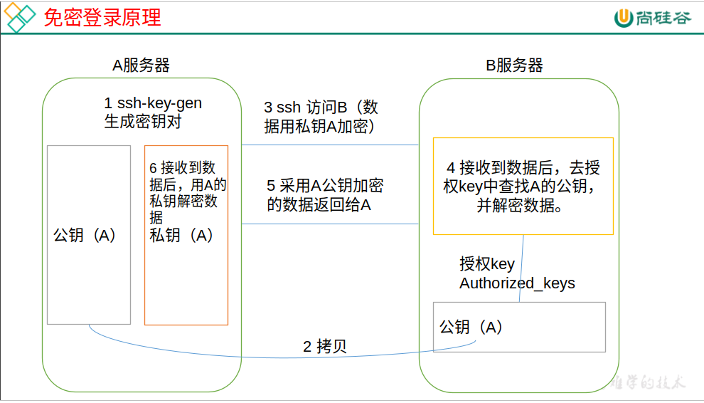

2. 测试用hadoop2免密登录hadoop3

   注意每次重新打开容器,端口都会重新分配的(因为/etc/hosts中的配置被清掉,建议不要随便关闭容器),查看每个主机中的hosts,把所有主机都加上

   注: ~/.ssh/authorized_keys里装的是所有已知的能免密登录本机的密钥

   > - authorized_keys: 存放授权过得无密登录服务器公钥
   > - id_rsa : 生成的私钥文件
   > - id_rsa.pub ： 生成的公钥文件 
   > - know_hosts : 记录ssh访问过计算机的公钥(public key)

   ```shell
   root@hadoop2:/usr/local# service ssh start
   root@hadoop3:/usr/local# service ssh start
   
   root@hadoop2:/usr/local# ssh-copy-id hadoop3
   #如果提示更新
   #root@hadoop2:/usr/local# ssh-keygen -f "/root/.ssh/known_hosts" -R "hadoop3"
   #看能否免密登录hadoop3
   
   #可以看到是hadoop2的公钥,可以不用ssh-cop-id,直接手动复制
   root@hadoop3:/usr/local# cat ~/.ssh/authorized_keys 
   
   #如果提示输密码可设置:
   #vi /etc/ssh/sshd_config
   #PasswordAuthentication no
   #service ssh restart
   
   
   root@hadoop2:/usr/local# ssh hadoop3
   Welcome to Ubuntu 18.04.4 LTS (GNU/Linux 4.15.0-96-generic x86_64)
   .......
   Last login: Fri Apr 17 08:41:55 2020 from 172.17.0.2
   root@hadoop3:~# 
   ```

##### 3.6 群起集群

1. 配置slaves

```shell
#配置所有从机
root@hadoop2:/usr/local/hadoop-2.6.0-cdh5.9.3# vim etc/hadoop/slaves 
hadoop2
hadoop3
hadoop4

#分发配置
root@hadoop2:/usr/local/hadoop-2.6.0-cdh5.9.3# xsync etc/hadoop/slaves
```

2. 启动集群

如果集群是第一次启动，需要格式化NameNode（注意格式化之前，一定要先停止上次启动的所有namenode和datanode进程，然后再==删除data和log数据==）

- 启动HDFS

```shell
root@hadoop3:/usr/local/hadoop-2.6.0-cdh5.9.3# rm -rf temp/ logs/
root@hadoop4:/usr/local/hadoop-2.6.0-cdh5.9.3# rm -rf temp/ logs/

root@hadoop2:/usr/local/hadoop-2.6.0-cdh5.9.3# vim etc/hadoop/core-site.xml 
root@hadoop2:/usr/local/hadoop-2.6.0-cdh5.9.3# vim etc/hadoop/yarn-site.xml 
root@hadoop2:/usr/local/hadoop-2.6.0-cdh5.9.3# vim etc/hadoop/hdfs-site.xml 
root@hadoop2:/usr/local/hadoop-2.6.0-cdh5.9.3# start-dfs.sh                          
Starting namenodes on [hadoop2]
hadoop2: starting namenode, logging to /usr/local/hadoop-2.6.0-cdh5.9.3/logs/hadoop-root-namenode-hadoop2.out
hadoop4: starting datanode, logging to /usr/local/hadoop-2.6.0-cdh5.9.3/logs/hadoop-root-datanode-hadoop4.out
hadoop3: starting datanode, logging to /usr/local/hadoop-2.6.0-cdh5.9.3/logs/hadoop-root-datanode-hadoop3.out
hadoop2: starting datanode, logging to /usr/local/hadoop-2.6.0-cdh5.9.3/logs/hadoop-root-datanode-hadoop2.out
Starting secondary namenodes [hadoop4]
hadoop4: starting secondarynamenode, logging to /usr/local/hadoop-2.6.0-cdh5.9.3/logs/hadoop-root-secondarynamenode-hadoop4.out
```

- 启动YARN

  ```shell
  root@hadoop3:/usr/local/hadoop-2.6.0-cdh5.9.3# start-yarn.sh
  ```

  注意：NameNode和ResourceManger如果不是同一台机器，不能在NameNode上启动 YARN，应该在ResouceManager所在的机器上启动YARN

- Web端查看SecondaryNameNode

  http://172.17.0.2:50070/dfshealth.html#tab-overview

  http://localhost:50071/dfshealth.html#tab-overview
  
  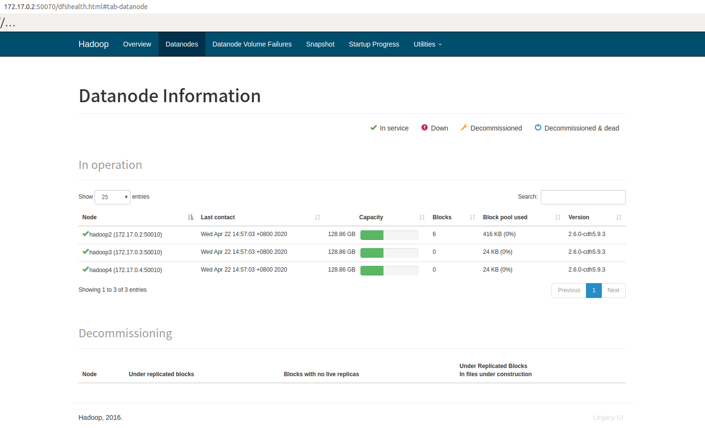
  
  注意: 如果发现只有hadoop2一个节点,可能是因为我之前的镜像是格式化且启动过hdfs发,导致datanode的VERSION里面有2个id是一样的，datanodeUuid和storageID，因此在master:50070上死活只看到一个datanode.
  
  解决方法: 删掉hadoop3,hadoop4的temp和logs文件夹
  
  ```shell
  root@hadoop4:/usr/local/hadoop-2.6.0-cdh5.9.3# rm -rf temp/ logs/
  ```
  
  
  
  http://172.17.0.3:8088/cluster  : 看Nodes
  
  http://localhost:8090/cluster 注意端口

3. 在Mac下不能ping通容器的IP。

   ​				                     ==LINUX的docker架构==                          ==OSX的docker架构==

   <center>
     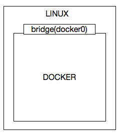 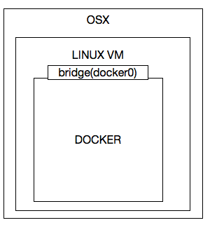
   </center>


   docker是在linux内核容器基础上实现的，linux安装docker后，会创建一个为docker0的虚拟网卡，linux宿机与docker容器之间的通信，通过docker0虚拟网卡进行

   docker在OSX的实现方式，是首先创建一个linux的虚拟机，在将docker放入到虚拟机中实现，而对于linux虚拟机，与OSX之间的通信，目前版本采用`/var/run/docker.sock`这种socket文件来通信，在OSX宿机中自然ping不通docker容器。

   

4. 集群基本测试

   - 上传文件

     ```shell
     $ hdfs dfs -put wcinput /
     ```

   - 计算

     ```shell
     $hadoop jar share/hadoop/mapreduce/hadoop-mapreduce-examples-2.6.0-cdh5.9.3.jar wordcount /wcinput /wcoutput
     ```

5. 一些问题

   如果登录后执行,用到的环境变量文件是 : /etc/profile

   未登录执行($ ssh hadoop2 “jps”),用到的环境变量文件: .bashrc

   若JAVA的环境变量配置在etc_profile, 则采取未登录执行命令的方式就没有配置的环境变量了. 解决方案:

   > 1. ```shell
   >    ssh hadoop2 "source /etc/profile jps"
   >    ```
   >
   > 2. 到~/.bashrc中配置环境变量

##### 3.7 集群启动/停止方式总结

1. 各个服务组件逐一启动/停止

> - 分别启动/停止HDFS组件
>
>   ```shell
>   $hadoop-daemon.sh start/stop  namenode/datanode/secondarynamenode
>   ```
>
> - 启动/停止YARN
>
>   ```shell
>   $yarn-daemon.sh start/stop  resourcemanager/nodemanager
>   ```

2.  各个模块分开启动/停止（配置ssh是前提）常用

   > - 整体启动/停止HDFS
   >
   >   ```shell
   >   $ start-dfs.sh  
   >   $ stop-dfs.sh
   >   ```
   >
   > - 整体启动/停止YARN
   >
   >   ```shell
   >  $ start-yarn.sh 
   >   $ stop-yarn.sh
   >   ```

##### 	3.8 历史服务器和日志聚集配置(跳过,失败了)

配置之前先停止集群

```shell
root@hadoop2:/usr/local/hadoop-2.6.0-cdh5.9.3# stop-dfs.sh
root@hadoop3:/usr/local/hadoop-2.6.0-cdh5.9.3# stop-yarn.sh
```

配置:

> - mapred-site.xml
>
>   配置在哪个主机都可以
>
>   ```xml
>   <!-- 历史服务器端地址 -->
>   <property>
>   <name>mapreduce.jobhistory.address</name>
>   <value>hadoop4:10020</value>
>   </property>
>   <!-- 历史服务器web端地址 -->
>   <property>
>       <name>mapreduce.jobhistory.webapp.address</name>
>       <value>hadoop4:19888</value>
>   </property>
>   ```
>
> - yarn-site.xml
>
>   ```xml
>   <!-- 日志聚集功能使能 -->
>   <property>
>   <name>yarn.log-aggregation-enable</name>
>   <value>true</value>
>   </property>
>   
>   <!-- 日志保留时间设置7天 -->
>   <property>
>   <name>yarn.log-aggregation.retain-seconds</name>
>   <value>604800</value>
>   </property>
>   ```
>
> - 分发配置到所有主机
>
>   ```shell
>   root@hadoop2:/usr/local/hadoop-2.6.0-cdh5.9.3# xsync etc/
>   ```
>
> - 启动集群
>
>   ```shell
>   root@hadoop2:/usr/local/hadoop-2.6.0-cdh5.9.3# start-dfs.sh
>   root@hadoop3:/usr/local/hadoop-2.6.0-cdh5.9.3# start-yarn.sh
>   root@hadoop4:/usr/local/hadoop-2.6.0-cdh5.9.3# mr-jobhistory-daemon.sh start historyserver
>   ```
>

##### 3.9 集群时间同步(失败)

时间同步的方式：找一个机器，作为时间服务器，所有的机器与这台集群时间进行定时的同步，比如，每隔十分钟，同步一次时间

```shell
#每台主机都执行:
#安装,已安装可跳过
$ apt-get install ntp
#查看状态
$ service ntp status
#如果是开启的,则关闭
```

- vim /etc/ntp.conf

```shell
#打开下列语句的注释
#192.168.123.0 - 192.168.123.255 网段上的所有机器可以从这台机器上查询和同步时间
restrict 192.168.123.0 mask 255.255.255.0 notrust

#添加注释
#集群在局域网中，不使用其他互联网上的时间
#pool 0.ubuntu.pool.ntp.org iburst
#pool 1.ubuntu.pool.ntp.org iburst
#pool 2.ubuntu.pool.ntp.org iburst
#pool 3.ubuntu.pool.ntp.org iburst

#添加以下语句（当该节点丢失网络连接，依然可以采用本地时间作为时间服务器为集群中的其他节点提供时间同步）
server 127.127.1.0
fudge 127.127.1.0 stratum 10
```

- vim /usr/sbin/ntpd(不用设置,时间已经同步了)

```shell
#Drop root to id 'ntp:ntp' by default
OPTIONS="-u ntp:ntp -p /var/run/ntpd.pid -g"
SYNC_HWCLOCK=yes
```

- 启动ntp服务

  ```shell
  $ service ntp start
  $ date
  Sun Apr 19 22:53:47 CST 2020
  ```

## 5. 配置Zookeeper集群

1. 上传文件到hadoop2

   ```shell
   cxy@Cxy:~/下载$ docker cp apache-zookeeper-3.6.0-bin.tar.gz hadoop2:/usr/local/
   ```

2. 解压

   ```shell
   root@hadoop2:/usr/local# tar -zxvf apache-zookeeper-3.6.0-bin.tar.gz
   ```

3. 重命名apache-zookeeper-3.6.0-bin/conf这个目录下的zoo_sample.cfg为zoo.cfg

   ```shell
   root@hadoop2:/usr/local/apache-zookeeper-3.6.0-bin/conf# mv zoo_sample.cfg zoo.cfg
   ```

4. 配置zoo.cfg文件

   ```cfg
   dataDir=/usr/local/apache-zookeeper-3.6.0-bin/zkData
   #######################cluster##########################
   server.2=hadoop2:2888:3888
   server.3=hadoop3:2888:3888
   server.4=hadoop4:2888:3888
   ```

   > Server.A=B:C:D。
   >
   > A是一个数字，表示这个是第几号服务器；
   >
   > B是这个服务器的IP地址；
   >
   > C是这个服务器与集群中的Leader服务器交换信息的端口；
   >
   > D是万一集群中的Leader服务器挂了，需要一个端口来重新进行选举，选出一个新的Leader，而这个端口就是用来执行选举时服务器相互通信的端口。
   >
   > 集群模式下配置一个文件myid，这个文件在dataDir目录下，这个文件里面有一个数据就是A的值，Zookeeper启动时读取此文件，拿到里面的数据与zoo.cfg里面的配置信息比较从而判断到底是哪个server。
   >
   > ==Zookeeper中的配置文件zoo.cfg中参数含义解读如下==：
   >
   > 1．tickTime =2000：通信心跳数，Zookeeper服务器与客户端心跳时间，单位毫秒
   >
   > Zookeeper使用的基本时间，服务器之间或客户端与服务器之间维持心跳的时间间隔，也就是每个tickTime时间就会发送一个心跳，时间单位为毫秒。
   >
   > 它用于心跳机制，并且设置最小的session超时时间为两倍心跳时间。(session的最小超时时间是2*tickTime)
   >
   > 2．initLimit =10：LF初始通信时限
   >
   > 集群中的Follower跟随者服务器与Leader领导者服务器之间初始连接时能容忍的最多心跳数（tickTime的数量），用它来限定集群中的Zookeeper服务器连接到Leader的时限。
   >
   > 3．syncLimit =5：LF同步通信时限
   >
   > 集群中Leader与Follower之间的最大响应时间单位，假如响应超过syncLimit * tickTime，Leader认为Follwer死掉，从服务器列表中删除Follwer。
   >
   > 4．dataDir：数据文件目录+数据持久化路径
   >
   > 主要用于保存Zookeeper中的数据。
   >
   > 5．clientPort =2181：客户端连接端口
   >
   > 监听客户端连接的端口。

   

5. 创建并修改==zkData==下的myid(如果是本地模式,则不用配置此文件)

   ```shell
   root@hadoop2:/usr/local/apache-zookeeper-3.6.0-bin/zkData# vim myid
   #表示这个是第几号服务器
   2
   ```

6. 分发zookeeper配置, 并分别修改myid文件中内容为3、4

   ```shell
   #注意在此之前,先检查hosts和xsync,还有ssh是否启动
   root@hadoop2:/usr/local/apache-zookeeper-3.6.0-bin# xsync apache-zookeeper-3.6.0-bin/
   ```

7. 修改hadoop3,hadoop4的myid文件中内容为3、4

8. 启动zookeeper

   ```shell
   root@hadoop2:/usr/local/apache-zookeeper-3.6.0-bin# bin/zkServer.sh start
   root@hadoop3:/usr/local/apache-zookeeper-3.6.0-bin# bin/zkServer.sh start
   root@hadoop4:/usr/local/apache-zookeeper-3.6.0-bin# bin/zkServer.sh start
   ```

9. 查看状态

   ```shell
   root@hadoop2:/usr/local/apache-zookeeper-3.6.0-bin# bin/zkServer.sh status
   #当所有节点都启动了,就不会提示以下警告了
   ZooKeeper JMX enabled by default
   Using config: /usr/local/apache-zookeeper-3.6.0-bin/bin/../conf/zoo.cfg
   Client port found: 2181. Client address: localhost.
   Error contacting service. It is probably not running.
   ```


## 6. 配置HDFS-HA集群

官方地址：http://hadoop.apache.org/

1. 准备Hadoop

```shell
#创建HA文件夹
root@hadoop2:/usr/local# mkdir ha

#将之前配置好的Hadoop目录复制到ha目录下
root@hadoop2:/usr/local# cp -r hadoop-2.6.0-cdh5.9.3/ ha

# 删除之前的使用痕迹
root@hadoop2:/usr/local/ha/hadoop-2.6.0-cdh5.9.3# rm -rf output/ input/ logs/ temp/
root@hadoop2:/usr/local/ha/hadoop-2.6.0-cdh5.9.3# rm -rf wc*
```

2. ==修改Hadoop的环境变量,$HADOOP_HOME改到ha下==

   hadoop-env.sh

3. 配置==core-site.xml==

   ```xml
   <configuration>
   		<!-- 把两个NameNode的地址组装成一个集群mycluster -->
   		<property>
   			<name>fs.defaultFS</name>
           	<value>hdfs://mycluster</value>
   		</property>
   
   		<!-- 指定hadoop运行时产生文件的存储目录 -->
   		<property>
   			<name>hadoop.tmp.dir</name>
   			<value>/usr/local/ha/hadoop-2.6.0-cdh5.9.3/data/tmp</value>
   		</property>
   </configuration>
   ```

4. 配置==hdfs-site.xml==

   ```xml
   <configuration>
   	<!-- 完全分布式集群名称 -->
   	<property>
   		<name>dfs.nameservices</name>
   		<value>mycluster</value>
   	</property>
   
   	<!-- 集群中NameNode节点都有哪些 -->
   	<property>
   		<name>dfs.ha.namenodes.mycluster</name>
   		<value>nn1,nn2</value>
   	</property>
   
   	<!-- nn1的RPC通信地址 -->
   	<property>
   		<name>dfs.namenode.rpc-address.mycluster.nn1</name>
   		<value>hadoop2:9000</value>
   	</property>
   
   	<!-- nn2的RPC通信地址 -->
   	<property>
   		<name>dfs.namenode.rpc-address.mycluster.nn2</name>
   		<value>hadoop3:9000</value>
   	</property>
   
   	<!-- nn1的http通信地址 -->
   	<property>
   		<name>dfs.namenode.http-address.mycluster.nn1</name>
   		<value>hadoop2:50070</value>
   	</property>
   
   	<!-- nn2的http通信地址 -->
   	<property>
   		<name>dfs.namenode.http-address.mycluster.nn2</name>
   		<value>hadoop3:50070</value>
   	</property>
   
   	<!-- 指定NameNode元数据在JournalNode上的存放位置 -->
   	<property>
   		<name>dfs.namenode.shared.edits.dir</name>
   	<value>qjournal://hadoop2:8485;hadoop3:8485;hadoop4:8485/mycluster</value>
   	</property>
   
   	<!-- 配置隔离机制，即同一时刻只能有一台服务器对外响应 -->
   	<property>
   		<name>dfs.ha.fencing.methods</name>
   		<value>sshfence</value>
   	</property>
   
   	<!-- 使用隔离机制时需要ssh无秘钥登录-->
   	<property>
   		<name>dfs.ha.fencing.ssh.private-key-files</name>
   		<value>/root/.ssh/id_rsa</value>
   	</property>
   
   	<!-- 声明journalnode服务器存储目录-->
   	<property>
   		<name>dfs.journalnode.edits.dir</name>
   		<value>/usr/local/ha/hadoop-2.6.0-cdh5.9.3/data/jn</value>
   	</property>
   
   	<!-- 关闭权限检查-->
   	<property>
   		<name>dfs.permissions.enable</name>
   		<value>false</value>
   	</property>
   
   	<!-- 访问代理类：client，mycluster，active配置失败自动切换实现方式-->
   	<property>
       <name>dfs.client.failover.proxy.provider.mycluster</name>
          <value>org.apache.hadoop.hdfs.server.namenode.ha.ConfiguredFailoverProxyProvider</value>
   	</property>
   </configuration>
   ```

5. 分发配置好的hadoop环境到其他节点

   ```shell
   root@hadoop2:/usr/local# xsync ha/
   ```

#### 启动HDFS-HA集群

1. 命令启动 journalnode 服务

```shell
root@hadoop2:/usr/local/ha/hadoop-2.6.0-cdh5.9.3# sbin/hadoop-daemons.sh start journalnode
hadoop2: starting journalnode, logging to /usr/local/hadoop-2.6.0-cdh5.9.3/logs/hadoop-root-journalnode-hadoop2.out
hadoop4: starting journalnode, logging to /usr/local/hadoop-2.6.0-cdh5.9.3/logs/hadoop-root-journalnode-hadoop4.out
hadoop3: starting journalnode, logging to /usr/local/hadoop-2.6.0-cdh5.9.3/logs/hadoop-root-journalnode-hadoop3.out

#查看,jpsall
root@hadoop2:/usr/local/ha/hadoop-2.6.0-cdh5.9.3# jpsall
578 JournalNode
630 Jps
474 QuorumPeerMain
```

2. 在[nn1]上，对其进行格式化，并启动

   ```shell
   root@hadoop2:/usr/local/ha/hadoop-2.6.0-cdh5.9.3#bin/hdfs namenode -format
   root@hadoop2:/usr/local/ha/hadoop-2.6.0-cdh5.9.3#sbin/hadoop-daemon.sh start namenode
   ```

   http://172.17.0.2:50070/dfshealth.html#tab-overview

   http://localhost:50071/dfshealth.html#tab-overview

   

3. 在[nn2]上，同步nn1的元数据信息

   ```shell
   #同步nn1的元数据信息
   root@hadoop3:/usr/local/ha/hadoop-2.6.0-cdh5.9.3# bin/hdfs namenode -bootstrapStandby
   ......
   20/04/28 16:13:38 INFO util.ExitUtil: Exiting with status 0
   20/04/28 16:13:38 INFO namenode.NameNode: SHUTDOWN_MSG: 
   /************************************************************
   SHUTDOWN_MSG: Shutting down NameNode at hadoop3/172.17.0.3
   ```

4. 启动[nn2]

   ```shell
   #启动nn2
   root@hadoop3:/usr/local/ha/hadoop-2.6.0-cdh5.9.3# sbin/hadoop-daemon.sh start namenode
   ```

   http://172.17.0.3:50070/dfshealth.html#tab-overview

   http://localhost:50072/dfshealth.html#tab-overview

   

5. 在[nn1]上，启动所有datanode

   ```shell
   root@hadoop2:/usr/local/ha/hadoop-2.6.0-cdh5.9.3# sbin/hadoop-daemons.sh start datanode
   ```

6. 将[nn1]切换为Active

   ```shell
   root@hadoop2:/usr/local/ha/hadoop-2.6.0-cdh5.9.3# bin/hdfs haadmin -transitionToActive nn1
   ```

7. 查看是否Active

```shell
root@hadoop2:/usr/local/ha/hadoop-2.6.0-cdh5.9.3# bin/hdfs haadmin -getServiceState nn1
active
```

> 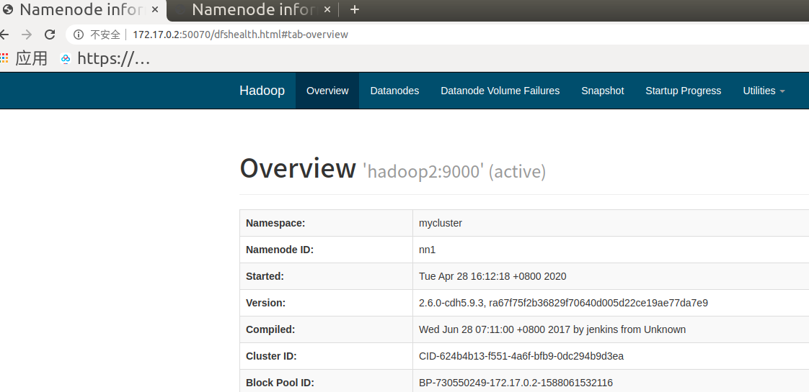


#### 配置HDFS-HA自动故障转移

##### 1. 具体配置

1. 先停掉集群,删除log,data

   ```shell
   root@hadoop2:/usr/local/ha/hadoop-2.6.0-cdh5.9.3# sbin/stop-dfs.sh
   root@hadoop2:/usr/local/ha/hadoop-2.6.0-cdh5.9.3# rm -rf data/ logs/
   ```

2. 在hdfs-site.xml中增加

   ```xml
   <property>
                   <name>dfs.ha.automatic-failover.enabled</name>
                   <value>true</value>
   </property>
   ```

3. 在core-site.xml文件中增加

   ```xml
   <property>
                   <name>ha.zookeeper.quorum</name>
                   <value>hadoop2:2181,hadoop3:2181,hadoop4:2181</value>
   </property>
   ```

4. 分发配置

   ```shell
   root@hadoop2:/usr/local/ha/hadoop-2.6.0-cdh5.9.3# xsync etc/
   ```

##### 2. 启动

1. 命令启动 journalnode 服务

```shell
root@hadoop2:/usr/local/ha/hadoop-2.6.0-cdh5.9.3# sbin/hadoop-daemons.sh start journalnode
```

2. 启动Zookeeper集群(之前没有关可跳过)

```shell
bin/zkServer.sh start
```

3. 在[nn1]上，对其进行格式化

```shell
root@hadoop2:/usr/local/ha/hadoop-2.6.0-cdh5.9.3#bin/hdfs namenode -format
```

4. 初始化HA在Zookeeper中状态

```shell
root@hadoop2:/usr/local/apache-zookeeper-3.6.0-bin-bin/bin# ./zkCli.sh
#查看历史节点,如果是如下结果即可有其他目录需用rmr加节点名称 删掉
[zk: localhost:2181(CONNECTED) 1] ls /
[zookeeper]

#在zookeeper中创建节点
root@hadoop2:/usr/local/ha/hadoop-2.6.0-cdh5.9.3# bin/hdfs zkfc -formatZK
[zk: localhost:2181(CONNECTED) 1] ls /
[hadoop-ha, zookeeper]
```

##### 3. 验证

1. 在[nn1]上，对其进行格式化,并群起集群

   ```shell
   root@hadoop2:/usr/local/ha/hadoop-2.6.0-cdh5.9.3# bin/hdfs namenode -format
   root@hadoop2:/usr/local/ha/hadoop-2.6.0-cdh5.9.3# sbin/start-dfs.sh
   ```

2. 在[nn2]上，同步nn1的元数据信息

   ```shell
   root@hadoop3:/usr/local/ha/hadoop-2.6.0-cdh5.9.3#bin/hdfs namenode -bootstrapStandby
   ```

   

3. 将[nn1]切换为Active

   ```shell
   root@hadoop2:/usr/local/ha/hadoop-2.6.0-cdh5.9.3# bin/hdfs haadmin -transitionToActive nn1
   ```

4. 查看是否Active

```shell
root@hadoop2:/usr/local/ha/hadoop-2.6.0-cdh5.9.3# bin/hdfs haadmin -getServiceState nn1
active
```

## 7. 配置YARN-HA集群

1. 规划集群

   | hadoop2         | hadoop3         | hadoop4     |
   | --------------- | --------------- | ----------- |
   | NameNode        | NameNode        |             |
   | JournalNode     | JournalNode     | JournalNode |
   | DataNode        | DataNode        | DataNode    |
   | ZK              | ZK              | ZK          |
   | ResourceManager | ResourceManager |             |
   | NodeManager     | NodeManager     | NodeManager |

2. 具体配置

   - ==yarn-site.xml==

     ```xml
     <configuration>
     
         <property>
             <name>yarn.nodemanager.aux-services</name>
             <value>mapreduce_shuffle</value>
         </property>
     
         <!--启用resourcemanager ha-->
         <property>
             <name>yarn.resourcemanager.ha.enabled</name>
             <value>true</value>
         </property>
      
         <!--声明两台resourcemanager的地址-->
         <property>
             <name>yarn.resourcemanager.cluster-id</name>
             <value>cluster-yarn1</value>
         </property>
     
         <property>
             <name>yarn.resourcemanager.ha.rm-ids</name>
             <value>rm1,rm2</value>
         </property>
     
         <property>
             <name>yarn.resourcemanager.hostname.rm1</name>
             <value>hadoop2</value>
         </property>
     
         <property>
             <name>yarn.resourcemanager.hostname.rm2</name>
             <value>hadoop3</value>
         </property>
      
         <!--指定zookeeper集群的地址--> 
         <property>
             <name>yarn.resourcemanager.zk-address</name>
             <value>hadoop2:2181,hadoop3:2181,hadoop4:2181</value>
         </property>
     
         <!--启用自动恢复--> 
         <property>
             <name>yarn.resourcemanager.recovery.enabled</name>
             <value>true</value>
         </property>
      
         <!--指定resourcemanager的状态信息存储在zookeeper集群--> 
         <property>
             <name>yarn.resourcemanager.store.class</name>     <value>org.apache.hadoop.yarn.server.resourcemanager.recovery.ZKRMStateStore</value>
     </property>
     
     </configuration>
     ```

   - 同步更新其他节点的配置信息

     ```shell
     root@hadoop2:/usr/local/ha/hadoop-2.6.0-cdh5.9.3# xsync etc/
     ```

3. 启动zookeeper

4. 启动集群

   ```shell
   #启动hdfs
   root@hadoop2:/usr/local/ha/hadoop-2.6.0-cdh5.9.3# sbin/start-dfs.sh
   #启动yarn
   root@hadoop2:/usr/local/ha/hadoop-2.6.0-cdh5.9.3# sbin/start-yarn.sh
   starting yarn daemons
   starting resourcemanager, logging to /usr/local/ha/hadoop-2.6.0-cdh5.9.3/logs/yarn--resourcemanager-hadoop2.out
   hadoop4: starting nodemanager, logging to /usr/local/ha/hadoop-2.6.0-cdh5.9.3/logs/yarn-root-nodemanager-hadoop4.out
   hadoop3: starting nodemanager, logging to /usr/local/ha/hadoop-2.6.0-cdh5.9.3/logs/yarn-root-nodemanager-hadoop3.out
   hadoop2: starting nodemanager, logging to /usr/local/ha/hadoop-2.6.0-cdh5.9.3/logs/yarn-root-nodemanager-hadoop2.out
   
   #yarn默认只启动一个节点,需在hadoop3中自行启动yarn
   root@hadoop3:/usr/local/ha/hadoop-2.6.0-cdh5.9.3# sbin/yarn-daemon.sh start resourcemanager
   starting resourcemanager, logging to /usr/local/ha/hadoop-2.6.0-cdh5.9.3/logs/yarn--resourcemanager-hadoop3.out
   ```

5. 查看是否成功

   ```shell
   root@hadoop2:/usr/local/ha/hadoop-2.6.0-cdh5.9.3# bin/yarn rmadmin -getServiceState rm1
   active
   ```

   http://172.17.0.2:8088/cluster/nodes

   http://localhost:8089/cluster

   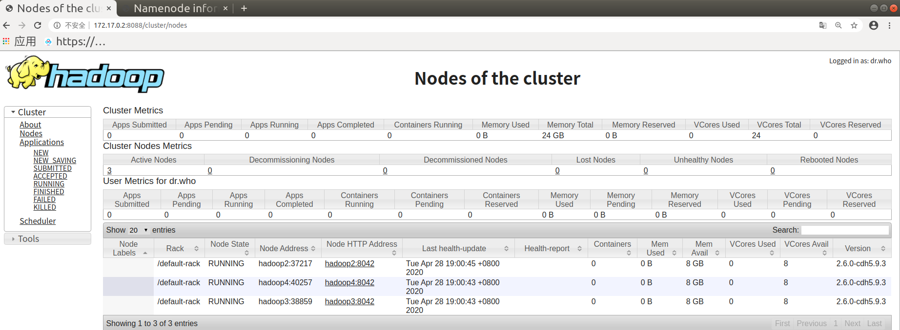
   
   查看hadoop3会自动跳到hadoop2,跳过去是用的域名,如果不能显示,查看hosts里有没有加入hadoop2,hadoop3,hadoop4的IP地址

## 8. Hive 安装与配置

注: Hive的使用依赖于Hadoop,所以启动Hive前先要[启动Hadoop集群](#8.2. Hadoop集群配置). 为了实现登录Hive可以打开多窗口,使用mysql作为元数据库.所以如果配置了mysql作为元数据库,就要[开启mysql服务](#8.3. 安装MySql).此时再登录Hive

1. Hive官网地址

   http://hive.apache.org/

2. 文档查看地址

   https://cwiki.apache.org/confluence/display/Hive/GettingStarted

3. 下载地址

   http://archive.apache.org/dist/hive/

4. github地址

   https://github.com/apache/hive

### 8.1. 安装

1. 将安装包复制到hadoop2

   ```shell
   cxy@Cxy:~/下载$ docker cp apache-hive-1.2.2-bin.tar.gz hadoop2:/usr/local
   ```

2. unpack the tarball.

   ```shell
   root@hadoop2:/usr/local# tar -xzvf apache-hive-1.2.2-bin.tar.gz
   ```

3. 修改conf目录下的hive-env.sh.template名称为hive-env.sh,并配置hive-env.sh文件

   ```shell
   root@hadoop2:/usr/local/apache-hive-2.3.7-bin/conf# mv hive-env.sh.template hive-env.sh 
   
   #写下:
   HADOOP_HOME=/usr/local/hadoop-2.6.0-cdh5.9.3
   export HIVE_CONF_DIR=/usr/local/apache-hive-1.2.2-bin/conf
   ```

### 8.2. Hadoop集群配置

1. 设置hosts,开启ssh服务

2. 必须启动hdfs和yarn

   ```shell
   root@hadoop2:/usr/local/hadoop-2.6.0-cdh5.9.3# sbin/start-dfs.sh
   root@hadoop2:/usr/local/hadoop-2.6.0-cdh5.9.3#  sbin/start-yarn.sh
   ```

   

3. 在HDFS上创建/tmp和/user/hive/warehouse两个目录并修改他们的同组权限可写

   ``` shell
   root@hadoop2:/usr/local/hadoop-2.6.0-cdh5.9.3# hadoop fs -mkdir /tmp
   root@hadoop2:/usr/local/hadoop-2.6.0-cdh5.9.3# hadoop fs -mkdir -p /user/hive/warehouse
   
   root@hadoop2:/usr/local/hadoop-2.6.0-cdh5.9.3# bin/hadoop fs -chmod g+w /tmp
   root@hadoop2:/usr/local/hadoop-2.6.0-cdh5.9.3# hadoop fs -chmod g+w /user/hive/warehouse
   ```

4. 启动Hive

   ```shell
   root@hadoop2:/usr/local/apache-hive-1.2.2-bin# bin/hive
   ```

   

### 8.3. 安装MySql

为了将元数据放到MySQL而安装MySQL,在hadoop==2==中安装mysql

#### 安装MySql服务器

<a href="https://blog.csdn.net/qq_31811537/article/details/89226096">apt安装mysql</a>

<a href="https://blog.csdn.net/weixin_43185093/article/details/103217400">修改密码：</a>

这里是关键点，由于mysql5.7没有password字段，密码存储在authentication_string字段中，password()方法还能用

```mysql
mysql>show databases;
mysql>use mysql;
mysql>update user set authentication_string=PASSWORD("自定义密码") where user='root';
mysql>update user set plugin="mysql_native_password";
mysql>flush privileges;
mysql>quit;
```

修改完密码，需要重启mysql （我没有重启，貌似也可以）

```shell
$/etc/init.d/mysql restart;
```

http://www.coozhi.com/youxishuma/g4/86480.html

```mysql
# 安装MySQL的依赖库
sudo apt install yum
sudo apt install numactl
sudo apt install libaio-dev

#复制安装包到hadoop2容器内的 /usr/local/mysql 下
#也可解压后重命名为mysql，再移动到/usr/local/
sudo mv mysql /usr/local

#给Ubuntu系统添加一个mysql的用户组
root@hadoop2:/usr/local/# groupadd mysql

#添加一个mysql用户到mysql用户组中
root@hadoop2:/usr/local/# useradd -r -g mysql -s /bin/false mysql

#切换到/usr/local/mysql目录
root@hadoop2:/usr/local/mysql# cd /usr/local/mysql

#然后给移动后的文件夹添加目录权限到mysql用户组
root@hadoop2:/usr/local/mysql#mkdir mysql-files
root@hadoop2:/usr/local/mysql#chown mysql:mysql mysql-files
root@hadoop2:/usr/local/mysql#chmod 750 mysql-files

#对mysql数据库执行初始化命令
root@hadoop2:/usr/local/mysql#  bin/mysqld --initialize --user=mysql
2020-05-30T12:37:26.837048Z 6 [Note] [MY-010454] [Server] A temporary password is generated for root@localhost: IX=KXe2wZc:B
Wki-tAqhV7(d
#开启MySQL服务
root@hadoop2:/usr/local/mysql# bin/mysqld_safe --user=mysql&
```

测试是否安装成功

```shell
root@hadoop2:/usr/local/mysql# mysqladmin --version
```

如果报错：bash: mysqladmin: command not found

```shell
$ln -s /usr/local/mysql/bin/mysqladmin /usr/bin
```

 linux上该命令将输出以下结果，该结果基于你的系统信息：

```shell
mysqladmin  Ver 8.42 Distrib 5.7.29, for Linux on x86_64
```

 如果以上命令执行后未输出任何信息，说明你的Mysql未安装成功。 

登录:

```mysql
#输入初始化时得到的密码
root@hadoop2:/usr/local/# mysql -uroot -p
Enter password: 
Welcome to the MySQL monitor.  Commands end with ; or \g.
Your MySQL connection id is 9
Server version: 8.0.20

Copyright (c) 2000, 2020, Oracle and/or its affiliates. All rights reserved.

Oracle is a registered trademark of Oracle Corporation and/or its
affiliates. Other names may be trademarks of their respective
owners.

Type 'help;' or '\h' for help. Type '\c' to clear the current input statement.

mysql>
```

如果报错：

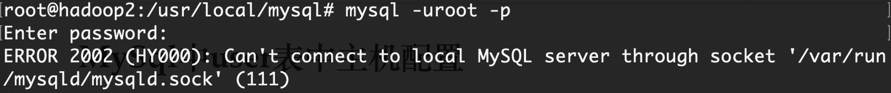

查看启动日志，发现是因为之前安装一个的mysql.sock文件没有删，找到报错的目录把那个文件删了重新初始化就好了

重置密码:

```mysql
mysql> use mysql;
ERROR 1820 (HY000): You must reset your password using ALTER USER statement before executing this statement.
mysql> alter user 'root'@'localhost' identified by '12345c';
Query OK, 0 rows affected (0.02 sec)
```

#### MySql中user表中主机配置

目标是配置: 只要是root用户+密码，在==任何主机==上都能登录MySQL数据库。

1. 进入mysql

```shell
root@hadoop2:/usr/local# mysql -uroot -p  
```

2．显示数据库

```mysql
mysql>show databases;
```

3．使用mysql数据库

```mysql
mysql>use mysql;
```

4．展示mysql数据库中的所有表

```mysql
mysql>show tables;
```

5．展示user表的结构

```mysql
mysql>desc user;
```

6．查询user表

```mysql
mysql> select User, Host, Password_require_current from user;
+------------------+-----------+--------------------------+
| User        								     | Host      | Password_require_current |
+------------------+-----------+--------------------------+
| mysql.infoschema | localhost | NULL                     |
| mysql.session          | localhost | NULL                     |
| mysql.sys      						  | localhost | NULL                     |
| root          									   | localhost | NULL                     |
+------------------+-----------+--------------------------+
```

7．修改user表，把Host表内容修改为%

```mysql
mysql> update user set host='%' where host='localhost';
mysql> select User, Host, Password_require_current from user;
+------------------+------+--------------------------+
| User                             | Host | Password_require_current |
+------------------+------+--------------------------+
| mysql.infoschema | %    | NULL                     |
| mysql.session          | %    | NULL                     |
| mysql.sys                   | %    | NULL                     |
| root                              | %    | NULL                     |
+------------------+------+--------------------------+
```

8．删除root用户的其他host,有则删

```mysql
mysql>delete from user where Host='hadoop102';
mysql>delete from user where Host='127.0.0.1';
mysql>delete from user where Host='::1';
```

9．刷新

```mysql
mysql>flush privileges;
```

10．退出

```mysql
mysql>quit;
```

### 8.4. Hive基本操作

1. 在新hadoop2窗口启动mysql
2. 启动hive

```shell
root@hadoop2:/usr/local/apache-hive-1.2.2-bin# bin/hive
```

2. 查看数据库

```mysql
hive> show databases;
OK
default
Time taken: 0.959 seconds, Fetched: 1 row(s)
```

3. 打开默认数据库

```mysql
hive> use default;
OK
```

4. 显示default数据库中的表

```mysql
hive> show tables;
OK
```

5. 创建一张表

```mysql
hive> create table student(id int, name string);
hive> show tables;
OK
student
```

6. 查看表的结构

```mysql
hive> desc student;
OK
id                  	int                 	                    
name                	string              	                    
Time taken: 0.507 seconds, Fetched: 2 row(s)
```

7. 向表中插入数据

```mysql
hive> insert into student values(1000,"ss");
```

8. 查询表中数据

```mysql
hive> select * from student;
```

9. 删除表

```mysql
hive> drop table student;
```

如果不能删除，可能是字符集的问题，退出hive，在mysql中移除hive的database，再新建其字符集，改变字符集，最后重启hive。如下：

```MySQL
mysql> drop database metastore ;
mysql> create database metastore ;
mysql> alter database metastore character set latin1;
```

10.退出hive

```mysql
hive> quit;
```

说明：（查看hive在hdfs中的结构）

数据库：在hdfs中表现为${hive.metastore.warehouse.dir}目录下一个文件夹

表：在hdfs中表现所属db目录下一个文件夹，文件夹中存放该表中的具体数据

### 8.5. 将本地文件导入Hive案例

**需求:**

将本地(==容器本地,不是宿主机本地==) student.txt 的数据导入到hive的student(id int, name string)表中。

1. 先将从宿主机将文件传到hadoop2,或者直接在hadoop2下新建文本文件

   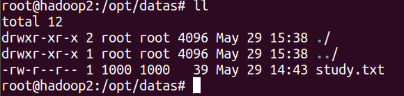

2. 创建student表, 并声明文件分隔符’\t’

```mysql
hive> create table student(id int,name string) ROW FORMAT DELIMITED FIELDS TERMINATED BY '\t';
```

3. 加载/opt/datas/student.txt 文件到student数据库表中。

```mysql
hive> load data local inpath '/opt/datas/study.txt' into table student;
Loading data to table default.student
Table default.student stats: [numFiles=1, totalSize=39]
OK
Time taken: 1.39 seconds
```

4. Hive查询结果

```mysql
hive> select * from student;
OK
1001	zhangshan
1002	lishi
1003	zhaoliu
```

5. 再打开一个客户端窗口启动hive，会产生java.sql.SQLException异常。

```mysql
Exception in thread "main" java.lang.RuntimeException: java.lang.RuntimeException:
 Unable to instantiate
 org.apache.hadoop.hive.ql.metadata.SessionHiveMetaStoreClient
        at org.apache.hadoop.hive.ql.session.SessionState.start(SessionState.java:522)
        at org.apache.hadoop.hive.cli.CliDriver.run(CliDriver.java:677)
        at org.apache.hadoop.hive.cli.CliDriver.main(CliDriver.java:621)
        at sun.reflect.NativeMethodAccessorImpl.invoke0(Native Method)
        at sun.reflect.NativeMethodAccessorImpl.invoke(NativeMethodAccessorImpl.java:57)
        at sun.reflect.DelegatingMethodAccessorImpl.invoke(DelegatingMethodAccessorImpl.java:43)
        at java.lang.reflect.Method.invoke(Method.java:606)
        ... 8 more
```

原因是，==Metastore默认存储在自带的derby数据库中，推荐使用MySQL存储Metastore;==

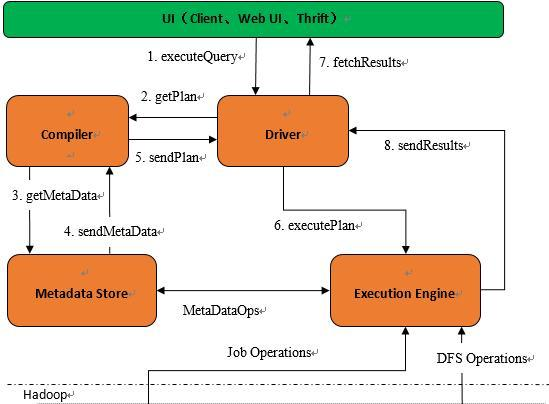

hive默认将元数据存储到本地内嵌的Derby数据库中，但是Derby不支持多会话链接，因此我们使用mysql数据库来存储hive的元数据。配置完成hiveSQL的元数据库之后再开始安装、配置hive

### 8.6. Hive元数据配置到MySql

驱动下载: https://mvnrepository.com/artifact/mysql/mysql-connector-java

##### 1. 驱动拷贝:

```shell
cxy@Cxy:~/下载/Java/Hive$ docker cp mysql-connector-java-8.0.20.jar hadoop2:/usr/local/apache-hive-1.2.2-bin/lib
```

##### 2. 配置Metastore到MySql

1．根据官方文档配置参数，拷贝数据到hive-site.xml文件中

```xml
root@hadoop2:/usr/local/apache-hive-1.2.2-bin/conf# vim hive-site.xml
#写入:
<?xml version="1.0"?>
<?xml-stylesheet type="text/xsl" href="configuration.xsl"?>
<configuration>
	<property>
	  <name>javax.jdo.option.ConnectionURL</name>
	  <value>jdbc:mysql://hadoop2:3306/metastore?createDatabaseIfNotExist=true</value>
	  <description>JDBC connect string for a JDBC metastore</description>
	</property>

	<property>
	  <name>javax.jdo.option.ConnectionDriverName</name>
	  <value>com.mysql.cj.jdbc.Driver</value>
	  <description>Driver class name for a JDBC metastore</description>
	</property>

	<property>
	  <name>javax.jdo.option.ConnectionUserName</name>
	  <value>root</value>
	  <description>username to use against metastore database</description>
	</property>

	<property>
	  <name>javax.jdo.option.ConnectionPassword</name>
	  <value>12345c</value>
	  <description>password to use against metastore database</description>
	</property>
</configuration>
```

2. 把元数据放到Mysql

   退出mysql,新建窗口打开hadoop2容器,登录Hive

```mysql
#新窗口
root@hadoop2:/usr/local/apache-hive-1.2.2-bin# bin/hive
#mysql窗口
root@hadoop2:/usr/local/mysql# mysql -uroot -p
mysql> show databases;
+--------------------+
| Database        							      |
+--------------------+
| information_schema 	  |
| metastore      								      |
| mysql          										      |
| performance_schema  |
| sys      													          |
+--------------------+
5 rows in set (0.00 sec)
```

​                                登录Hive前                                                       登录Hive后

<center class="center">
  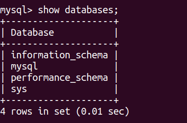   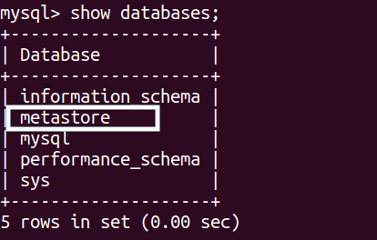
</center>

3. 配置完毕后，如果启动hive异常，可以重新启动虚拟机。（重启后，别忘了启动hadoop集群）

### 8.7. 多窗口启动Hive测试

在两个窗口中分别启动Hive

```mysql
root@hadoop2:/usr/local/apache-hive-1.2.2-bin# bin/hive
```

###8.8. Hive常用交互命令

```shell
#查看帮助命令
root@hadoop2:/usr/local/apache-hive-1.2.2-bin# bin/hive -help
usage: hive
 -d,--define <key=value>          Variable subsitution to apply to hive
                                  commands. e.g. -d A=B or --define A=B
    --database <databasename>     Specify the database to use
 -e <quoted-query-string>         SQL from command line
 -f <filename>                    SQL from files
 -H,--help                        Print help information
    --hiveconf <property=value>   Use value for given property
    --hivevar <key=value>         Variable subsitution to apply to hive
                                  commands. e.g. --hivevar A=B
 -i <filename>                    Initialization SQL file
 -S,--silent                      Silent mode in interactive shell
 -v,--verbose                     Verbose mode (echo executed SQL to the
                                  console)

#登录Hive
root@hadoop2:/usr/local/apache-hive-1.2.2-bin# bin/hive
Logging initialized using configuration in jar:file:/usr/local/apache-hive-1.2.2-bin/lib/hive-common-1.2.2.jar!/hive-log4j.properties

#查看databases,默认是default
hive> show databases;
OK
default
Time taken: 0.934 seconds, Fetched: 1 row(s)

hive> show tables;
OK
Time taken: 0.049 seconds
hive> create table student(id int,name string)ROW FORMAT DELIMITED FIELDS TERMINATED BY '\t';
OK
Time taken: 0.374 seconds
```

因为之前将本地数据读入Hive了,而Hive是将数据存在HDFS上的,所以在Hive上新建table(相当于建立索引),就会到hdfs上对应位置去寻找有没有该表. 注:==Hive存的是对应关系,HDFS存的是数据==

```mysql
hive> select * from student;
OK
1001	zhangshan
1002	lishi
1003	zhaoliu
Time taken: 0.366 seconds, Fetched: 3 row(s)
```


1. “-e”==不进入hive的交互窗口==执行sql语句

   ```shell
   root@hadoop2:/usr/local/apache-hive-1.2.2-bin# bin/hive -e "select * from student"
   Logging initialized using configuration in jar:file:/usr/local/apache-hive-1.2.2-bin/lib/hive-common-1.2.2.jar!/hive-log4j.properties
   OK
   1001	zhangshan
   1002	lishi
   1003	zhaoliu
   Time taken: 1.711 seconds, Fetched: 3 row(s)
   ```

2. “-f”执行脚本中sql语句

   - 在/opt/datas目录下创建hivef.hql文件

     ```shell
     root@hadoop2:/usr/local/apache-hive-1.2.2-bin# vim /opt/datas/hivef.hql
     #写入:
     select * from student;
     ```

   - 执行文件中的sql语句

     ```mysql
     root@hadoop2:/usr/local/apache-hive-1.2.2-bin# bin/hive -f /opt/datas/hivef.hql
     ......
     OK
     1001	zhangshan
     1002	lishi
     1003	zhaoliu
     Time taken: 1.721 seconds, Fetched: 3 row(s)
     ```

   - 执行文件中的sql语句并将结果写入文件中

     ```mysql
     root@hadoop2:/usr/local/apache-hive-1.2.2-bin# bin/hive -f /opt/datas/hivef.hql > /opt/datas/hivef_result.txt
     ```

### 8.9. Hive其他命令操作

1. 退出hive窗口

   在新版的hive中没区别了，在以前的版本是有的：

   exit:先隐性提交数据，再退出；

   quit:不提交数据，退出；

```mysql
hive(default)>exit;
hive(default)>quit;
```

2. 在hive cli命令窗口中如何查看==hdfs==文件系统

```mysql
hive> dfs -ls /;
Found 4 items
-rw-r--r--   3 root supergroup       1366 2020-04-22 21:10 /README.txt
drwxr-xr-x   - root supergroup          0 2020-04-22 21:14 /output
drwx-w----   - root supergroup          0 2020-05-27 20:56 /tmp
drwxr-xr-x   - root supergroup          0 2020-05-27 20:49 /user
```

3. 在hive cli命令窗口中如何查看==本地==文件系统

```mysql
hive> ! ls /opt/datas;
hivef.hql
hivef_result.txt
study.txt
```

4. 查看在hive中输入的所有历史命令

   （1）进入到当前用户的根目录/root或/home/atguigu
   （2）查看. hivehistory文件

```mysql
root@hadoop2:/usr/local/apache-hive-1.2.2-bin# cd
root@hadoop2:~# cat .hivehistory 
show databases;
exit
quit
......
create table student(id int,name string);
show tables;
```


### 8.10. Hive常见属性配置

##### 1. 查询后信息显示配置

1）在hive-site.xml文件中添加如下配置信息，就可以实现显示当前数据库，以及查询表的头信息配置。

```xml
<property>
	<name>hive.cli.print.header</name>
	<value>true</value>
</property>

<property>
	<name>hive.cli.print.current.db</name>
	<value>true</value>
</property>
```

2）重新启动hive，对比配置前后差异。

​                             Hive重启前                                                                    Hive重启后

<center class="center">
  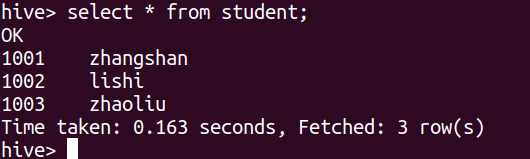 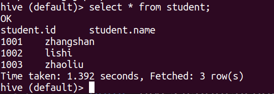
</center>


3. 配置完毕后，如果启动hive

   

##### 2. Hive数据仓库位置配置

- Default数据仓库的最原始位置是在hdfs上的：/user/hive/warehouse路径下。

  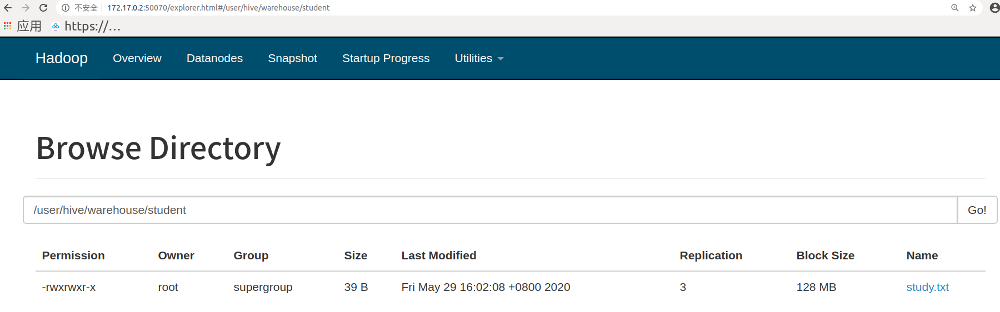

- 在仓库目录下，没有对默认的数据库default创建文件夹。如果某张表属于default数据库，直接在数据仓库目录下创建一个文件夹。

- 修改default数据仓库原始位置（将hive-default.xml.template如下配置信息拷贝到hive-site.xml文件中）。

  ```xml
    <property>
      <name>hive.metastore.warehouse.dir</name>
      <value>/user/hive/warehouse</value>
      <description>location of default database for the warehouse</description>
    </property>
  ```

  配置同组用户有执行权限

  ```shell
  bin/hdfs dfs -chmod g+w /user/hive/warehouse
  ```

  

##### 3. Hive运行日志信息配置

1. Hive的log默认存放在/tmp/root/hive.log目录下（当前用户名下）

2. 修改hive的log存放日志到/opt/hive/logs

   - 修改conf/hive-log4j.properties.template文件名称为:hive-log4j.properties

     ```shell
     root@hadoop2:/usr/local/apache-hive-1.2.2-bin/conf# mv hive-log4j.properties.template hive-log4j.properties
     ```

   - 在hive-log4j.properties文件中修改log存放位置

     ```xml
     hive.log.dir=/usr/local/apache-hive-1.2.2-bin/logs
     ```

     

### 8.11 参数配置方式

1．查看当前所有的配置信息

```mysql
hive>set;
```

2. 参数的配置三种方式

   - 配置文件方式

     默认配置文件：hive-default.xml

     用户自定义配置文件：hive-site.xml

     ​	注意：==用户自定义配置会覆盖默认配置==。另外，Hive也会读入Hadoop的配置，因为Hive是作为Hadoop的客户端启动的，==Hive的配置会覆盖Hadoop的配置==。配置文件的设定对本机启动的所有Hive进程都有效。

   - 命令行参数方式

     启动Hive时，可以在命令行添加-hiveconf param=value来设定参数。

     ```shell
     root@hadoop2:/usr/local/apache-hive-1.2.2-bin# bin/hive -hiveconf mapred.reduce.tasks=10;
     
     #查看参数设置：
     hive (default)> set mapred.reduce.tasks;
     mapred.reduce.tasks=10
     ```

     注意：仅对本次hive启动有效

   - 参数声明方式

     可以在HQL中使用SET关键字设定参数

     ```mysql
     hive (default)> set mapred.reduce.tasks=100;
     ```

     注意：仅对本次hive启动有效

     上述三种设定方式的==优先级依次递增==。即==配置文件<命令行参数<参数声明==。注意某些系统级的参数，例如log4j相关的设定，必须用前两种方式设定，因为那些参数的读取在会话建立以前已经完成了。

# 23. VSCode访问Docker容器内的文件系统

1. 在vscode中下载插件: Remote - Containersms

   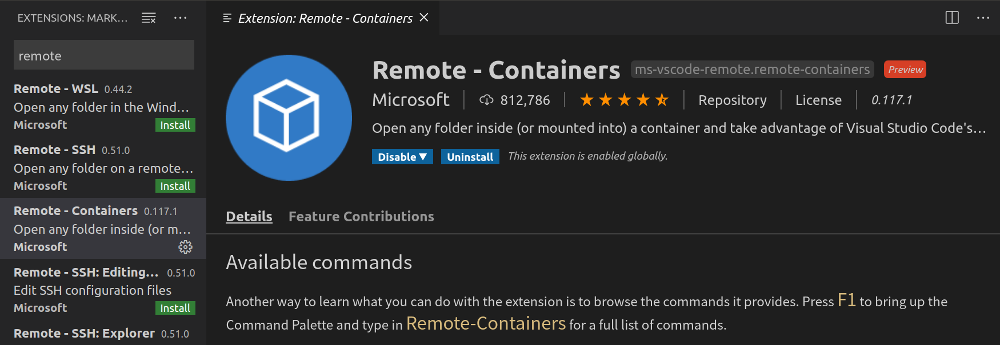

2. Attach

   Another way to learn what you can do with the extension is to browse the commands it provides. Press `F1` to bring up the Command Palette and type in `Remote-Containers` for a full list of commands.

   

   You can also click on the Remote "Quick Access" status bar item to get a list of the most common commands.

   

   For more information, please see the [extension documentation](https://aka.ms/vscode-remote/containers).

3. 选择需要打开的文件

   选择File –> open file


# 24. ubuntu 安装anydesk

1. 进入<a href="https://anydesk.com/zhs">anydesk</a>官网下载最新版linux版本

2. 直接双击运行.deb格式的安装包,然后在软件超市中安装即可


# 25. Mac 安装 Matlab

1. 下载<a href="https://www.jianshu.com/p/a5466682ba3d?from=singlemessage&isappinstalled=0">安装包</a>

2. 安装包太大，被分成多个保存，用The Unarchiever打开 Matlab98R2020a_Mac64.zip。自动生成dmg格式安装包

   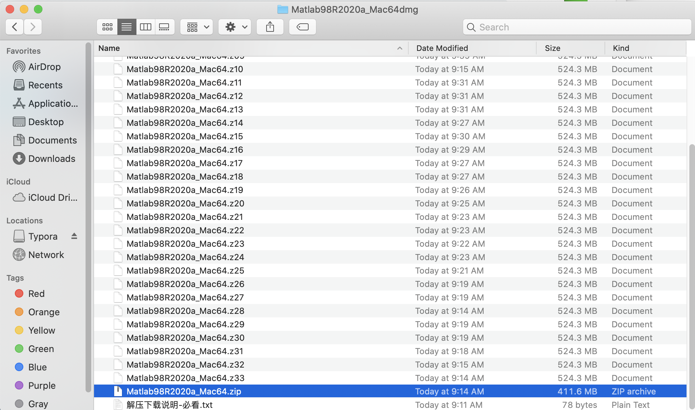

   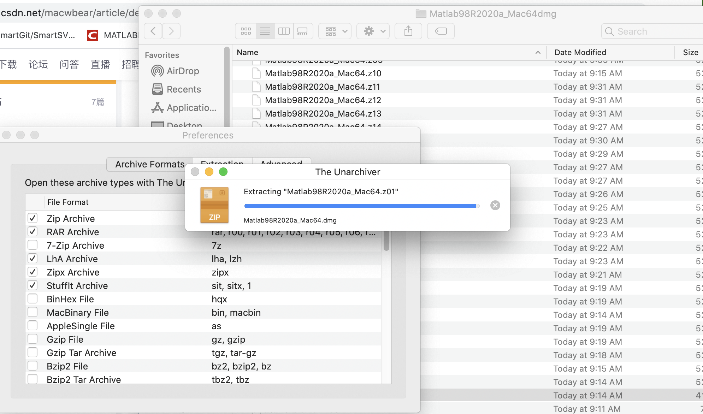

   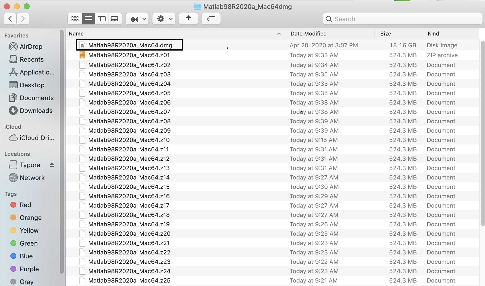

3. 双击dmg文件开始安装

   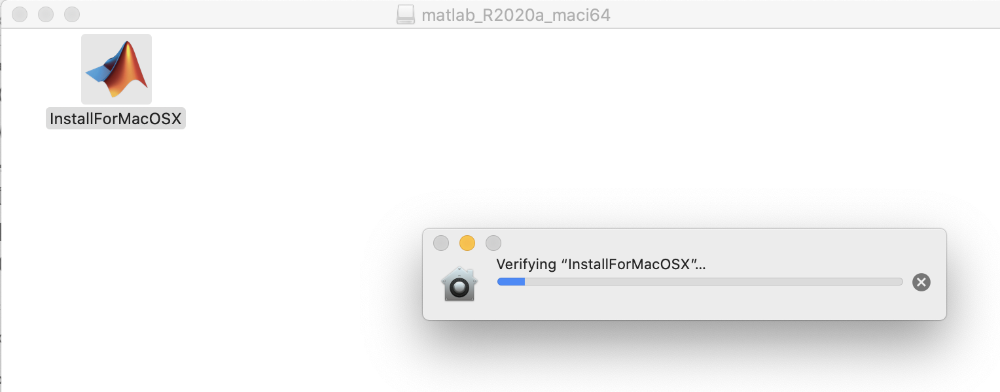

4. 输入密钥

   09806-07443-53955-64350-21751-41297

5. 选择license file，license_standalone.lic的目录

   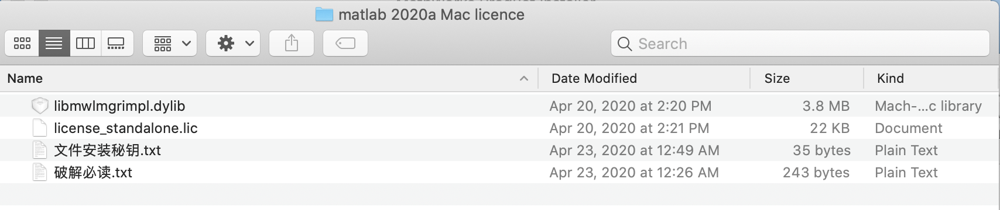

   

   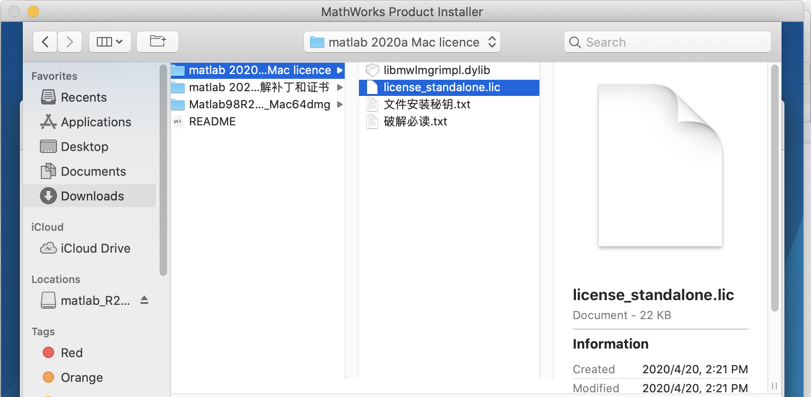

6. 破解

   安装完成，我们来激活Matlab R2020a，解压破解补丁（破解证书）压缩包，拷贝==替换==补丁即libmwlmgrimpl.dylib文件到软件安装目录

   我的是在/Applications/Matlab/R2020a/bin/maci64/matlab_startup_plugins/lmgrimpl下

7. 在安装目录下的bin目录下点击active激活

   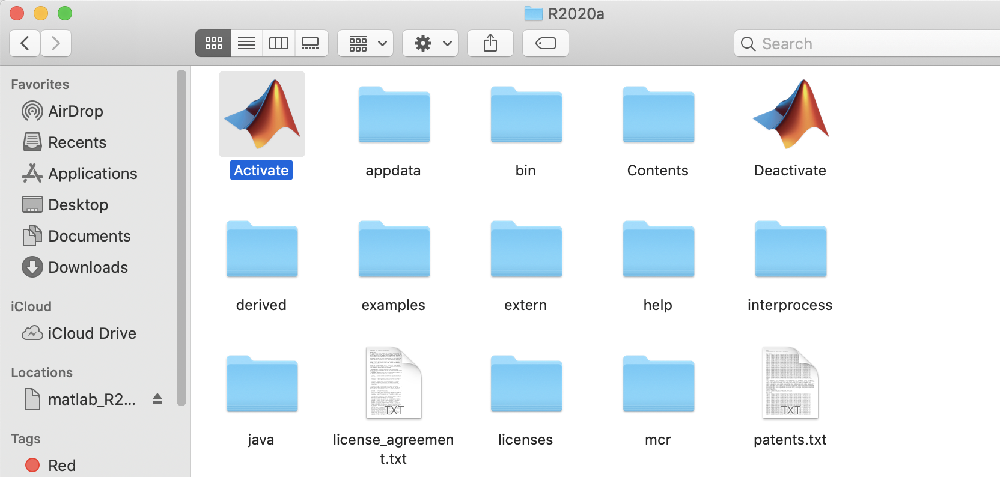

   之后按提示操作即可

8. 创建桌面图标

   

   

   


