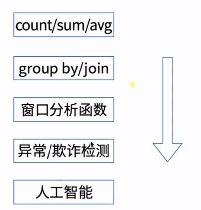
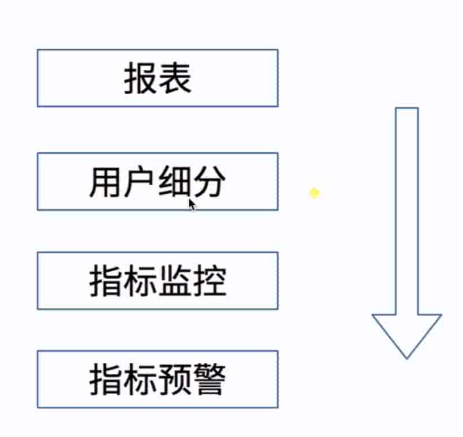

PC

```
F4不能使用时，同时按住Fn+F4
```

```
Ctrl+D 实现终端的切换
```

```
t'读作 t prime
```

```
Windows上装Git后可以用bash shell运行Linux命令
```


# Python

配置python的环境变量时，不仅要加python的安装路径，还要加一个其子目录：Script。环境配置是配置系统目录

```
在cmd中输入python，回车，会进入Python环境。
它的运行和IDLE基本一致，但是没有了语法高亮、自动缩进、方法提示，唯一的好处就是运行速度比IDLE快了些。
退出此python环境使用Ctrl + Z，然后回车。
```

```
在代码的最后增加如下语句：
raw_input()
然后你再双击运行，结果就会停留在那里，直到你敲击回车键才消失。
```

查看帮助：

```
help("numpy")
```

==注意：python的索引是从0开始的!!!==

创建矩阵

```
import array
aaaa=np.array([1,0,0,1,0,0]).reshape(2,3)
```

用np.where找到等于或大于、小于某个值的元素坐标，横坐标和纵坐标各一列，索引从0开始

用np.argwhere则直接生成坐标，索引从0开始

python连接字符

```
str = "-";
seq = ("a", "b", "c"); # 字符串序列
print str.join( seq );

以上实例输出结果如下：
a-b-c
```

scipy.misc (bytescale, fromimage, imfilter, imread, imresize, imrotate, imsave, imshow, toimage)这些函数已经被弃用了。

**解决方法：**
用其他函数来代替，比如imageio

```python
from scipy.misc import bytescale
#改为
from imageio import bytescale
```


更新pip：

```
$ python -m pip install --upgrade pip
```

## JupyterNotebook

读取文件

```python
import os
import sys

os.chdir('D:\\3MyCode\\Python\\learn\\VSCodePy\\Biophysics')
```


批量读取文件

```python
import scipy.io as scio
import pandas as pd
import os

#os.listdir(r'E:\EEG_data_sets\lvdanping\Pre')
for info in os.listdir(r'E:\EEG_data_sets\lvdanping\Pre'):
    domain = os.path.abspath(r'E:\EEG_data_sets\lvdanping\Pre') #获取文件夹的路径，此处其实没必要这么写，目的是为了熟悉os的文件夹操作
    info = os.path.join(domain,info) #将路径与文件名结合起来就是每个文件的完整路径
    #info = open(info,'r') #读取文件内容
    #print(info.readline()) #使用readline函数得到一条一条的信息，如果使用read获取全部信息亦可；
    #info.close()
    data = scio.loadmat(info)
    
    data_train_label=data.get('label')#取出字典里的label

    data_train_data=data.get('data')#取出字典里的data
```

看data里有哪些东西

```python
data.keys()
# dict_keys(['__header__', '__version__', '__globals__', 'Veeg'])
Veeg = data["Veeg"]
type(Veeg)
#numpy.ndarray
        
```

#Ts = 1.0/Fs; # sampling interval
​    t = np.arange(0,snippet_time,Ts) # time vector

    # ff = 5;   # frequency of the signal
    # y = np.sin(2*np.pi*ff*t)
    y = snippet
print('Ts: ',Ts)

print(t)

print(y.shape)

    n = len(y) # length of the signal
    
    T = n/Fs
    frq = k/T # two sides frequency range
    frq = frq[range(n//2)] # one side frequency range
    
    Y = np.fft.fft(y)/n # fft computing and normalization
    Y = Y[range(n//2)]
    #Added in: (To remove bias.)
    #Y[0] = 0
    return frq,abs(Y)
#f,Y = get_fft(np.hanning(len(snippet))*snippet)

# Java

#### Hashmap

```java
		HashMap<String, String> map = new HashMap<>();//创建Hash对象
		map.put("zhang", "31");//存放键值对

		System.out.println(map.containsKey("zhang"));//键中是否包含这个数据

		System.out.println(map.get("zhang"));//通过键拿值

		System.out.println(map.isEmpty());//判空

		System.out.println(map.remove("zhang"));//从键值中删除
		System.out.println(map.containsKey("zhang"));

```


# Matlab

#### 创建结构体

```matlab
cnn.layers={
    struct('type','i')%input layer 
    struct('type','c','outputmaps',6,'kernelsize',5)%convolution layer 
    struct('type','s','scale',2)%sub sampling layer 
    struct('type','c','outputmaps',12,'kernelsize',5)%convolution layer 
    struct('type','s','scale',2)%subsampling layer
};
```

#### 矩阵内的元素自乘

```matlab
prod(A)
```

#### 每次产生随机数都与第一次相同

```matlab
rand ('state',0)
```

#### 三维数组的拼接

```matlab
beta_sum = cat(3,A,B);
```


#### 不显示边界

```matlab
imshow(A1,'Border','tight')
```

#### 当matlab使用ginput，使用%d仍然显示出科学计数法时，用%d控制输出

```
%f 显示小数形式
%e 显示科学计数法形式
%g 是两者的综合，会根据数据选择适当的显示方式
```

#### 当matlab的变量中有几个结果输出时，记得用'.'来获取某一个具体的结果

#### 给一个矩阵中的某几个特定位置赋值

```matlab
>> a=zeros(5); i = [2;3;4]; j = [1;4;2];
>> a(sub2ind(size(a), i, j))=1
>> sum(a,2) %每行非零的个数
```

#### 保存和加载文件

```matlab
%保存文件
>> save(['.\FeaturePoints\',image_file(i+2).name(1:end-4),'_point.mat'],'features');
>> imwrite(A_crop,[CropOutputPath,image_file(i+2).name(1:end-4),'_crop.jpg']); 
>> save TrainSample SampleMatrix labels;%第一个是保存名称，后两个是保存的变量
%加载文件
>> load  TrainSample SampleMatrix labels;%第一个是加载的文件名称，后两个是保存的变量
```

#### 文件夹内的文件获取

```matlab

Img_file = dir(Imgpath);
Img_file = Img_file(3:end,:);%可能是到end，也可能是end-1，看具体情况
file_num = length(Img_file);

for i=1:image_num
    image_name = image_file(i).name;
end

```

#### 文件名命名

```
photo_name=[num2str(number),num2str(num,'%05d'),'.jpg'];%图片名100001.jpg
```

#### 打开文件夹

```matlab
folderName = uigetdir(cd);
if(~ischar(folderName))
    errordlg('No such directory','File Error');
    disp('No such directory!');
    return;
end
folderName = [folderName,'\'];
cd(folderName);

datafile=dir('*.mat');
Nfile=length(datafile);
num=1;
Filt_Seg_data = [];
while num<=Nfile
    filename=datafile(num,1).name; %文件名循环每次不一样
    A=load(filename);
    %...
end
```

#### 相对路径

```matlab
abel_path = ['.\val\'];%记得加方括号
cd(label_path)
```

#### rep

```
res = zeros(m, 1);
for p = 1:m
res(p) = ...;
end
```

#### 将cell数组中的空元素置零

```matlab
A(cellfun(@isempty,A))=[];
```

#### 找cell数组非空元素的索引

```matlab
idx=cellfun(@(x)~isempty(x),aa);%非空元素的索引，非空则该位置的值为1
c1=cellfun(@(x)x(:,1),aa(idx));%去除非空元素，1表是第一个子元素中索引值对应目标
ind = find(ind>=1)
```

```
b = a(a~=0);
```


#### 判断是否为灰度图像

```matlab
if size(imagen,3)==3 %RGB image
    imagen=rgb2gray(imagen);
end
```

#### 提取字符串中的数字

```matlab
s=a(regexp(a,'\d'))
```

#### 查看字符串是字符还是数字

```matlab
str='ajsk123sjkl'
A=isstrprop(str,'digit');  
%A =
%     0     0     0     0     1     1     1     0     0     0     0
```

#### 找联通区域

```matlab
[L,num]=bwlabel(closebw,8);%获取连通区域
stats = regionprops(closebw,'basic');
boundingbox=cat(1,stats.BoundingBox);
centroids = cat(1,stats.Centroid);
```

#### 字符串和变量的相互转换

```matlab
%将字符串变成变量进行赋值
str_var = 'varNumber';
eval( [str_var, '= 10']);
%两级结构体命名，先把数据给一个结构体，再把结构体给根级结构体
A.delta = delta;
eval(['filt_pre_eeg.sub',num2str(num),'=A']);
%将变量变成字符串
str_varName = sprintf('%s', inputname(1));
%（如在串成路径地址时，虽然文件名的格式是char但它是变量）
```

#### 生成struct，保存各个subject的信息

```matlab
for num = 1:Nfile
    filename = pre_file(num,1).name;
    eeg = load([root_path,filename]);
    eeg = eeg.Veeg;
    
    % omit...
    A.delta = delta;
    A.theta = theta;
    A.alpha = alpha;
    A.beta = beta;
    
    eval(['filt_eeg.sub',num2str(num),'=A']);
    
    clear sd SRD5 SRD4 SRD3 SRD2 SRD1 delta theta alpha beta;  
end
```

#### 字符串变为变量

```matlab
eval( [str_var, '= 10']);
%两级结构体命名，先把数据给一个结构体，再把结构体给根级结构体

data_i = eval(['raw_data.sub',num2str(i)]);
```


#### 寻找字符串中的字符或字符串

```matlab
strfind(file,'m')
isempty(strfind(dataNewName,'1024'))

re_ind = strfind(allSubNewNames,allSubNewNames{j}(end-3:end));
digt_ind = cellfun(@(x)~isempty(x),re_ind);
idx_ind = find(digt_ind==1);
```

#### 在cell数组中找指定字符串

```matlab
example = {'问题','如何';'解决',2333};
string = '解';
fun = @(x)strmatch(string,char(x));
result = cellfun(fun,example,'un',0);
[row,col] = find(~cellfun(@isempty,result));
```

#### 导入txt文档

```matlab
data = importdata('.\competition.txt')
```

#### 查看某变量是否存在

```matlab
exist(['flag_',num2str(idx(1))])
```

#### 同时删除多个变量

```matlab
%用空格隔开
clear sd SRD5 SRD4 SRD3 SRD2 SRD1;
```

#### 逆

```matlab
pinv(A)是左伪逆，（pinv(A')）'是右伪逆

det(A)=0，不可逆

inv(A)*B
实际上可以写成A\B
B*inv(A)
实际上可以写成B/A
这样比求逆之后带入精度要高
A\B=pinv(A)*B 
A/B=A*pinv(B)
```


# Latex

#### 并排显示图片

有多少图片写多少个标签

```HTML
<center class="half">
    
</center>
```

#### 转换:

```
按住shift键+鼠标右键 打开powershell
pandoc转换：（注意tex文件必须是UTF：8格式的）
Latex转Docx：pandoc -s a.tex -o b.docx

Docx转Latex：pandoc -s a.docx -o b.tex
```

#### 插入链接：pandoc -s Hell.tex -o jj.docx

```
<a href="http://write.blog.csdn.net/postlist">麦田里的码农</a>
```

#### 缩进：

临时取消首行缩进的用\noindent

```
半方大的空白&ensp;或&#8194;
全方大的空白&emsp;或&#8195;
不断行的空白格&nbsp;或&#160;
```

#### 浙大latex模板编译：

```
用CTex自带的WinEdt编译反而可行。WinEdt里的编译过程是依次点击latex+bibtex+latex+latex。
```

#### latex package导入方式：

```
在CTAN网站去下载包，解压后按reademe来，一般是`-Latex xxx.tex `或`-Latex xxx.ins`
```

#### 表格转换

http://www.tablesgenerator.com/#

#### 显示中文

```
\usepackage{ctex}
```

#### 去掉content后的空白页

在` \documentclass{}` 后面加`[oneside]`

#### 让latex从任意页面开始

```
用 \documentclass[openany]{book} 让 \chapter 可以从任何页面开始。
```

#### 插入子文件

\input 在插入子文件的时候不换页，\include在插入子文件的时候强制换页

```latex
\include{./Chapters/abstract_zh}%换页，注意斜杠的方向
\input{./Chapters/abstract_zh}%不换页
```

在 LaTeX 中直接插入 pdf 图像：

```latex
\includegraphics{文件名.pdf}
```

#### 参考文献

环境（配置如下），但很麻烦

```latex
\begin{thebibliography}{}
\bibitem[显示符号]{引用标签}Book Title，Author
\bibitem[显示符号]{引用标签}Book Title，Author
\bibitem[显示符号]{引用标签}Book Title，Author 
\end{thebibliography}
```

简单方式：需要一个.bib格式的文件（可从模板里复制），用来装文献引用

主程序中：

```latex
\documentalass{ article}
\begin{document}
Knowing yourself is the beginning of all wisdom \cite{20}.%要引用的文献才会显示
He who would climb the ladder must begin at the bottom \cite{31}.
\bibliographystyle{unsrt}%设置参考文献风格
\addtolength{\itemsep}{-2.5ex}%缩小行间距
\bibliography{a}  %a.bib,即那个装bibtex参考文献的文件
\end{document}
```

#### 插入图表

```latex
\listoffigures
\listoftables
```

#### 加线

```latex
%加下划线
\usepackage{ulem}
\uline{这里加文字}
\underline{这里加文字}%\uline是可以换行的，而\underline却不可以换行

\uuline{双下划线}\par
\uwave{波浪线}\par
\sout{中间删除线}\par
\xout{斜删除线}\par
\dashuline{虚线}\par
\dotuline{加点}
```


#### 简易模板

```latex
%%%LaTeX文档的基本结构，编译和调试，命令符合的输入（如：%，$,{ ... },\）
 
\documentclass{book} %book,article,report,letter
\usepackage{amsmath} %宏包
 
%导言区
\begin{document}
 
\title{This is my book}  %%书名
\author{Thistle Zhang} %%作者
 
\date{} %%如果没有这句，会生成时间
\maketitle  %%生成书名
 
\tableofcontents  %%生成目录
\mainmatter %%表示文章的正文部分，在生成目录后将从第一页开始
 
\part{elementary}
 
\chapter{introduction1}
 
\section{first section}
 
\subsection{I like LaTeX}
 
 
\chapter{summary}
 
\chapter{introduction3}
 
\part{advanced}
 
\chapter{introduction}
 
\chapter{conclusion}
 
\end{document}

```


#### 希腊字母

- 在word中敲入26个英文字母“ABCDEFGHIJKLMNOPQRSTUVWXYZ"

- 改变字体，改为”symbol“这时候你就惊奇的发现所有的字母都变成希腊字母


**LaTex Greek letters**

$\alpha ,\nu,\psi,\beta,\xi$          `\alpha ,\nu,\psi,\beta,\xi`   

$\omega,\gamma,\pi,\Gamma, \delta$          `\omega,\gamma,\pi,\Gamma, \delta`     

 $ \varpi ,\epsilon , \rho,\Theta, \varepsilon $ 	     `\varpi ,\epsilon , \rho,\Theta, \varepsilon`

$ \varrho ,\Lambda,\varLambda,\zeta ,\sigma$	     ` \varrho ,\Lambda,\varLambda,\zeta ,\sigma` 

$ \Xi,\eta,\varsigma,\Pi,\theta$          `\Xi,\eta,\varsigma,\Pi,\theta`

$ \tau,\Sigma,\displaystyle \Sigma , \vartheta,\upsilon$	     ` \tau,\Sigma,\displaystyle\Sigma,\vartheta,\upsilon`             	     

$\Upsilon,\iota,\phi , \Phi , \kappa$        `\Upsilon,\iota,\phi , \Phi , \kappa`

$\varphi	,\lambda,\chi,\Omega,\mu$       `\varphi	,\lambda,\chi,\Omega,\mu`

$\digamma,\dagger,\lceil,\rceil,\lfloor,\rfloor$      `\digamma,\dagger,\lceil,\rceil,\lfloor,\rfloor`

$\mathcal{N}$                         `\mathcal{N}`


**Special characters**

$\ell,\cal I,\Im,\jmath,\prod$        `\ell,\cal I,\Im,\jmath,\prod`

$\surd,\checkmark,\times	,\xi,\circlearrowleft$     `\surd,\checkmark,\times	,\xi,\circlearrowleft`

$\circlearrowright,\mathbb R,\rightarrow ,\leftarrow $      `\circlearrowright,\mathbb R,\rightarrow ,\leftarrow`

$\mapsto , \Rightarrow,\Leftrightarrow$          `\mapsto , \Rightarrow,\Leftrightarrow`

$\otimes,\ominus ,\oslash,\oplus$        `\otimes,\ominus ,\oslash,\oplus`

$\star,\ast,\oplus,\circ,\bullet$       `\star,\ast,\oplus,\circ,\bullet`


**Accents in formulas** 

$$
\acute a ,\ddot a ,\hat a  \qquad \bar a,\dot a,\tilde a \qquad \breve a ,\grave a, \vec a \qquad \mathbf a  \boldsymbol x
$$

###数学符号

$\forall,\in,\notin,\exists,\pm,\mp$            `\forall,\in,\notin,\exists,\pm,\mp`

$\le,\ge,\gg,\ll,\neq,\times$         `\le,\ge,\gg,\ll,\neq,\times`

$\Rightarrow,\nRightarrow,\rightarrow,\nrightarrow,\Leftrightarrow$     `\Rightarrow,\nRightarrow,`

​                                  `\rightarrow,\nrightarrow,\Leftrightarrow`

$\supseteq,\subseteq,\supset,\subset,\cup,\cap$      `\supseteq,\subseteq,\supset,\subset,\cup,\cap`

$\bot,\simeq	,\sim,\backsim,\approx,\partial$       `\bot,\simeq,\sim,\backsim,\approx,\partial`

$\int,\oint,\iint,\iiint,\prod$         `\int,\oint,\iint,\iiint,\prod`

$\left[~\right] ,\Vert ,\mid,\|,\nabla,\propto$              `\left[~\right] ,\Vert ,\mid,\|,\nabla,\propto`

​	

#### 数学公式

- $\sum\limits_{i=0}^2$

- 符号下面标字：$\underset {u, u^T = 1}  { min} u^T  \nabla_{x} f(x)  $     

- $$
   \begin{equation}W_{\bf S}(t,\omega) = \int\limits_{-\infty}^{\infty} {  {\cal R}_{\bf S}(t,\tau) e^{-j\omega\tau} \,d \tau }\label{LABELLING}\end{equation}
   $$

- 上下式子  ${x \atop y}$    

   ${n + 1 \choose 3}$        

   $$ z = \left\{  \begin{array}{ll}  1 & (x>0)\\0 & (x<0)  \end{array}       \right. $$                                         

- 矩阵：
   $$
   Y = F(x)  \rightarrow \frac {dY} {dx} =  \begin{bmatrix} 
   \frac{\partial F}{\partial x_1} \\
   \frac{\partial F}{\partial x_2} \\
   \vdots \\
   \frac{\partial F}{\partial x_m} \\
   \end{bmatrix}
   $$
   $$
   \begin{equation}
    \left(
    \begin{array}{ccc}
      a_{11} & a_{12} & a_{13} \\
      a_{21} & a_{22} & a_{23} \\
      a_{31} & a_{32} & a_{33}
     \end{array}
     \right)
     \end{equation}
   $$

   ​


   若需要加列用 &  , 详细见帮助文档。矩阵格式还有 Bmatrix, pmatrix, Vmatrix, vmatrix,matrix

##### 多行公式显示一个编号
$$
\begin{equation}
\begin{split}
\widehat{\boldsymbol{\theta}}^{[i+1]} &=\arg \max _{\theta} \mathbb{E}_{d \in D} \left[\sum_{k} \sum_{i, j} o_{i^{\prime}, j', k} \log \theta_{i j}+\mathrm{constant} | \boldsymbol{o}, \widehat{\boldsymbol{\theta}}^{[i]} \right]\\
&= \arg \max _{\theta} \mathbb{E}_{d \in D}\left[\sum_{k} \sum_{i, j} o_{i^{\prime}, j', k} \log \theta_{i j} | \boldsymbol{o}, \widehat{\boldsymbol{\theta}}^{[i]}\right]
\end{split}
\end{equation}
$$

#### 修改图片比例大小

```

```


#### WinEdt Note

​	**分段**：空一行，或\par（默认是首行缩进的），用\\ 或者\newline 可以强制换行在下一行继续，且在下一行不会有缩进。

​	空格：\quad  两个空格：\qquad  大空格：\ 

​	自动补全：Ctrl+Enter

插图：

    \begin{figure}[ht]
    \centering
    \includegraphics[scale=0.6]{Figure/图1.jpg}
    \caption{说明建议的PCANet如何通过三个最简单的处理组件从图像中提取特征：PCA滤波器，二进制散列和直方图。}
    \end{figure}


​    
​    \includegraphics 命令有许多选项，使用选项scale=0.03 指明了整体的伸缩因子，常用的选项还有宽度值和高度值选项，例如width=64mm 和height=48mm 等等。如果宽度值和高度值只指明一项，将按同比例对另一项作伸缩。
​    ▪默认情况下，图片是和正文的基线对齐的，当图片高度比行距大时，结果不是很美观。可以用\raisebox命令稍微降低图片的位置。
参考文献：

```
环境：
\begin{thebibliography}{}
\bibitem[显示符号]{引用标签} Book Title, Author
\end{thebibliography}
```


插入代码：

```
\usepackage{listings}  %code
\usepackage{ xcolor}    %code
%下面的在document下面写
\lstset{numbers=left,numberstyle=\tiny,keywordstyle=\color{blue!70},commentstyle=\color{red!50!green!50!blue!50},frame=shadowbox, rulesepcolor=\color{red!20!green!20!blue!20},escapeinside=``,xleftmargin=2em,xrightmargin=2em, aboveskip=1em}
 \lstset{breaklines}%自动将长的代码行换行排版
 \lstset{extendedchars=false}%解决代码跨页时，章节标题，页眉等汉字不显示的问题
\lstset{language=Matlab}
    
\begin{lstlisting}[language=Matlab]

\end{lstlisting}
```

字体大小：

```
代码设置字体大小(由小到大)，用lstset中的basictyle = 
\tiny
\scriptsize
\footnotesize
\small
\normalsize
\large
\Large
\LARGE
\huge
\Huge
\zihao{-4}%设置字号为小四
```

```
%\noindent设置首行不缩进，\par通过换行取消首行不缩进,如
    \noindent 1.如何降维--“降噪”和“去冗余”\par

\vskip x cm%跳过x cm的间距。
```

```
字体加粗：
1.对普通字符：空心符号：\mathbb   实心加粗：\mathbf    
2.对希腊字母：实心加粗：\boldsymbol
```

```
%多个式子只显示一个公式号，且显示在中间
%若用eqnarray ，则不显示哪一行行号在那一行末加 \nonumber
\begin{equation}
    \begin{split}\label{Correlation constrain}
     * &= * \cr
     * &= *
    \end{split}
\end{equation}
```

```
\iffalse
注释多行，也可以右键选择Insert Comment
\fi
```

```
矩阵中的省略符号
\cdots ⋯ \ddots ⋱ \vdots ⋮ 
```

```
引用某一章节：
~\ref{PC}
```

```
“\\”，或者是“\linebreak”，这个命 令的作用是直接换行但不分段，即新换的行前不空两格
```

```
\lstset{ %
extendedchars=false,            % Shutdown no-ASCII compatible
language=Matlab,                % choose the language of the code
basicstyle=\footnotesize\ttfamily,    % the size of the fonts that are used for the code
tabsize=3,                            % sets default tabsize to 3 spaces
numbers=left,                   % where to put the line-numbers
numberstyle=\tiny,              % the size of the fonts that are used for the line-numbers
stepnumber=1,                   % the step between two line-numbers. If it's 1 each line
                                % will be numbered
numbersep=5pt,                  % how far the line-numbers are from the code   %
keywordstyle=\color[rgb]{0,0,1},                % keywords
commentstyle=\color[rgb]{0.133,0.545,0.133},    % comments
stringstyle=\color[rgb]{0.627,0.126,0.941},      % strings
                                %
backgroundcolor=\color{white}, % choose the background color. You must add \usepackage{color}
showspaces=false,               % show spaces adding particular underscores
showstringspaces=false,         % underline spaces within strings
showtabs=false,                 % show tabs within strings adding particular underscores
frame=single,
}
\begin{lstlisting}
贴你的代码吧
\end{lstlisting}
```

```
插入图片在当前位置
\usepackage{float}
\usepackage{graphix}

\begin{figure}[H]
     \centering
     \includegraphics[height=10cm]{image/1.pdf}
     \caption{反射谱特性曲线} \label{fig1}
\end{figure}
```

```
word2016，在公式的最后键入#和标号，然后回车就有了标号
```

#### Latex简易模板

```latex
\documentclass{article}
\usepackage{ctex} %show Chinese
\usepackage{graphicx}%figure
\usepackage{amsmath}%mathmatic
\usepackage{amssymb}
\usepackage{amsthm}
\usepackage{ulem}  %underline

\title{hhhhh}
\author{Caixiyu}
\begin{document}
    \maketitle
    %\date{} %删掉日期
    \part{}
    \section{}
    \paragraph{基本的二级结构:}α螺旋，β折叠，β转角，无规则卷曲(coils)
    \subsection{}
    \subsubsection{}

\end{document}

%%插入图片
%    \begin{figure}[ht]
%    \centering
%    \includegraphics[width=1.4\textwidth]{Figure/ 图2.jpg}
%    \caption{两个阶段PCANet的详细框图。}
%    \label{图:labe2}
%    \end{figure}

%%插入两张图片
    %\begin{figure}[ht]
    %\centering
    %\begin{minipage}[t]{0.49\textwidth}
    %\centering
    %\includegraphics[width=5cm]{Pictures/5.eps}
    %\caption{正常形态下的白细胞}\label{white blood cell}
    %\end{minipage}
    %\begin{minipage}[t]{0.49\textwidth}
    %\centering
    %\includegraphics[width=5cm]{Pictures/6.eps}
    %\caption{正常形态下的红细胞}\label{red blood cell}
    %\end{minipage}
    %\end{figure}
%
%%插入代码
% \lstset{numbers=left,numberstyle=\tiny,keywordstyle=\color{blue!70},commentstyle=\color{red!50!green!50!blue!50},frame=shadowbox, rulesepcolor=\color{red!20!green!20!blue!20},escapeinside=``,xleftmargin=2em,xrightmargin=2em, aboveskip=1em}
%    \lstset{breaklines}%自动将长的代码行换行排版
%    \lstset{extendedchars=false}%解决代码跨页时，章节标题，页眉等汉字不显示的问题
%    \lstset{language=Matlab}
%
%    \begin{lstlisting}
%    贴你的代码吧
%    \end{lstlisting}
%    
```


#### 表格合并单元格

<table>
  <tr>
    <th>项目1</th>
    <th>项目2</th>
    <th>项目3</th>
  </tr>
  <tr>
    <td>a1</td>
    <td colspan="2">a2</td>
  </tr>
  <tr>
    <td rowspan="2">b1</td>
    <td>b2</td>
    <td>b3</td>
  </tr>
  <tr>
    <td>c2</td>
    <td>c3</td>
  </tr>
</table>
#### 报错

- ! Missing $ inserted.

  编译出现这样的错误。原因是在图的caption里使用了下标线“_”。因为latex会把它作为有特殊意义的标号或作为数学模式(math mode)进行编译。


#### 超链接的颜色改不了

页内链接和URL的颜色是分开设置的，加上 urlcolor=black

```latex
\usepackage[bookmarks=true,colorlinks,linkcolor=blue,urlcolor=black,anchorcolor=blue,citecolor=blue]{hyperref}
```


# JupyterNotebook & Anaconda

## 报错

- name 'reload' is not defined

  python3.x下应该改为如下方式

  ```python
  import importlib
  importlib.reload(sys)
  ```

- 

# PaddlePaddle

### 使用paddlepaddle

```
#首先打开docker，需要打开Type-V
#再在命令行中输入如下代码：
#03fc8fbaae0f是paddle paddle的ImageID

docker ps -a
docker start f274fc87442e
docker attach f274fc87442e
```

# Docker

```
docker images    #查看镜像
docker run -d -it -t 03fc8fbaae0f /bin/bash  #创建容器
docker ps -a  #查看所有容器
docker attach f274fc87442e  #打开容器
docker system prune #删除所有未使用的容器，图像，网络和卷
#单独删除它们：
docker container prune
docker image prune
docker network prune
docker volume prune
```

训练：

```
touch xxx.py #新建名为 xxx 的 py 文件
vi xxx.py    #打开文件，注意不要直接输入vi 要加上py文件名称
i #进入编辑模式
Esc   #退出编辑模式
:wq   #保存代码，回车以退出vi编辑器
```


# R

```R
常用R程序包
·base:R基础功能包
·stats:R统计学包
·nlme：线性及非线性混合效应模型
·Graphics：绘图
·lattice：栅格图
```

##### 程序包的安装及使用

```R
安装：install.packages("程序包名")
使用（载入）：library(程序包名)
```

##### 查看帮助文档

```R
1>help（"t.test"）
2>？t.test
3>help.search（"t.test"）
4>apropos（"t.test"）
5 RGui>Help>Html help
6查看R包pdf手册
```

##### 对象的类型

```R
对象的类型
·数值型Numeric如100，0，-4.335，NA
·字符型Character 如“China”·逻辑型Logical如TRUE，FALSE
·因子型Factor表示不同类别
·复数型Complex如：2+3i
```

##### 查看矩阵维度和类型

```R
#维度
dim(X)
#类型
class(X)
#若X不是matrix类型想要转换为matrix
 X <- as.matrix(X)
```

##### 矩阵乘法

```R
#点乘
X*t(X)
#矩阵乘法
X%*%t(X)

```

```
Eigen$vector矩阵类型
```


#### 矩阵求和

```
#矩阵列求和
colSums(A)
apply(A，2，sum)
```


##### 生成随机数

```R
#生成服从正太分布的随机数
c <- rnorm(10,mean=0,sd=1)
```

##### 生成连续序列

```
> rep(1:4, 2)
[1] 1 2 3 4 1 2 3 4
```

##### 产生矩阵

```
aaa = matrix(c(1,2,3),3,3)
Mean_add <- matrix(1,nr=4,nc=4)
```

```
看到网上别人的做法，发现了用class(A)和class(B)之后才发现，是因为读入的时候数据的类型不对，A、B的类型并不是matrix，才导致了"需要数值/复数矩阵/矢量参数"这个问题。
用as.matrix来变型一下，就OK了。
```

### 求矩阵的逆

```
solve()
```


##### 求和

```
设矩阵为A
方法一、
colSums(A) #列和
方法二、
apply(A，2，sum)
CA1<-matrix(rowSums(CA),nrow = 2,ncol = 1,byrow = FALSE)#CA的行之和
```


##### 循环

```R
for( i in 1:10) {
   c <- rnorm(10,mean=0,sd=1)
  A[,i] <- t(c)
}
```


##### 赋值与注释

```
赋值与注释
·赋值符号：<-、=或 ->
·注释：#
```

##### 数据的读入和输出

```
数据的输入输出
-数据读入：read.table，read.csv，read.xls，read.xlsx，read.arff，scan，load...
-数据输出：write.table，WriteXLS，write，save
```

##### 运行脚本

```
1.通过source()函数运行:  -source（“d:/regression.r”）
2.通过R脚本编辑器运行: -路径：RGui>File>Open Script#Ctrl+R运行
3.直接粘贴到R控制台: -ctrl+c，ctrl+v
```

##### 编写函数

```
·R可以灵活的编写程序，用户自己编写的程序可以直接调用。R语言编程时无需声明变量的类型，这与C，C++等语言不同。
·基本格式
function.name<-function（x，y）
{
表达式
}

调用函数：
path="E:/R"
setwd(path)
source('test.R')
```

###### if

```
程序流程控制if
-if（条件）表达式
-if（条件）表达式1else表达式2
```

###### 循环for，while

```
·for（变量in向量）表达式
-for（i in 1：10）print（i）

·while（条件）表达式一i<-1
-while（i<10）
-{
-print（i）
-i<-i+1
-}
```

```R
A=read.xlsx2(file="D:\\Biopysics\\Discipline\\现代回归分析\\Work\\AirQualityUCI.xlsx",sheetIndex=1);
D=A[1:5000,11];
MEAN=mean(D);

```

```
在上述所列分布中，加入不同前缀表示不同意义
d-    概率密度函数或分布律
p-    分布函数
q-     分布函数的反函数。即给定概率p后，求其下分位点
r-      仿真（产生相同分布的随机数）

```

##### ndcb 

```R
dsssb
if
    end

```

##### 注意事项

- 用`read.xlsx2`导入数据前要先导入xlsx的包。xlsx在导入excel文件数据时，如果数据量太大，可能会出现多出一行（229 Levels: 0 100 101 102 103 104 ......）在末尾。最好把excel文件转成csv文件再用`read.csv`读取

# Linux

##### 连接服务器

```
$ ssh simone@202.115.22.242 -p 22
```

退出服务器

```
$ exit
```

安装gedit文本编辑器

```
$ sudo apt-get install gedit-plugins
scp -r D:/Biopysics/Discipline/Perl/ simone@202.115.22.242:~/2019
```

编辑文档

```
$ vim #进入文档或者vi
Esc 保存
$ :wq保存并退出
```

创建脚本：

```
touch startname.sh
```


运行shell

```
$ bash startname.sh
```

or

```
$ ./ startname.sh
```

将shell脚本变为可执行文件

```
chmod 777 ./startname.sh 
#./表示在当前目录找文件
```

创建数组(不要空格)

```
a=(1,2,'q')
echo $a
```

```shell
#!/bin/sh
cd ~
mkdir shell_tut
cd shell_tut
for ((i=0; i<10; i++)); do
 touch test_$i.txt
done
```

```
echo ${arr[1]} #取第二个元素
```

提取子字符串

```shell
string="runoob is a great site"
echo ${string:1:4} # 输出 unoo
```

查找字符串

```shell
string="runoob is a great site"
echo `expr index "$string" io`  # 输出 4
```

多行注释

```
:<<EOF
注释内容...
注释内容...
注释内容...
EOF
```

```
:<<'
注释内容...
注释内容...
注释内容...
'

:<<!
注释内容...
注释内容...
注释内容...
!
```

##### vi 下显示行号

```
ESC后输入 :set nu #显示当前行号
ESC后输入 :set nu #显示所有行号
```

#####从本地上传文件

```
scp D:\Biopysics\Discipline\Perl\201821140611_Caixiyu.pdf simone@202.115.22.242:/home/simone/2019/2019Presentation
```

注：scp是服务器与服务器安全传输协议，所以要在终端里输入上述代码，不能在bash里传。

