[TOC]


# 剑指offer

## 数据结构类题目

- LinkedList
  - 003-从尾到头打印链表
  - 014-链表中倒数第k个结点
  - 015-反转链表
  - 016-合并两个或k个有序链表
  - 025-复杂链表的复制
  - 036-两个链表的第一个公共结点
  - 055-链表中环的入口结点
  - 056-删除链表中重复的结点
- Tree
  - 004-重建二叉树
  - 017-树的子结构
  - 018-二叉树的镜像
  - 022-从上往下打印二叉树
  - 023-二叉搜索树的后序遍历序列
  - 024-二叉树中和为某一值的路径
  - **026-二叉搜索树与双向链表**
  - 038-二叉树的深度
  - 039-平衡二叉树
  - 057-二叉树的下一个结点
  - 058-对称的二叉树
  - 059-按之字形顺序打印二叉树
  - 060-把二叉树打印成多行
  - 061-序列化二叉树
  - 062-二叉搜索树的第k个结点
- Stack & Queue
  - 005-用两个栈实现队列
  - 020-包含min函数的栈
  - 021-栈的压入、弹出序列
  - 044-翻转单词顺序列(栈)
  - 064-滑动窗口的最大值(双端队列)
- Heap
  - **029-最小的K个数**
- Hash Table
  - 034-第一个只出现一次的字符
- 图
  - 065-矩阵中的路径(BFS)
  - 066-机器人的运动范围(DFS)

## 具体算法类题目

- 斐波那契数列
  - 007-斐波拉契数列
  - 008-跳台阶
  - 009-变态跳台阶
  - 010-矩形覆盖
- 搜索算法
  - 001-二维数组查找
  - 006-旋转数组的最小数字（二分查找）
  - 037-数字在排序数组中出现的次数（二分查找）
- 全排列
  - 027-字符串的排列
- 动态规划
  - 030-连续子数组的最大和
  - 052-正则表达式匹配(我用的暴力)
- 回溯
  - 065-矩阵中的路径(BFS)
  - 066-机器人的运动范围(DFS)
- 排序
  - 035-数组中的逆序对(归并排序)
  - **029-最小的K个数**(堆排序)
  - **029-最小的K个数**(快速排序)
- 位运算
  - 011-二进制中1的个数
  - 012-数值的整数次方
  - 040-数组中只出现一次的数字
- 其他算法
  - 002-替换空格
  - 013-调整数组顺序使奇数位于偶数前面
  - 028-数组中出现次数超过一半的数字
  - 031-整数中1出现的次数（从1到n整数中1出现的次数）
  - 032-把数组排成最小的数
  - 033-丑数
  - 041-和为S的连续正数序列(滑动窗口思想)
  - 042-和为S的两个数字(双指针思想)
  - 043-左旋转字符串(矩阵翻转)
  - 046-孩子们的游戏-圆圈中最后剩下的数(约瑟夫环)
  - 051-构建乘积数组

每个人基础不一样，不过我觉得刷题还是要全职专项的刷。


## Implement

#### 3. [数组中重复的数字](https://leetcode-cn.com/problems/shu-zu-zhong-zhong-fu-de-shu-zi-lcof/)

难度简单


在一个长度为 n 的数组 nums 里的所有数字都在 0～n-1 的范围内。数组中某些数字是重复的，但不知道有几个数字重复了，也不知道每个数字重复了几次。请找出数组中任意一个重复的数字。

**示例 1：**

```
输入：
[2, 3, 1, 0, 2, 5, 3]
输出：2 或 3 
```

**限制：**

```
2 <= n <= 100000
```

```java
public int findRepeatNumber(int[] nums) {
        HashSet<Integer> set = new HashSet<>();
        if (nums.length == 0 || nums.length == 1) return 0;
        set.add(nums[0]);

        for (int i = 1; i < nums.length; i++) {

            if (set.contains(nums[i])){
                return nums[i];
            }
            set.add(nums[i]);
        }


        return 0;
    }
```


#### 4. [二维数组中的查找](https://leetcode-cn.com/problems/er-wei-shu-zu-zhong-de-cha-zhao-lcof/)

难度简单

在一个 n * m 的二维数组中，每一行都按照从左到右递增的顺序排序，每一列都按照从上到下递增的顺序排序。请完成一个函数，输入这样的一个二维数组和一个整数，判断数组中是否含有该整数。

 

**示例:**

现有矩阵 matrix 如下：

==站在右上角看。这个矩阵其实就像是一个Binary Search Tree==

```
[
  [1,   4,  7, 11, 15],
  [2,   5,  8, 12, 19],
  [3,   6,  9, 16, 22],
  [10, 13, 14, 17, 24],
  [18, 21, 23, 26, 30]
]
```

给定 target = `5`，返回 `true`。

给定 target = `20`，返回 `false`。

```java
public boolean findNumberIn2DArray(int[][] matrix, int target) {
        if(matrix == null || matrix.length == 0) {
            return false;
        }
        int m = matrix.length, n = matrix[0].length;
        int row = 0, col = n - 1;
        while(row < m && col >= 0) {
            if(matrix[row][col] > target) {
                col--;
            }else if(matrix[row][col] < target) {
                row++;
            }else {
                return true;
            }
        }
        return false;
    }
```

由于给定的二维数组具备每行从左到右递增以及每列从上到下递增的特点，当访问到一个元素时，可以排除数组中的部分元素。

从二维数组的右上角开始查找。如果当前元素等于目标值，则返回 true。如果当前元素大于目标值，则移到左边一列。如果当前元素小于目标值，则移到下边一行。

可以证明这种方法不会错过目标值。如果当前元素大于目标值，说明当前元素的下边的所有元素都一定大于目标值，因此往下查找不可能找到目标值，往左查找可能找到目标值。如果当前元素小于目标值，说明当前元素的左边的所有元素都一定小于目标值，因此往左查找不可能找到目标值，往下查找可能找到目标值。

若数组为空，返回 false
初始化行下标为 0，列下标为二维数组的列数减 1
重复下列步骤，直到行下标或列下标超出边界
获得当前下标位置的元素 num
如果 num 和 target 相等，返回 true
如果 num 大于 target，列下标减 1
如果 num 小于 target，行下标加 1
循环体执行完毕仍未找到元素等于 target ，说明不存在这样的元素，返回 false`


#### 5. [替换空格](https://leetcode-cn.com/problems/ti-huan-kong-ge-lcof/)

难度简单

请实现一个函数，把字符串 `s` 中的每个空格替换成"%20"。

 

**示例 1：**

```
输入：s = "We are happy."
输出："We%20are%20happy."
```

**限制：**

```
0 <= s 的长度 <= 10000
```


```java
public String replaceSpace(String s) {
  return s.replace(" ","%20");
}
```


#### 6.[从尾到头打印链表](https://leetcode-cn.com/problems/cong-wei-dao-tou-da-yin-lian-biao-lcof/)

难度简单

输入一个链表的头节点，从尾到头反过来返回每个节点的值（用数组返回）。

 

**示例 1：**

```
输入：head = [1,3,2]
输出：[2,3,1] 
```

**限制：**

```
0 <= 链表长度 <= 10000
```

```java
public int[] reversePrint(ListNode head) {

    int count = 0;

    Stack<Integer> stack = new Stack<>();

    while (head != null){
        stack.push(head.val);
        head = head.next;
        count++;
    }

    int[] res = new int[count];
    for (int i = 0; i < count; i++) {
        res[i] = stack.pop();
    }
    return res;
}
```


#### [9. 用两个栈实现队列](https://leetcode-cn.com/problems/yong-liang-ge-zhan-shi-xian-dui-lie-lcof/)

用两个栈实现一个队列。队列的声明如下，请实现它的两个函数 appendTail 和 deleteHead ，分别完成在队列尾部插入整数和在队列头部删除整数的功能。(若队列中没有元素，deleteHead 操作返回 -1 )

 

示例 1：

```
输入：
["CQueue","appendTail","deleteHead","deleteHead"]
[[],[3],[],[]]
输出：[null,null,3,-1]
```


示例 2：

```
输入：
["CQueue","deleteHead","appendTail","appendTail","deleteHead","deleteHead"]
[[],[],[5],[2],[],[]]
输出：[null,-1,null,null,5,2]
```


提示：

1 <= values <= 10000
最多会对 appendTail、deleteHead 进行 10000 次调用


思路：

维护两个栈，第一个栈支持插入操作，第二个栈支持删除操作。

根据栈先进后出的特性，我们每次往第一个栈里插入元素后，第一个栈的底部元素是最后插入的元素，第一个栈的顶部元素是下一个待删除的元素。为了维护队列先进先出的特性，我们引入第二个栈，用第二个栈维护待删除的元素，在执行删除操作的时候我们首先看下第二个栈是否为空。如果为空，我们将第一个栈里的元素一个个弹出插入到第二个栈里，这样第二个栈里元素的顺序就是待删除的元素的顺序，要执行删除操作的时候我们直接弹出第二个栈的元素返回即可。


```java
class CQueue {
    Deque<Integer> stack1;
    Deque<Integer> stack2;
    
    public CQueue() {
        stack1 = new LinkedList<Integer>();
        stack2 = new LinkedList<Integer>();
    }
    
    public void appendTail(int value) {
        stack1.push(value);
    }
    
    public int deleteHead() {
        // 如果第二个栈为空
        if (stack2.isEmpty()) {
            while (!stack1.isEmpty()) {
                stack2.push(stack1.pop());
            }
        } 
        if (stack2.isEmpty()) {
            return -1;
        } else {
            return stack2.pop();
        }
    }
}
```

#### 10-I. [斐波那契数列](https://leetcode-cn.com/problems/fei-bo-na-qi-shu-lie-lcof/)

难度简单

写一个函数，输入 `n` ，求斐波那契（Fibonacci）数列的第 `n` 项。斐波那契数列的定义如下：

```
F(0) = 0,   F(1) = 1
F(N) = F(N - 1) + F(N - 2), 其中 N > 1.
```

斐波那契数列由 0 和 1 开始，之后的斐波那契数就是由之前的两数相加而得出。

==答案需要取模 1e9+7==（1000000007），如计算初始结果为：1000000008，请返回 1。

**示例 1：**

```
输入：n = 2
输出：1
```

**示例 2：**

```
输入：n = 5
输出：5
```

**提示：**

- `0 <= n <= 100`

注意：本题与主站 509 题相同：https://leetcode-cn.com/problems/fibonacci-number/


参考答案：

```java
public int fib(int n){
    if(n <=1 ) return n;

    int left = 0;
    int right = 1;
    for (int i = 0; i < n-1; i++) {
        int sum = left  + right;
        left = right;
        right = sum%1000000007;//取模防止数溢出
    }
    return right;
}
```


#### 10-II. [青蛙跳台阶问题](https://leetcode-cn.com/problems/qing-wa-tiao-tai-jie-wen-ti-lcof/)

难度简单

一只青蛙一次可以跳上1级台阶，也可以跳上2级台阶。求该青蛙跳上一个 `n` 级的台阶总共有多少种跳法。

答案需要取模 1e9+7（1000000007），如计算初始结果为：1000000008，请返回 1。

**示例 1：**

```
输入：n = 2
输出：2
```

**示例 2：**

```
输入：n = 7
输出：21
```

**示例 3：**

```
输入：n = 0
输出：1
```

**提示：**

- `0 <= n <= 100`

注意：本题与主站 70 题相同：https://leetcode-cn.com/problems/climbing-stairs/


#### [11. 旋转数组的最小数字](https://leetcode-cn.com/problems/xuan-zhuan-shu-zu-de-zui-xiao-shu-zi-lcof/)

难度简单

把一个数组最开始的若干个元素搬到数组的末尾，我们称之为数组的旋转。输入一个递增排序的数组的一个旋转，输出旋转数组的最小元素。例如，数组 `[3,4,5,1,2]` 为 `[1,2,3,4,5]` 的一个旋转，该数组的最小值为1。 

**示例 1：**

```
输入：[3,4,5,1,2]
输出：1
```

**示例 2：**

```
输入：[2,2,2,0,1]
输出：0
```

注意：本题与主站 154 题相同：https://leetcode-cn.com/problems/find-minimum-in-rotated-sorted-array-ii/

```java
	public int minArray(int[] numbers) {
        int num0 = numbers[0];

        for (int num : numbers) {
            if (num < num0){
                return num;
            }
        }
        return num0;
    }
```


#### [15. 二进制中1的个数](https://leetcode-cn.com/problems/er-jin-zhi-zhong-1de-ge-shu-lcof/)

难度简单

请实现一个函数，输入一个整数，输出该数二进制表示中 1 的个数。例如，把 9 表示成二进制是 1001，有 2 位是 1。因此，如果输入 9，则该函数输出 2。

**示例 1：**

```
输入：00000000000000000000000000001011
输出：3
解释：输入的二进制串 00000000000000000000000000001011 中，共有三位为 '1'。
```

**示例 2：**

```
输入：00000000000000000000000010000000
输出：1
解释：输入的二进制串 00000000000000000000000010000000 中，共有一位为 '1'。
```

**示例 3：**

```
输入：11111111111111111111111111111101
输出：31
解释：输入的二进制串 11111111111111111111111111111101 中，共有 31 位为 '1'。 
```

注意：本题与主站 191 题相同：https://leetcode-cn.com/problems/number-of-1-bits/

```java
  public int hammingWeight(int n) {
        int count = 0;
        int num = n;

        while (num != 0){
            count += (num & 1);
            num = num >>> 1;
        }
        return count;
    }
```

#### [17. 打印从1到最大的n位数](https://leetcode-cn.com/problems/da-yin-cong-1dao-zui-da-de-nwei-shu-lcof/)

难度简单

输入数字 `n`，按顺序打印出从 1 到最大的 n 位十进制数。比如输入 3，则打印出 1、2、3 一直到最大的 3 位数 999。

**示例 1:**

```
输入: n = 1
输出: [1,2,3,4,5,6,7,8,9]
```

解题：

```java
public int[] printNumbers(int n) {
        int len = (int) Math.pow(10,n)-1;
        int[] res = new int[len];
        for (int i = 1; i <= len; i++) {
            res[i-1] = i;
        }
        return res;
    }
```

#### [18. 删除链表的节点](https://leetcode-cn.com/problems/shan-chu-lian-biao-de-jie-dian-lcof/)

难度简单

给定单向链表的头指针和一个要删除的节点的值，定义一个函数删除该节点。

返回删除后的链表的头节点。

**注意：**此题对比原题有改动

**示例 1:**

```
输入: head = [4,5,1,9], val = 5
输出: [4,1,9]
解释: 给定你链表中值为 5 的第二个节点，那么在调用了你的函数之后，该链表应变为 4 -> 1 -> 9.
```

**示例 2:**

```
输入: head = [4,5,1,9], val = 1
输出: [4,5,9]
解释: 给定你链表中值为 1 的第三个节点，那么在调用了你的函数之后，该链表应变为 4 -> 5 -> 9.
```

**说明：**

- 题目保证链表中节点的值互不相同
- 若使用 C 或 C++ 语言，你不需要 `free` 或 `delete` 被删除的节点

```java
public ListNode deleteNode(ListNode head, int val) {

    ListNode cur = new ListNode(-1);
    cur.next = head;
    ListNode dummyHead =head;

    if (head.val == val) return head.next;

    while (cur.next.next != null){
        if (cur.next.val != val){
            cur = cur.next;
            continue;
        }
        cur.next.val = cur.next.next.val;
        cur.next = cur.next.next;
        return dummyHead;
    }

    if(cur.next.val == val){
        cur.next = null;
    }else {
        return null;
    }

    return dummyHead;
}
```


#### [21. 调整数组顺序使奇数位于偶数前面](https://leetcode-cn.com/problems/diao-zheng-shu-zu-shun-xu-shi-qi-shu-wei-yu-ou-shu-qian-mian-lcof/)

难度简单

输入一个整数数组，实现一个函数来调整该数组中数字的顺序，使得所有奇数位于数组的前半部分，所有偶数位于数组的后半部分。

**示例：**

```
输入：nums = [1,2,3,4]
输出：[1,3,2,4] 
注：[3,1,2,4] 也是正确的答案之一。
```

**提示：**

1. `1 <= nums.length <= 50000`
2. `1 <= nums[i] <= 10000`

```java
	public int[] exchange(int[] nums) {
        int temp,j=0,i=0;
        while(i<nums.length) {
            if(nums[i] % 2 == 1) {
                temp = nums[j];
                nums[j] = nums[i];
                nums[i] = temp;
                j++;
            }
            i++;
        }
        return nums;
    }

  /*************暴力拼接*************/
	public int[] exchange(int[] nums) {
        int len = nums.length;
        int[] res = new int[len];
        Stack<Integer> stack = new Stack<>();

        int count = 0;
        for (int i = 0; i < len; i++) {
            if (nums[i]%2 ==0){
                stack.push(nums[i]);
                continue;
            }
            res[count] = nums[i];
            count++;
        }
        while (!stack.isEmpty()){
            res[count] = stack.pop();
            count++;
        }


        return res;
    }
```

#### [22. 链表中倒数第k个节点](https://leetcode-cn.com/problems/lian-biao-zhong-dao-shu-di-kge-jie-dian-lcof/)

难度简单

输入一个链表，输出该链表中倒数第k个节点。为了符合大多数人的习惯，本题从1开始计数，即链表的尾节点是倒数第1个节点。例如，一个链表有6个节点，从头节点开始，它们的值依次是1、2、3、4、5、6。这个链表的倒数第3个节点是值为4的节点。

**示例：**

```
给定一个链表: 1->2->3->4->5, 和 k = 2.

返回链表 4->5.
```

```java
public ListNode getKthFromEnd(ListNode head, int k) {
        ListNode fast = head,slow = head;
        int count = 0;

        while (fast != null){
            if (count >= k) slow = slow.next;

            fast = fast.next;
            count++;
        }
        return slow;
    }
```


#### [24. 反转链表](https://leetcode-cn.com/problems/fan-zhuan-lian-biao-lcof/)

难度简单

定义一个函数，输入一个链表的头节点，反转该链表并输出反转后链表的头节点。

**示例:**

```
输入: 1->2->3->4->5->NULL
输出: 5->4->3->2->1->NULL
```

**限制：**

```
0 <= 节点个数 <= 5000
```

**注意**：本题与主站 206 题相同：https://leetcode-cn.com/problems/reverse-linked-list/

```java
public ListNode reverseList(ListNode head) {
        if (head == null || head.next == null) return head;
        ListNode newHead = null;

        while (head != null){
            ListNode cur = head.next;
            head.next = newHead;
            newHead = head;
            head = cur;
        }

        return newHead;
    }
```


#### [25. 合并两个排序的链表](https://leetcode-cn.com/problems/he-bing-liang-ge-pai-xu-de-lian-biao-lcof/)

难度简单

输入两个递增排序的链表，合并这两个链表并使新链表中的节点仍然是递增排序的。

**示例1：**

```
输入：1->2->4, 1->3->4
输出：1->1->2->3->4->4
```

**限制：**

```
0 <= 链表长度 <= 1000
```

注意：本题与主站 21 题相同：https://leetcode-cn.com/problems/merge-two-sorted-lists/

```java
public ListNode mergeTwoLists(ListNode l1, ListNode l2) {
        ListNode dum = new ListNode(-1),cur = dum;
        while (l1 != null && l2 != null){
            if (l1.val < l2.val){
                cur.next = l1;
                l1 = l1.next;
            }else {
                cur.next = l2;
                l2 = l2.next;
            }
            cur = cur.next;
        }
        cur.next = (l1 == null)?l2:l1;
        return dum.next;
    }
```


#### [27. 二叉树的镜像](https://leetcode-cn.com/problems/er-cha-shu-de-jing-xiang-lcof/)

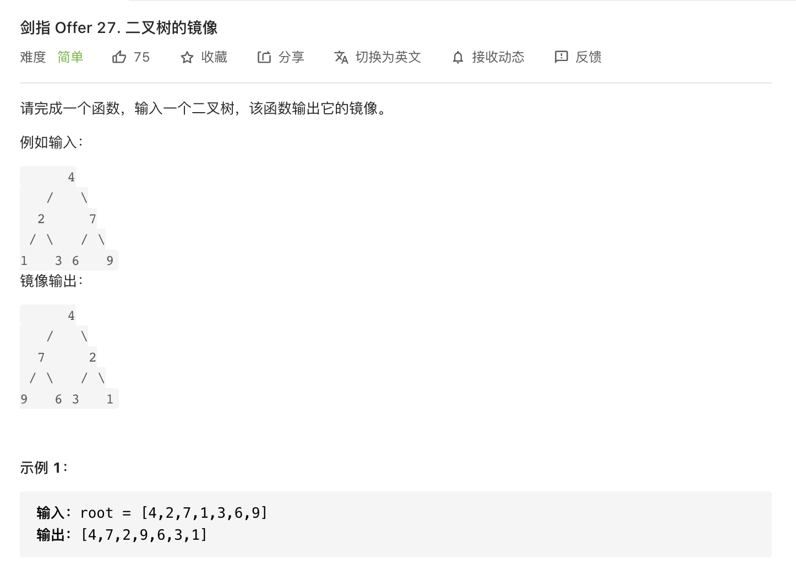

限制：

```
0 <= 节点个数 <= 1000
```

注意：本题与主站 226 题相同：https://leetcode-cn.com/problems/invert-binary-tree/

```java
public TreeNode mirrorTree(TreeNode root) {
        if (root == null) return root;

        TreeNode cur = new TreeNode(root.val);
        cur.left = mirrorTree(root.right);
        cur.right = mirrorTree(root.left);
        return cur;
    }
```


#### [28. 对称的二叉树](https://leetcode-cn.com/problems/dui-cheng-de-er-cha-shu-lcof/)

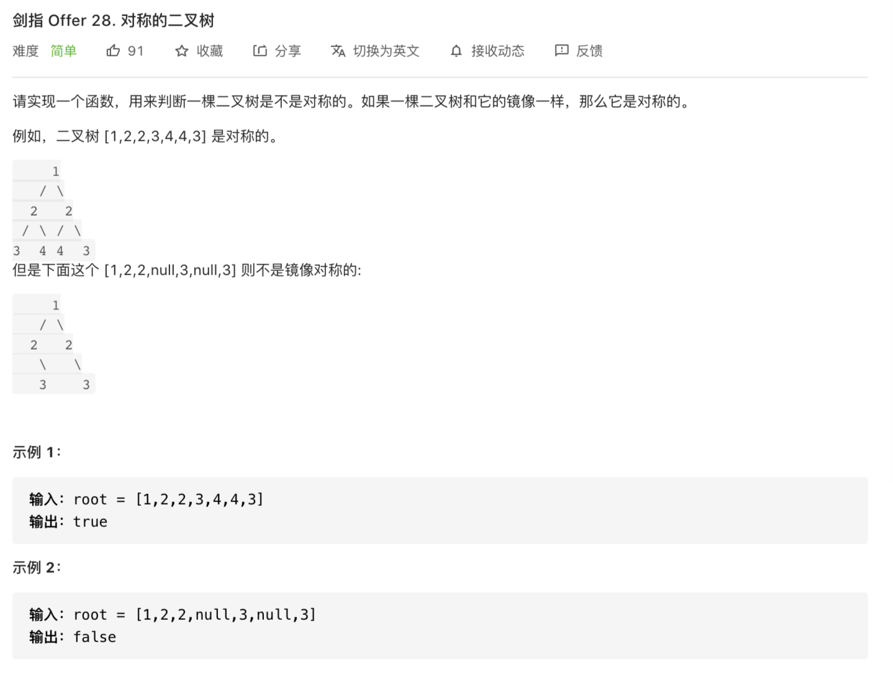

**限制：**

```
0 <= 节点个数 <= 1000
```

注意：本题与主站 101 题相同：https://leetcode-cn.com/problems/symmetric-tree/

```java
public boolean isSymmetric(TreeNode root) {
        return root == null ? true : recur(root.left, root.right);
    }
    boolean recur(TreeNode L, TreeNode R) {
        if(L == null && R == null) return true;
        if(L == null || R == null || L.val != R.val) return false;
        return recur(L.left, R.right) && recur(L.right, R.left);
    }
```


#### [29. 顺时针打印矩阵](https://leetcode-cn.com/problems/shun-shi-zhen-da-yin-ju-zhen-lcof/)

难度简单

输入一个矩阵，按照从外向里以顺时针的顺序依次打印出每一个数字。

 

**示例 1：**

```
输入：matrix = [[1,2,3],[4,5,6],[7,8,9]]
输出：[1,2,3,6,9,8,7,4,5]
```

**示例 2：**

```
输入：matrix = [[1,2,3,4],[5,6,7,8],[9,10,11,12]]
输出：[1,2,3,4,8,12,11,10,9,5,6,7]
```

 

**限制：**

- `0 <= matrix.length <= 100`
- `0 <= matrix[i].length <= 100`

注意：本题与主站 54 题相同：https://leetcode-cn.com/problems/spiral-matrix/

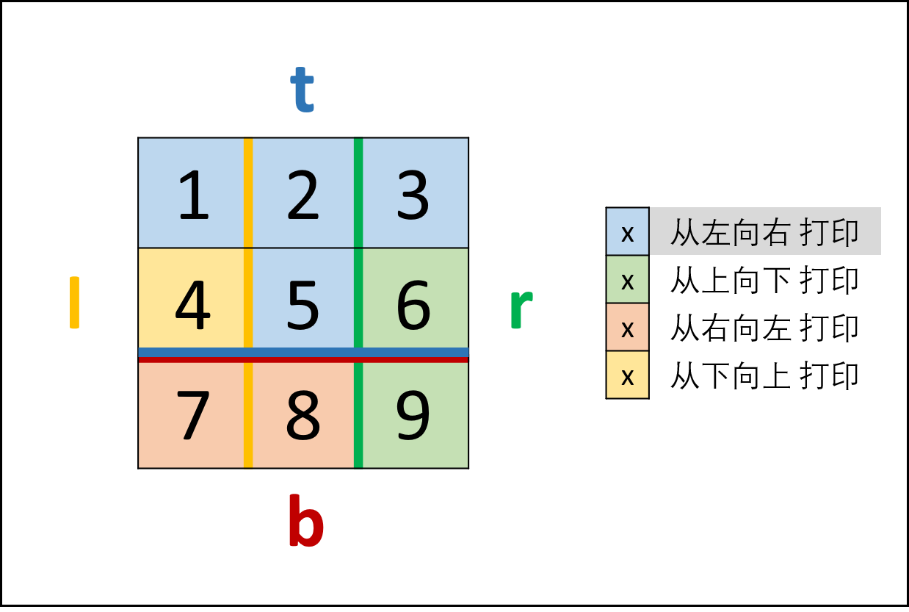

```java
    public int[] spiralOrder(int[][] matrix){
        if (matrix == null || matrix.length == 0) return new int[0];
        int m = matrix.length;
        int n = matrix[0].length;
        int top = 0;
        int bottom = m - 1;
        int left = 0;
        int right = n - 1;

        int[] res = new int[m*n];
        int k = 0;
        while (top <= bottom && left <= right){

            /********* left --> right **********/
            for (int i = left; i <= right; i++) {
                res[k++] = matrix[top][i];
            }
            top++;

            /********* top --> down **********/
            for (int i = top; i <= bottom ; i++) {
                res[k++] = matrix[i][right];
            }
            right--;

            /********* right --> left **********/
            for (int i = right; i >= left && top <= bottom ; i--) {
                res[k++] = matrix[bottom][i];
            }
            bottom--;

            /********* bottom --> top **********/
            for (int i = bottom; i >= top && left <= right ; i--) {
                res[k++] = matrix[i][left];
            }
            left++;

        }
        return res;
    }
```


#### [30. 包含min函数的栈](https://leetcode-cn.com/problems/bao-han-minhan-shu-de-zhan-lcof/)

难度简单

定义栈的数据结构，请在该类型中实现一个能够得到栈的最小元素的 min 函数在该栈中，调用 min、push 及 pop 的时间复杂度都是 O(1)。

**示例:**

```
MinStack minStack = new MinStack();
minStack.push(-2);
minStack.push(0);
minStack.push(-3);
minStack.min();   --> 返回 -3.
minStack.pop();
minStack.top();      --> 返回 0.
minStack.min();   --> 返回 -2.
```

**提示：**

1. 各函数的调用总次数不超过 20000 次

   注意：本题与主站 155 题相同：https://leetcode-cn.com/problems/min-stack/

   

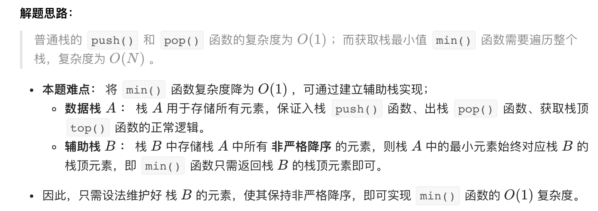


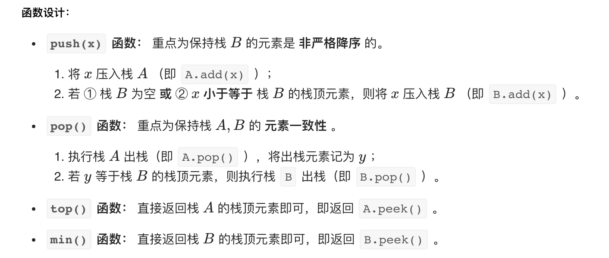

```java
class MinStack {

        Stack<Integer> A,B;
        /** initialize your data structure here. */
        public MinStack() {
             A = new Stack<>();
             B = new Stack<>();
        }

        public void push(int x) {
            A.add(x);
            if (B.empty() || B.peek() >= x) B.add(x);
        }

        public void pop() {
            //注意：此处A.pop()已经把数pop出去了
            if (A.pop().equals(B.peek())) B.pop();
        }

        public int top() {
            return A.peek();
        }

        public int min() {
            return B.peek();
        }
    }
```


#### ==[32 - II. 从上到下打印二叉树 II](https://leetcode-cn.com/problems/cong-shang-dao-xia-da-yin-er-cha-shu-ii-lcof/)==

难度简单

从上到下按层打印二叉树，同一层的节点按从左到右的顺序打印，每一层打印到一行。

 

例如:
给定二叉树: `[3,9,20,null,null,15,7]`,

```
    3
   / \
  9  20
    /  \
   15   7
```

返回其层次遍历结果：

```
[
  [3],
  [9,20],
  [15,7]
]
```

**提示：**

1. `节点总数 <= 1000`

注意：本题与主站 102 题相同：https://leetcode-cn.com/problems/binary-tree-level-order-traversal/


#### [39. 数组中出现次数超过一半的数字](https://leetcode-cn.com/problems/shu-zu-zhong-chu-xian-ci-shu-chao-guo-yi-ban-de-shu-zi-lcof/)

难度简单

数组中有一个数字出现的次数超过数组长度的一半，请找出这个数字。 

你可以假设数组是非空的，并且给定的数组总是存在多数元素。

 

**示例 1:**

```
输入: [1, 2, 3, 2, 2, 2, 5, 4, 2]
输出: 2
```

**限制：**

```
1 <= 数组长度 <= 50000
```

注意：本题与主站 169 题相同：https://leetcode-cn.com/problems/majority-element/

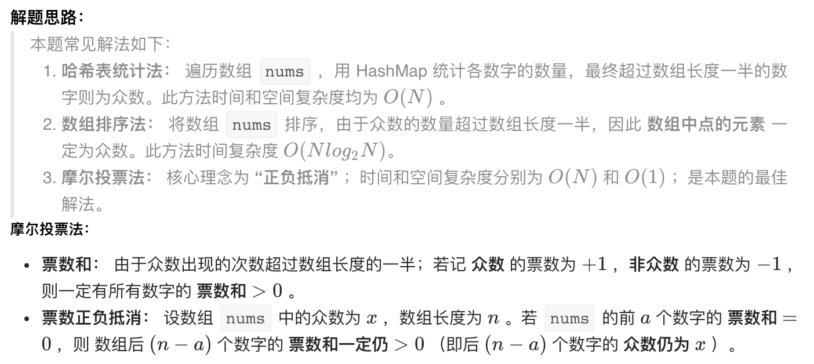


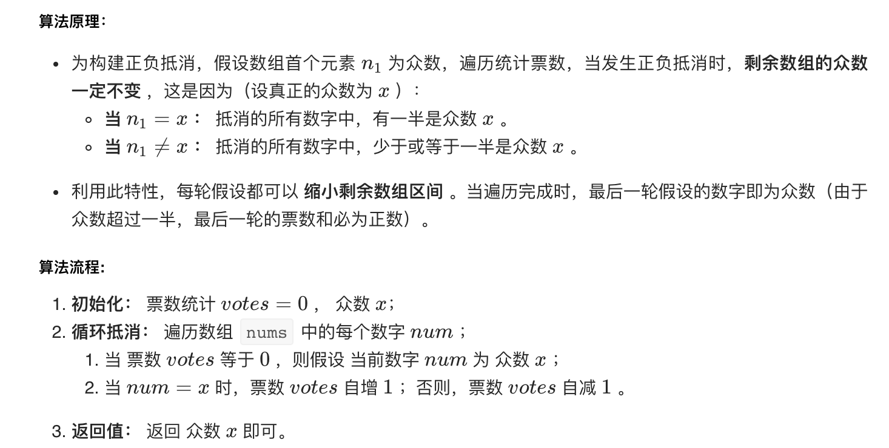

https://leetcode-cn.com/problems/shu-zu-zhong-chu-xian-ci-shu-chao-guo-yi-ban-de-shu-zi-lcof/solution/mian-shi-ti-39-shu-zu-zhong-chu-xian-ci-shu-chao-3/

注意：==假设提供的数组中，众数是存在的==

```java
public int majorityElement(int[] nums) {
        int votes = 0;
        int x = 0;

        for (int num:nums) {
            if (votes == 0) x = num;
            votes += (num == x)?1:-1;
        }
        return x;
    }
```


#### ==[40. 最小的k个数](https://leetcode-cn.com/problems/zui-xiao-de-kge-shu-lcof/)==

难度简单143收藏分享切换为英文接收动态反馈

输入整数数组 `arr` ，找出其中最小的 `k` 个数。例如，输入4、5、1、6、2、7、3、8这8个数字，则最小的4个数字是1、2、3、4。

 

**示例 1：**

```
输入：arr = [3,2,1], k = 2
输出：[1,2] 或者 [2,1]
```

**示例 2：**

```
输入：arr = [0,1,2,1], k = 1
输出：[0]
```

**限制：**

- `0 <= k <= arr.length <= 10000`

- `0 <= arr[i] <= 10000`

  

#### [42. 连续子数组的最大和](https://leetcode-cn.com/problems/lian-xu-zi-shu-zu-de-zui-da-he-lcof/)

难度简单

输入一个整型数组，数组中的一个或连续多个整数组成一个子数组。求所有子数组的和的最大值。

要求时间复杂度为O(n)。 

**示例1:**

```
输入: nums = [-2,1,-3,4,-1,2,1,-5,4]
输出: 6
解释: 连续子数组 [4,-1,2,1] 的和最大，为 6。 
```

**提示：**

- `1 <= arr.length <= 10^5`
- `-100 <= arr[i] <= 100`

注意：本题与主站 53 题相同：https://leetcode-cn.com/problems/maximum-subarray/

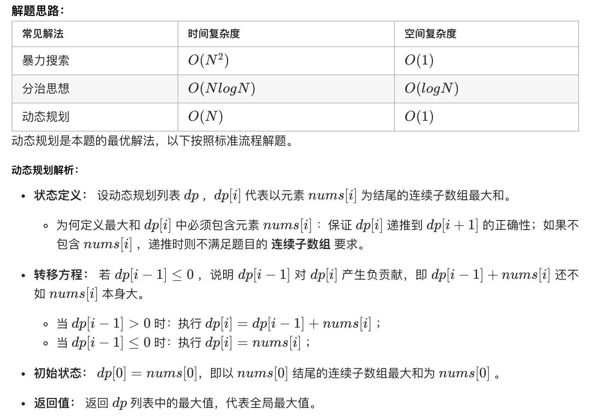

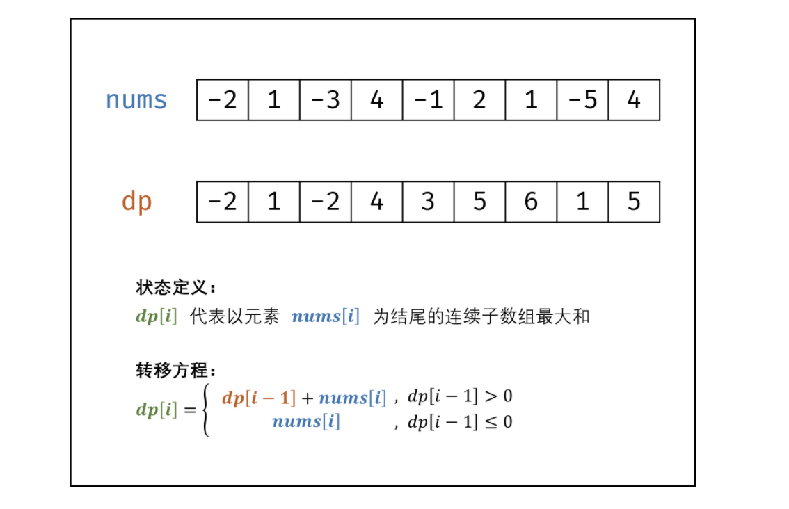

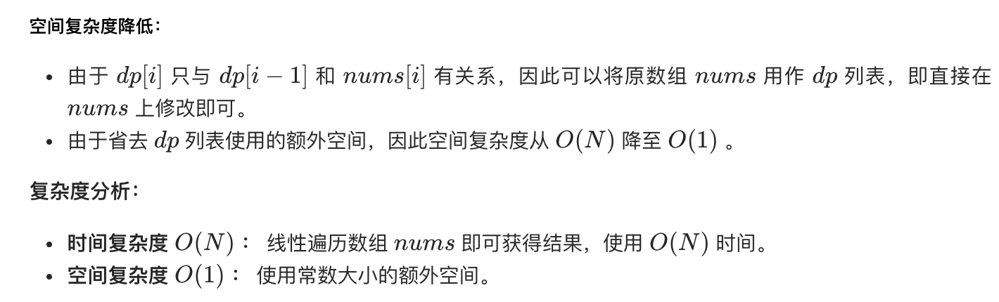

```java
public int maxSubArray(int[] nums) {
        int res = nums[0];
        for(int i = 1; i < nums.length; i++) {
            nums[i] += Math.max(nums[i - 1], 0);
            res = Math.max(res, nums[i]);
        }
        return res;
    }
```


#### ==[49. 丑数](https://leetcode-cn.com/problems/chou-shu-lcof/)==

难度中等

我们把只包含质因子 2、3 和 5 的数称作==丑数==（Ugly Number）。求按从小到大的顺序的第 n 个丑数。

**示例:**

```
输入: n = 10
输出: 12
解释: 1, 2, 3, 4, 5, 6, 8, 9, 10, 12 是前 10 个丑数。
```

**说明:** 

1. `1` 是丑数。
2. `n` **不超过**1690。

注意：本题与主站 264 题相同：https://leetcode-cn.com/problems/ugly-number-ii/


#### [50. 第一个只出现一次的字符](https://leetcode-cn.com/problems/di-yi-ge-zhi-chu-xian-yi-ci-de-zi-fu-lcof/)

难度简单

在字符串 s 中找出第一个只出现一次的字符。如果没有，返回一个单空格。 s 只包含小写字母。

**示例:**

```
s = "abaccdeff"
返回 "b"

s = "" 
返回 " "
```

**限制：**

```
0 <= s 的长度 <= 50000
```

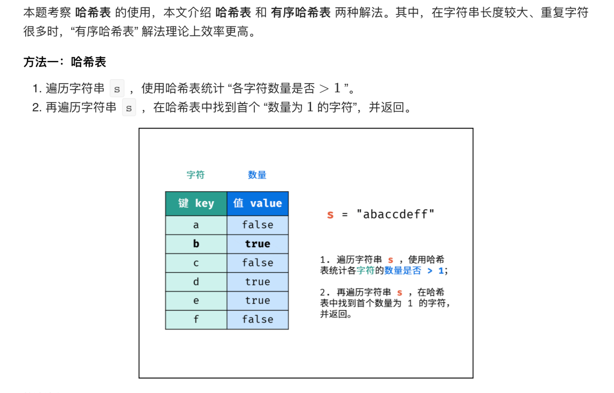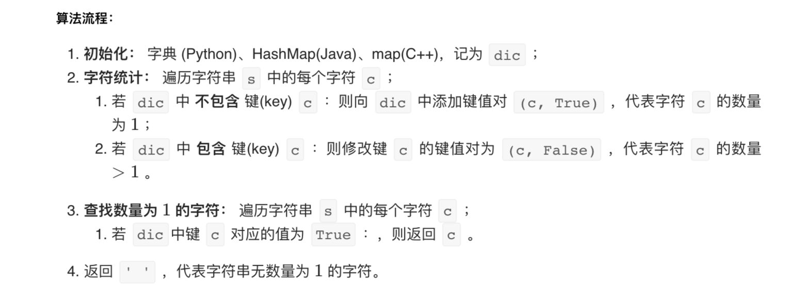


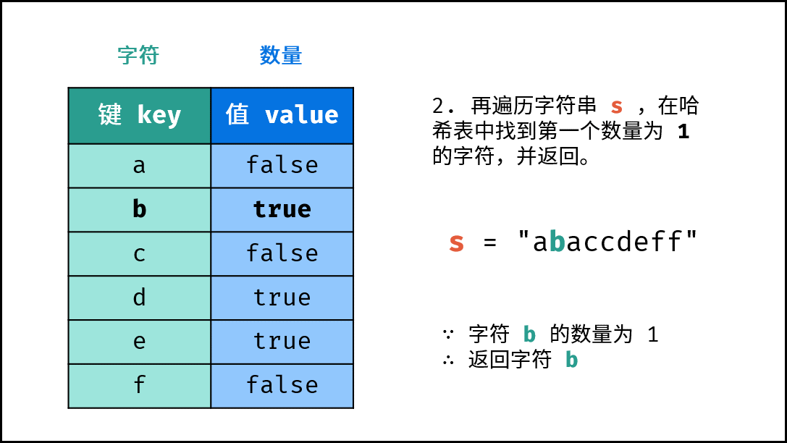

```java
public char firstUniqChar(String s) {
        HashMap<Character,Boolean> map = new HashMap<>();
        char[] ss = s.toCharArray();
        for (char c : ss) {
            map.put(c,!map.containsKey(c));
        }

        for(char c : ss){
            if (map.get(c) == true) return c;
        }
        return ' ';
    }
```


#### [52. 两个链表的第一个公共节点](https://leetcode-cn.com/problems/liang-ge-lian-biao-de-di-yi-ge-gong-gong-jie-dian-lcof/)

难度简单

输入两个链表，找出它们的第一个公共节点。

如下面的两个链表**：**

[](https://assets.leetcode-cn.com/aliyun-lc-upload/uploads/2018/12/14/160_statement.png)

在节点 c1 开始相交。

 

**示例 1：**

[](https://assets.leetcode.com/uploads/2018/12/13/160_example_1.png)

```
输入：intersectVal = 8, listA = [4,1,8,4,5], listB = [5,0,1,8,4,5], skipA = 2, skipB = 3
输出：Reference of the node with value = 8
输入解释：相交节点的值为 8 （注意，如果两个列表相交则不能为 0）。从各自的表头开始算起，链表 A 为 [4,1,8,4,5]，链表 B 为 [5,0,1,8,4,5]。在 A 中，相交节点前有 2 个节点；在 B 中，相交节点前有 3 个节点。
```

 

**示例 2：**

[](https://assets.leetcode.com/uploads/2018/12/13/160_example_2.png)

```
输入：intersectVal = 2, listA = [0,9,1,2,4], listB = [3,2,4], skipA = 3, skipB = 1
输出：Reference of the node with value = 2
输入解释：相交节点的值为 2 （注意，如果两个列表相交则不能为 0）。从各自的表头开始算起，链表 A 为 [0,9,1,2,4]，链表 B 为 [3,2,4]。在 A 中，相交节点前有 3 个节点；在 B 中，相交节点前有 1 个节点。
```

 

**示例 3：**

[](https://assets.leetcode.com/uploads/2018/12/13/160_example_3.png)

```
输入：intersectVal = 0, listA = [2,6,4], listB = [1,5], skipA = 3, skipB = 2
输出：null
输入解释：从各自的表头开始算起，链表 A 为 [2,6,4]，链表 B 为 [1,5]。由于这两个链表不相交，所以 intersectVal 必须为 0，而 skipA 和 skipB 可以是任意值。
解释：这两个链表不相交，因此返回 null。
```

 

**注意：**

- 如果两个链表没有交点，返回 `null`.
- 在返回结果后，两个链表仍须保持原有的结构。
- 可假定整个链表结构中没有循环。
- 程序尽量满足 O(*n*) 时间复杂度，且仅用 O(*1*) 内存。
- 本题与主站 160 题相同：https://leetcode-cn.com/problems/intersection-of-two-linked-lists/

```java
public ListNode getIntersectionNode(ListNode headA, ListNode headB) {
        ListNode curA = headA;
        ListNode curB = headB;

        while (curA != curB){
            curA = (curA != null)? curA.next : headB;
            curB = (curB != null)? curB.next : headA;

        }
        return curA;
    }
```


#### [53 - I. 在排序数组中查找数字 I](https://leetcode-cn.com/problems/zai-pai-xu-shu-zu-zhong-cha-zhao-shu-zi-lcof/)

难度简单68收藏分享切换为英文接收动态反馈

统计一个数字在排序数组中出现的次数。

 

**示例 1:**

```
输入: nums = [5,7,7,8,8,10], target = 8
输出: 2
```

**示例 2:**

```
输入: nums = [5,7,7,8,8,10], target = 6
输出: 0
```

 

**限制：**

```
0 <= 数组长度 <= 50000
```

 

**注意：**本题与主站 34 题相同（仅返回值不同）：https://leetcode-cn.com/problems/find-first-and-last-position-of-element-in-sorted-array/

方法一：遍历

```java
public int search(int[] nums, int target) {
        int count = 0;
        for (int num : nums){
            if (num == target) count++;
        }
        return count;
    }
```

方法二：两端逼近

```java
public int search(int[] nums, int target) {
        int len = nums.length;
        int i = 0;
        int j = len - 1;

        while (i<len && j>=0 && (nums[i] != target || nums[j] != target)){
            if (nums[i] != target) i++;
            if (nums[j] != target) j--;
        }
        if (i > len || j < 0) return 0;
        return j-i+1;
    }
```

方法三：二分法

```java
 public int search(int[] nums, int target) {
        return binarySearch(nums, target + 0.5) - binarySearch(nums, target - 0.5);
    }

    private int binarySearch(int[] nums, double target) {
        int left = 0, right = nums.length - 1;
        while (left <= right) {
            int mid = (right + left) >>> 1;
            if (nums[mid] < target) {
                left = mid + 1;
            } else if (nums[mid] > target) {
                right = mid - 1;
            }
        }
        return left;
    }
```


#### [53 - II. 0～n-1中缺失的数字](https://leetcode-cn.com/problems/que-shi-de-shu-zi-lcof/)

难度简单69收藏分享切换为英文接收动态反馈

一个长度为n-1的递增排序数组中的所有数字都是唯一的，并且每个数字都在范围0～n-1之内。在范围0～n-1内的n个数字中有且只有一个数字不在该数组中，请找出这个数字。

 

**示例 1:**

```
输入: [0,1,3]
输出: 2
```

**示例 2:**

```
输入: [0,1,2,3,4,5,6,7,9]
输出: 8
```

**限制：**

```
1 <= 数组长度 <= 10000
```

```java
//方法一：二分法
public int missingNumber(int[] nums) {
        int len = nums.length;
        if (len == 0) return 1;

        int left = 0;
        int right = len - 1;

        while (left < right){
            int mid = (left + right)/2;
            if (nums[mid] != mid) {
                right = mid;
            }else{
                left = mid + 1;
            }
        }
        return (nums[left] == left)?(left+1):left;
    }

//方法2
public int missingNumber(int[] nums) {
        int len = nums.length;
        if (len == 0) return 1;

        for (int i = 0; i < len ; i++) {
            if (nums[i] != i){
                if (nums[i] > i) return nums[i] - 1;
                return nums[i] + 1;
            }
        }
        return nums[len-1] + 1;
    }
```


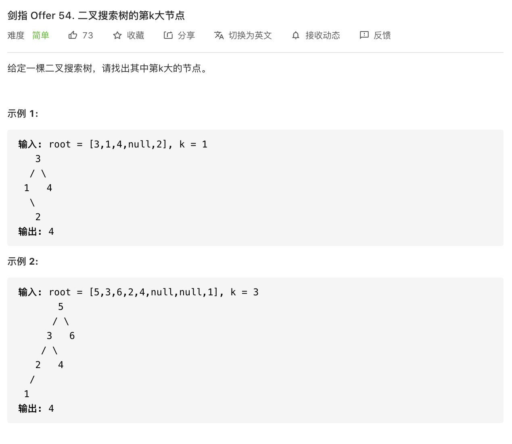

**限制：**

1 ≤ k ≤ 二叉搜索树元素个数


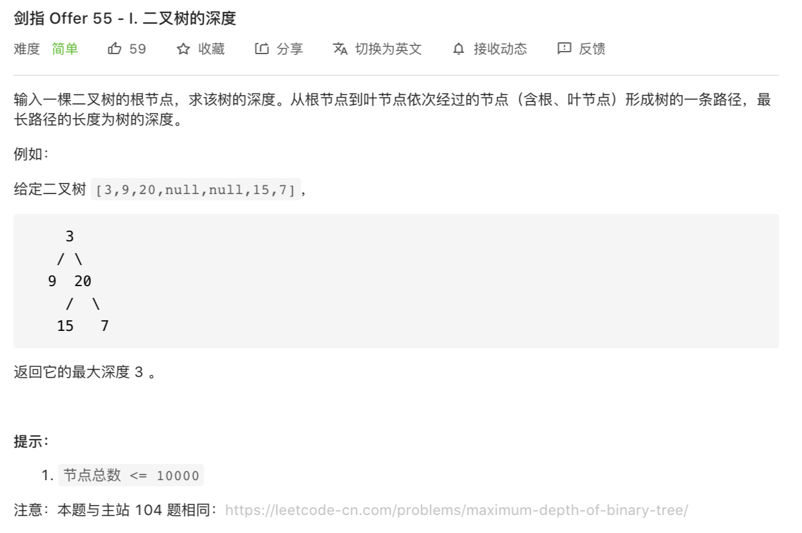


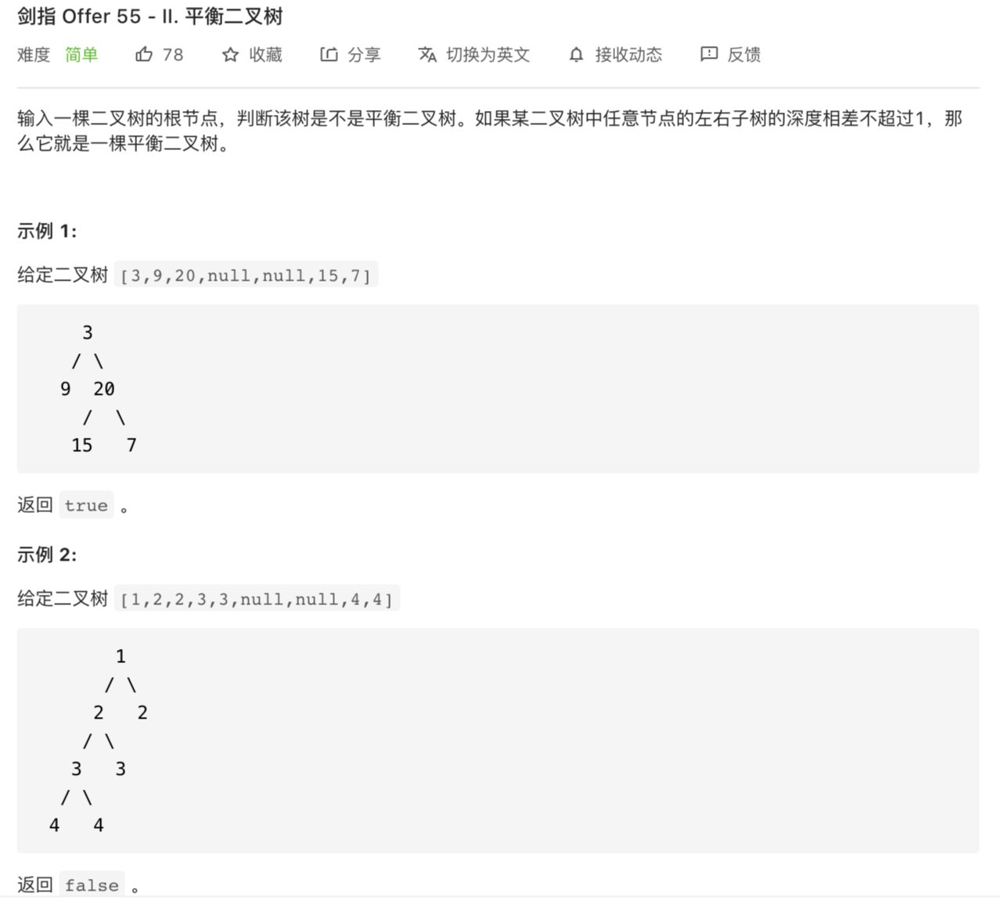

限制：

1 <= 树的结点个数 <= 10000
注意：本题与主站 110 题相同：https://leetcode-cn.com/problems/balanced-binary-tree/

 

#### [剑指 Offer 57. 和为s的两个数字](https://leetcode-cn.com/problems/he-wei-sde-liang-ge-shu-zi-lcof/)

难度简单48收藏分享切换为英文接收动态反馈

输入一个递增排序的数组和一个数字s，在数组中查找两个数，使得它们的和正好是s。如果有多对数字的和等于s，则输出任意一对即可。

 

**示例 1：**

```
输入：nums = [2,7,11,15], target = 9
输出：[2,7] 或者 [7,2]
```

**示例 2：**

```
输入：nums = [10,26,30,31,47,60], target = 40
输出：[10,30] 或者 [30,10]
```

 

**限制：**

- `1 <= nums.length <= 10^5`
- `1 <= nums[i] <= 10^6`


#### [剑指 Offer 57 - II. 和为s的连续正数序列](https://leetcode-cn.com/problems/he-wei-sde-lian-xu-zheng-shu-xu-lie-lcof/)

难度简单163收藏分享切换为英文接收动态反馈

输入一个正整数 `target` ，输出所有和为 `target` 的连续正整数序列（至少含有两个数）。

序列内的数字由小到大排列，不同序列按照首个数字从小到大排列。

 

**示例 1：**

```
输入：target = 9
输出：[[2,3,4],[4,5]]
```

**示例 2：**

```
输入：target = 15
输出：[[1,2,3,4,5],[4,5,6],[7,8]]
```

 

**限制：**

- `1 <= target <= 10^5`

 [剑指 Offer 58 - I. 翻转单词顺序](https://leetcode-cn.com/problems/fan-zhuan-dan-ci-shun-xu-lcof/)

难度简单42收藏分享切换为英文接收动态反馈

输入一个英文句子，翻转句子中单词的顺序，但单词内字符的顺序不变。为简单起见，标点符号和普通字母一样处理。例如输入字符串"I am a student. "，则输出"student. a am I"。

 

**示例 1：**

```
输入: "the sky is blue"
输出: "blue is sky the"
```

**示例 2：**

```
输入: "  hello world!  "
输出: "world! hello"
解释: 输入字符串可以在前面或者后面包含多余的空格，但是反转后的字符不能包括。
```

**示例 3：**

```
输入: "a good   example"
输出: "example good a"
解释: 如果两个单词间有多余的空格，将反转后单词间的空格减少到只含一个。
```

 

**说明：**

- 无空格字符构成一个单词。
- 输入字符串可以在前面或者后面包含多余的空格，但是反转后的字符不能包括。
- 如果两个单词间有多余的空格，将反转后单词间的空格减少到只含一个。

**注意：**本题与主站 151 题相同：https://leetcode-cn.com/problems/reverse-words-in-a-string/

**注意：**此题对比原题有改动


#### [剑指 Offer 58 - II. 左旋转字符串](https://leetcode-cn.com/problems/zuo-xuan-zhuan-zi-fu-chuan-lcof/)

难度简单55收藏分享切换为英文接收动态反馈

字符串的左旋转操作是把字符串前面的若干个字符转移到字符串的尾部。请定义一个函数实现字符串左旋转操作的功能。比如，输入字符串"abcdefg"和数字2，该函数将返回左旋转两位得到的结果"cdefgab"。

 

**示例 1：**

```
输入: s = "abcdefg", k = 2
输出: "cdefgab"
```

**示例 2：**

```
输入: s = "lrloseumgh", k = 6
输出: "umghlrlose"
```

 

**限制：**

- `1 <= k < s.length <= 10000`


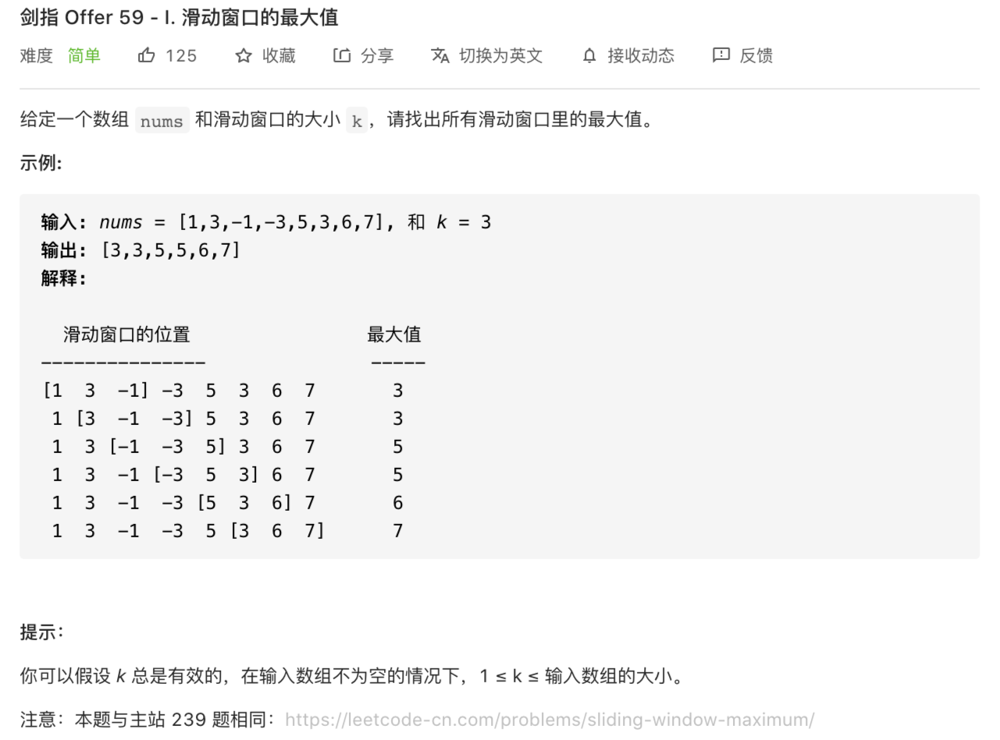

#### [剑指 Offer 60. n个骰子的点数](https://leetcode-cn.com/problems/nge-tou-zi-de-dian-shu-lcof/)

难度简单123收藏分享切换为英文接收动态反馈

把n个骰子扔在地上，所有骰子朝上一面的点数之和为s。输入n，打印出s的所有可能的值出现的概率。

 

你需要用一个浮点数数组返回答案，其中第 i 个元素代表这 n 个骰子所能掷出的点数集合中第 i 小的那个的概率。

 

**示例 1:**

```
输入: 1
输出: [0.16667,0.16667,0.16667,0.16667,0.16667,0.16667]
```

**示例 2:**

```
输入: 2
输出: [0.02778,0.05556,0.08333,0.11111,0.13889,0.16667,0.13889,0.11111,0.08333,0.05556,0.02778]
```

 

**限制：**

```
1 <= n <= 11
```

#### [剑指 Offer 61. 扑克牌中的顺子](https://leetcode-cn.com/problems/bu-ke-pai-zhong-de-shun-zi-lcof/)

难度简单70收藏分享切换为英文接收动态反馈

从扑克牌中随机抽5张牌，判断是不是一个顺子，即这5张牌是不是连续的。2～10为数字本身，A为1，J为11，Q为12，K为13，而大、小王为 0 ，可以看成任意数字。A 不能视为 14。

 

**示例 1:**

```
输入: [1,2,3,4,5]
输出: True
```

 

**示例 2:**

```
输入: [0,0,1,2,5]
输出: True
```

 

**限制：**

数组长度为 5 

数组的数取值为 [0, 13] .


#### [剑指 Offer 65. 不用加减乘除做加法](https://leetcode-cn.com/problems/bu-yong-jia-jian-cheng-chu-zuo-jia-fa-lcof/)

难度简单76收藏分享切换为英文接收动态反馈

写一个函数，求两个整数之和，要求在函数体内不得使用 “+”、“-”、“*”、“/” 四则运算符号。

 

**示例:**

```
输入: a = 1, b = 1
输出: 2
```

 

**提示：**

- `a`, `b` 均可能是负数或 0
- 结果不会溢出 32 位整数

#### [剑指 Offer 68 - I. 二叉搜索树的最近公共祖先](https://leetcode-cn.com/problems/er-cha-sou-suo-shu-de-zui-jin-gong-gong-zu-xian-lcof/)

难度简单63收藏分享切换为英文接收动态反馈

给定一个二叉搜索树, 找到该树中两个指定节点的最近公共祖先。

[百度百科](https://baike.baidu.com/item/最近公共祖先/8918834?fr=aladdin)中最近公共祖先的定义为：“对于有根树 T 的两个结点 p、q，最近公共祖先表示为一个结点 x，满足 x 是 p、q 的祖先且 x 的深度尽可能大（**一个节点也可以是它自己的祖先**）。”

例如，给定如下二叉搜索树: root = [6,2,8,0,4,7,9,null,null,3,5]


 

**示例 1:**

```
输入: root = [6,2,8,0,4,7,9,null,null,3,5], p = 2, q = 8
输出: 6 
解释: 节点 2 和节点 8 的最近公共祖先是 6。
```

**示例 2:**

```
输入: root = [6,2,8,0,4,7,9,null,null,3,5], p = 2, q = 4
输出: 2
解释: 节点 2 和节点 4 的最近公共祖先是 2, 因为根据定义最近公共祖先节点可以为节点本身。
```

 

**说明:**

- 所有节点的值都是唯一的。
- p、q 为不同节点且均存在于给定的二叉搜索树中。

注意：本题与主站 235 题相同：https://leetcode-cn.com/problems/lowest-common-ancestor-of-a-binary-search-tree/


#### [剑指 Offer 68 - II. 二叉树的最近公共祖先](https://leetcode-cn.com/problems/er-cha-shu-de-zui-jin-gong-gong-zu-xian-lcof/)

难度简单153收藏分享切换为英文接收动态反馈

给定一个二叉树, 找到该树中两个指定节点的最近公共祖先。

[百度百科](https://baike.baidu.com/item/最近公共祖先/8918834?fr=aladdin)中最近公共祖先的定义为：“对于有根树 T 的两个结点 p、q，最近公共祖先表示为一个结点 x，满足 x 是 p、q 的祖先且 x 的深度尽可能大（**一个节点也可以是它自己的祖先**）。”

例如，给定如下二叉树: root = [3,5,1,6,2,0,8,null,null,7,4]


 

**示例 1:**

```
输入: root = [3,5,1,6,2,0,8,null,null,7,4], p = 5, q = 1
输出: 3
解释: 节点 5 和节点 1 的最近公共祖先是节点 3。
```

**示例 2:**

```
输入: root = [3,5,1,6,2,0,8,null,null,7,4], p = 5, q = 4
输出: 5
解释: 节点 5 和节点 4 的最近公共祖先是节点 5。因为根据定义最近公共祖先节点可以为节点本身。
```

 

**说明:**

- 所有节点的值都是唯一的。
- p、q 为不同节点且均存在于给定的二叉树中。

注意：本题与主站 236 题相同：https://leetcode-cn.com/problems/lowest-common-ancestor-of-a-binary-tree/

